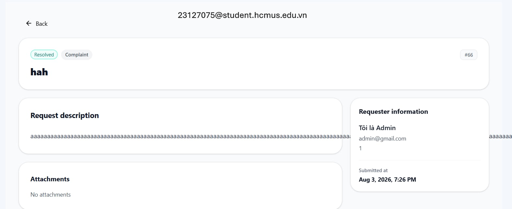

# Task 2 - Session Notes P01

File này dành cho người điều phối/interviewer ghi chú, không đưa participant tự điền. Participant chỉ đọc `../participant_brief.md`; các quan sát, metric, câu trả lời và SUS raw score sẽ do Lê Trung Kiên ghi lại trong file session tương ứng.

## 1. Thông tin phiên

| Trường             | Giá trị                                       |
| -------------------- | ----------------------------------------------- |
| Participant ID       | `P01`                                         |
| Họ tên             | Võ Trung Hiếu                                 |
| Số điện thoại    | 0365223199                                      |
| OS/browser          | Windows 11 - Chrome                             |
| Ngày giờ           | `2026-08-03 12:12`                              |
| Người điều phối | Lê Trung Kiên                                 |
| Scenario             | D - User requests Support and Admin resolves it |
| Consent              | Yes                                             |
| Recording            | `../video_links.md`                              |

## 2. Setup đã đưa cho participant

| Hạng mục         | Giá trị                                                         |
| ------------------ | ----------------------------------------------------------------- |
| Participant brief  | `../participant_brief.md`                         |
| Website EMS        | `https://prod-dev.ems-fitus.cloud`                              |
| User account D1-D2 | `ltkien23@clc.fitus.edu.vn` / `Nothing2k@5`                   |
| Admin account D3   | `admin@gmail.com` / `Admin@123`                               |
| Màn hình D1      | User tạo support request có image attachment                    |
| Màn hình D2      | User xem My Requests list/detail có response                     |
| Màn hình D3      | Admin xem Support Requests list, Pending/Resolved tabs và search |

Ghi chú kiểm soát:

- Không hướng dẫn từng cú click.
- Chỉ can thiệp nếu participant bị kẹt hoàn toàn.
- Không để participant đổi mật khẩu, email, profile hoặc sửa dữ liệu ngoài phạm vi test.
- Với D3, nếu không muốn đưa admin password cho participant, người điều phối đăng nhập sẵn admin session rồi cho participant thao tác dưới giám sát.

## 3. Task scenario đã đọc cho participant

```text
Bạn đang dùng hệ thống EMS của khoa. Bạn gặp một vấn đề khi tham gia hoặc đăng ký sự kiện và muốn gửi yêu cầu hỗ trợ kèm ảnh minh chứng.

Hãy gửi một yêu cầu hỗ trợ, sau đó kiểm tra lại yêu cầu của mình trong danh sách support requests và cho biết bạn thấy trạng thái/phản hồi ở đâu.
```

Phần admin D3:

```text
Sau khi trải nghiệm phía user, hãy dùng màn hình admin đã được chuẩn bị để tìm request theo tiêu đề, member code, category hoặc trạng thái, rồi cho biết bạn tìm thấy request ở tab nào.
```

## 4. Checklist quan sát nhanh

| Màn hình                              | Hoàn tất?                    | Quan sát chính | Lỗi/nhầm lẫn | Do dự                                               | Có can thiệp?  |
| --------------------------------------- | ------------------------------ | ---------------- | --------------- | ---------------------------------------------------- | ---------------- |
| D1 - Create support request             | `Completed`                    | Tạo được support request và gửi thành công, thao tác form nhìn chung suôn sẻ. | Không nhầm luồng đáng kể ở phía user. | 1 - Ban đầu cần đọc lại task để xác nhận phải kiểm tra request sau khi gửi. | `Không` |
| D2 - My Requests/detail                 | `Completed`                    | Tìm lại được request vừa tạo và xác định được trạng thái/phản hồi. | Không gặp lỗi thao tác rõ rệt. | 1 - Dừng ngắn để quan sát vị trí trạng thái/phản hồi trong màn hình detail. | `Không` |
| D3 - Admin Support Requests list/search | `Completed`                    | Tìm được request ở phía admin nhưng mất thời gian hơn đáng kể so với D1-D2. | Dễ lẫn giữa danh sách request và luồng xử lý tương ứng. | 1 - Do dự khi tìm request cần xử lý trong màn hình admin và phải thử cách tìm phù hợp. | `Không` |

## 5. Timeline/quan sát chi tiết

| Thời điểm | Màn hình | Hành động/quan sát | Có lỗi/nhầm lẫn? | Có do dự?  | Quote/ghi chú |
| ------------ | ---------- | ---------------------- | -------------------- | ------------ | -------------- |
| 00:00        | Start      | Bắt đầu task.       | No                   | No           |                |
| 05:33        | D1         | Hoàn tất việc tạo support request với nội dung và gửi form thành công. | No                   | No           | Participant nhận xét luồng phía user khá dễ hiểu. |
| 06:43        | D2         | Mở lại My Requests/detail để kiểm tra request vừa tạo và tìm trạng thái/phản hồi. | No                   | Yes          | Dừng ngắn để xác định vị trí hiển thị trạng thái. |
| 10:48        | D3         | Tìm request ở màn hình admin bằng thông tin có sẵn; hoàn tất nhưng chậm hơn các bước trước. | No                   | Yes          | "Khó kiếm request" và dễ bị rối khi nhìn danh sách. |

## 6. Kết quả task

| Metric        | Giá trị                                |
| ------------- | ---------------------------------------- |
| Success       | `Completed`                              |
| Time on task  | 10:48                                    |
| Errors        | 0                                        |
| Hesitations   | 3                                        |
| Interventions | `Không`                                  |
| Key friction  | Tìm request ở phía admin chậm hơn mong đợi; ngoài ra phần request description có lỗi tràn chữ làm giảm khả năng đọc. |
| Evidence      | `../../findings/defect-screenshots/UT-D-003_request-description-overflow.png` |

## 7. Câu trả lời sau task

| Câu hỏi                                                                                                   | Trả lời participant                                                                                                                      |
| ----------------------------------------------------------------------------------------------------------- | ------------------------------------------------------------------------------------------------------------------------------------------ |
| Phần nào giúp bạn hiểu đang cần làm gì? Phần nào gây khó hiểu?                                | User: Dễ hiểu, có thông báo, số nút bấm vừa phải<br />Admin: Khó kiếm request, bị nhàm qa danh sách request của bản thân |
| Nếu nhập sai hoặc muốn quay lại, bạn có thấy cách sửa/khôi phục rõ không?                     | Dễ                                                                                                                                        |
| Bước nào làm bạn chậm nhất?                                                                          | Tìm danh sách request bên admin                                                                                                         |
| Sau khi gửi request hoặc xem response, bạn có tin là hệ thống đã ghi nhận/xử lý chưa? Vì sao? | Có vì đúng thời gian, tiêu đề, nội dung                                                                                           |
| Bạn có dễ tìm lại request vừa tạo không?                                                            | Có                                                                                                                                        |
| Nếu phải tìm request để xử lý, bạn sẽ dùng title, member code, category hay status?               | Status > Title                                                                                                                             |
| Ở D3, bạn có tìm được đúng request trong Pending/Resolved tab không?                              | Có                                                                                                                                        |
| Bạn có nhận thấy vấn đề nào về layout mobile/desktop không?                                       | Request description nội dung bị tràn ra                                                                                                 |

## 8. SUS raw score

| Điểm | Ý nghĩa             |
| -----: | --------------------- |
|      1 | Rất không đồng ý |
|      2 | Không đồng ý      |
|      3 | Trung lập            |
|      4 | Đồng ý             |
|      5 | Rất đồng ý        |

| Mã             | Câu hỏi                                                                                                                  | Điểm 1-5 |
| --------------- | -------------------------------------------------------------------------------------------------------------------------- | ---------: |
| SUS-01          | Tôi nghĩ tôi muốn sử dụng hệ thống này thường xuyên nếu có nhu cầu gửi hoặc theo dõi yêu cầu hỗ trợ. |          5 |
| SUS-02          | Tôi thấy hệ thống này phức tạp không cần thiết.                                                                  |          2 |
| SUS-03          | Tôi thấy hệ thống này dễ sử dụng.                                                                                  |          4 |
| SUS-04          | Tôi nghĩ tôi cần người có kỹ thuật hỗ trợ thì mới dùng được hệ thống này.                              |          2 |
| SUS-05          | Tôi thấy các chức năng trong flow support request được liên kết với nhau hợp lý.                              |          5 |
| SUS-06          | Tôi thấy hệ thống có quá nhiều điểm không nhất quán.                                                           |          2 |
| SUS-07          | Tôi nghĩ hầu hết mọi người có thể học cách dùng flow này rất nhanh.                                          |          4 |
| SUS-08          | Tôi thấy hệ thống này rườm rà hoặc bất tiện khi sử dụng.                                                      |          1 |
| SUS-09          | Tôi cảm thấy tự tin khi sử dụng flow support request này.                                                           |          4 |
| SUS-10          | Tôi cần học thêm nhiều thứ trước khi có thể sử dụng flow này thành thạo.                                    |          2 |
| SUS score 0-100 | `82.5`                                                                                                              |            |

## 9. Candidate findings từ phiên này

| ID tạm    | Screen         | Type                | Description  | Evidence         | Severity 0-4 | Có submit Google Form? |
| ---------- | -------------- | ------------------- | ------------ | ---------------- | -----------: | ----------------------- |
| UT-P01-001 | `D3` | `Usability` | Request description chứa chuỗi dài không tự xuống dòng, bị tràn ngang khỏi khung nội dung và làm giảm khả năng đọc khi xử lý request. | `../../findings/defect-screenshots/UT-D-003_request-description-overflow.png`; participant ghi nhận: `Request description nội dung bị tràn ra` | 2 | `No` |


