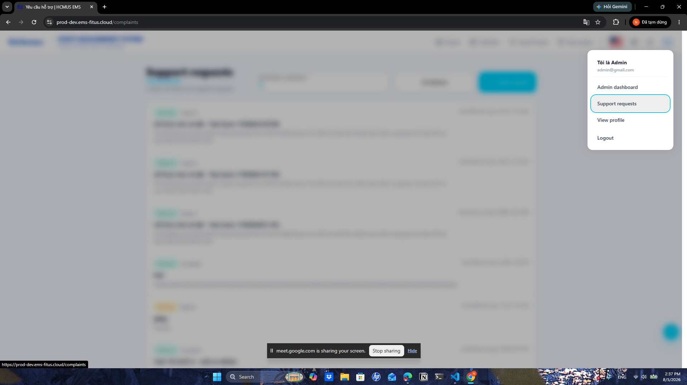
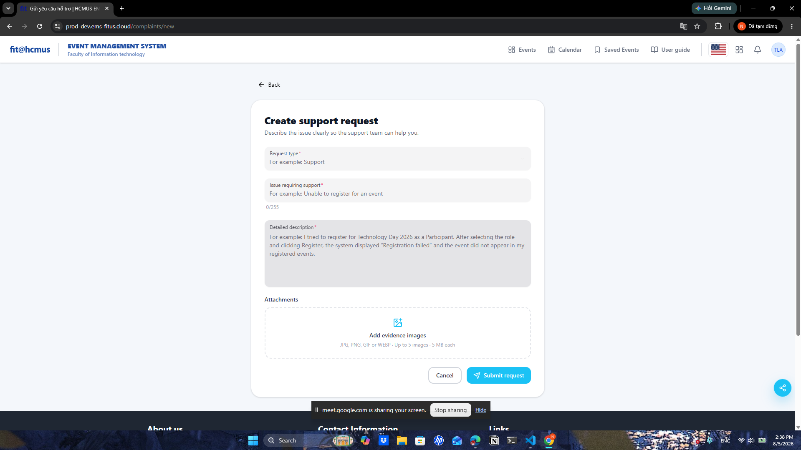
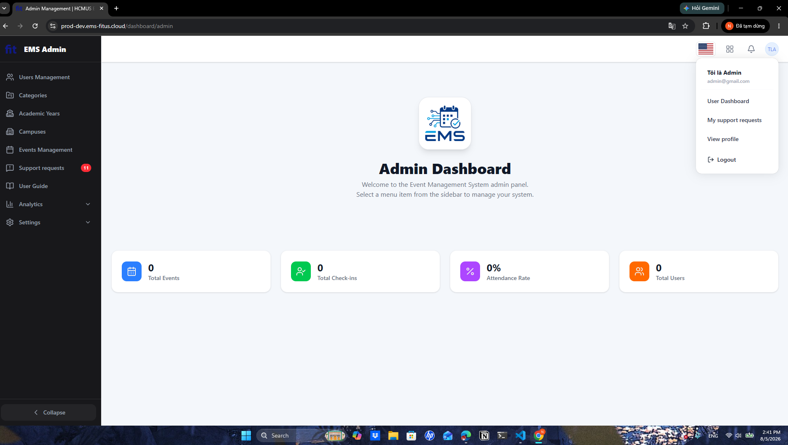

# Task 2 - Session Notes Template

File này dành cho người điều phối/interviewer ghi chú, không đưa participant tự điền. Participant chỉ đọc `../participant_brief.md`; các quan sát, metric, câu trả lời và SUS raw score sẽ do Lê Trung Kiên ghi lại trong file session tương ứng.

## 1. Thông tin phiên

| Trường             | Giá trị                                       |
| -------------------- | ----------------------------------------------- |
| Participant ID       | `P04`                                         |
| Họ tên             | Trần Hoài Thiện Nhân                        |
| Số điện thoại    | 0702525341                                      |
| OS/browser          | Windows 11 - Chrome                             |
| Ngày giờ           | `2026-08-05 14:20`                              |
| Người điều phối | Lê Trung Kiên                                 |
| Scenario             | D - User requests Support and Admin resolves it |
| Consent              | Yes                                             |
| Recording            | `N/A`                                           |

## 2. Setup đã đưa cho participant

| Hạng mục         | Giá trị                                                         |
| ------------------ | ----------------------------------------------------------------- |
| Participant brief  | `../participant_brief.md`                         |
| Website EMS        | `https://prod-dev.ems-fitus.cloud`                              |
| User account D1-D2 | `ltkien23@clc.fitus.edu.vn` / `Nothing2k@5`                   |
| Admin account D3   | `admin@gmail.com` / `Admin@123`                               |
| Màn hình D1      | User tạo support request có image attachment                    |
| Màn hình D2      | User xem My Requests list/detail có response                     |
| Màn hình D3      | Admin xem Support Requests list, Pending/Resolved tabs và search |

Ghi chú kiểm soát:

- Không hướng dẫn từng cú click.
- Chỉ can thiệp nếu participant bị kẹt hoàn toàn.
- Không để participant đổi mật khẩu, email, profile hoặc sửa dữ liệu ngoài phạm vi test.
- Với D3, nếu không muốn đưa admin password cho participant, người điều phối đăng nhập sẵn admin session rồi cho participant thao tác dưới giám sát.

## 3. Task scenario đã đọc cho participant

```text
Bạn đang dùng hệ thống EMS của khoa. Bạn gặp một vấn đề khi tham gia hoặc đăng ký sự kiện và muốn gửi yêu cầu hỗ trợ kèm ảnh minh chứng.

Hãy gửi một yêu cầu hỗ trợ, sau đó kiểm tra lại yêu cầu của mình trong danh sách support requests và cho biết bạn thấy trạng thái/phản hồi ở đâu.
```

Phần admin D3:

```text
Sau khi trải nghiệm phía user, hãy dùng màn hình admin đã được chuẩn bị để tìm request theo tiêu đề, member code, category hoặc trạng thái, rồi cho biết bạn tìm thấy request ở tab nào.
```

## 4. Checklist quan sát nhanh

| Màn hình                              | Hoàn tất?   | Quan sát chính | Lỗi/nhầm lẫn | Do dự | Có can thiệp? |
| --------------------------------------- | ------------- | ---------------- | --------------- | ------ | --------------- |
| D1 - Create support request             | `Completed`   | Tạo được support request; participant nhìn chung hiểu form và gửi được request. | Ghi nhận con trỏ/caret trong field không nhấp nháy rõ từ đầu khi click vào form. | 1 - Do dự ngắn do trạng thái focus của field chưa rõ. | `Không` |
| D2 - My Requests/detail                 | `Completed`   | Tìm lại được request vừa tạo và tin hệ thống đã ghi nhận nhờ trạng thái `Pending`. | Không gặp lỗi thao tác rõ rệt ở phía user, nhưng participant muốn có thêm filter thời gian/category để tìm lại request tốt hơn. | 0 - Không do dự đáng kể khi tìm lại request. | `Không` |
| D3 - Admin Support Requests list/search | `Completed`   | Tìm được request trong màn hình admin, nhưng chậm nhất ở bước xác định đúng nơi xử lý support request. | Bị lẫn giữa support request phía user và khu vực admin; label trong admin chuyển thành `My Support Requests` gây cảm giác không nhất quán. | 2 - Do dự khi vào đúng trang xử lý request trong admin. | `Không` |

## 5. Timeline/quan sát chi tiết

| Thời điểm | Màn hình | Hành động/quan sát | Có lỗi/nhầm lẫn? | Có do dự? | Quote/ghi chú |
| ------------ | ---------- | ---------------------- | -------------------- | ------------ | -------------- |
| 00:00        | Start      | Bắt đầu task.       | No                   | No           |                |
| 01:53        | D1         | Hoàn tất tạo support request; trong lúc thao tác form, participant ghi nhận caret/focus trong field không rõ ngay sau khi click. | Yes                  | Yes          | `Con trỏ không nhấp nháy từ đầu khi click vào field của form.` |
| 01:58        | D2         | Mở My Requests/detail để kiểm tra lại request vừa tạo; participant xác nhận hệ thống ghi nhận request nhờ giao diện trực quan và trạng thái `Pending`. | No                   | No           | Participant đề xuất thêm filter thời gian và category ở phía người dùng. |
| 03:01        | D3         | Tìm request trong admin; participant bị lẫn sang support request phía user và nhận thấy label trong admin chuyển thành `My Support Requests`. | Yes                  | Yes          | `Khó: Lộn xem support requests của user trong khi đăng nhập admin`; `Khi vào admin dashboard, tab support request chuyển thành My Support Requests`. |

## 6. Kết quả task

| Metric        | Giá trị                                |
| ------------- | ---------------------------------------- |
| Success       | `Completed`                              |
| Time on task  | 03:01                                    |
| Errors        | 2                                        |
| Hesitations   | 3                                        |
| Interventions | `Không`                                  |
| Key friction  | Participant chậm nhất ở D3 do lẫn giữa support request phía user và trang xử lý của admin; ngoài ra label `My Support Requests` trong admin gây không nhất quán, và field form có dấu hiệu focus/caret chưa rõ. |
| Evidence      | `image/P04_session_notes/1785915787357.png`; `image/P04_session_notes/1785915794108.png`; `image/P04_session_notes/1785915761757.png` |

## 7. Câu trả lời sau task

| Câu hỏi                                                                                                   | Trả lời participant                                                         |
| ----------------------------------------------------------------------------------------------------------- | ----------------------------------------------------------------------------- |
| Phần nào giúp bạn hiểu đang cần làm gì? Phần nào gây khó hiểu?                                | Khó: Lộn xem support requests của user trong khi đăng nhập admin        |
| Nếu nhập sai hoặc muốn quay lại, bạn có thấy cách sửa/khôi phục rõ không?                     | Quay lại thì bình thường. Không sửa request đã được gửi.         |
| Bước nào làm bạn chậm nhất?                                                                          | Tìm trang giải quyết support requests trong admin vì bị nhầm.            |
| Sau khi gửi request hoặc xem response, bạn có tin là hệ thống đã ghi nhận/xử lý chưa? Vì sao? | Có. Vì nó trực quan, dễ nhìn, có nút pending                          |
| Bạn có dễ tìm lại request vừa tạo không?                                                            | Có nhưng nên thêm filter thời gian và category bên phía người dùng |
| Nếu phải tìm request để xử lý, bạn sẽ dùng title, member code, category hay status?               | Date range > Category > Member code > Title > Status                          |
| Ở D3, bạn có tìm được đúng request trong Pending/Resolved tab không?                              | Có.                                                                          |
| Bạn có nhận thấy vấn đề nào về layout mobile/desktop không?                                       | Con trỏ không nhấp nháy từ đầu khi click vào field của form.         |

## 8. SUS raw score

| Điểm | Ý nghĩa             |
| -----: | --------------------- |
|      1 | Rất không đồng ý |
|      2 | Không đồng ý      |
|      3 | Trung lập            |
|      4 | Đồng ý             |
|      5 | Rất đồng ý        |

| Mã             | Câu hỏi                                                                                                                  | Điểm 1-5 |
| --------------- | -------------------------------------------------------------------------------------------------------------------------- | ---------: |
| SUS-01          | Tôi nghĩ tôi muốn sử dụng hệ thống này thường xuyên nếu có nhu cầu gửi hoặc theo dõi yêu cầu hỗ trợ. |          5 |
| SUS-02          | Tôi thấy hệ thống này phức tạp không cần thiết.                                                                  |          2 |
| SUS-03          | Tôi thấy hệ thống này dễ sử dụng.                                                                                  |          4 |
| SUS-04          | Tôi nghĩ tôi cần người có kỹ thuật hỗ trợ thì mới dùng được hệ thống này.                              |          1 |
| SUS-05          | Tôi thấy các chức năng trong flow support request được liên kết với nhau hợp lý.                              |          3 |
| SUS-06          | Tôi thấy hệ thống có quá nhiều điểm không nhất quán.                                                           |          2 |
| SUS-07          | Tôi nghĩ hầu hết mọi người có thể học cách dùng flow này rất nhanh.                                          |          4 |
| SUS-08          | Tôi thấy hệ thống này rườm rà hoặc bất tiện khi sử dụng.                                                      |          1 |
| SUS-09          | Tôi cảm thấy tự tin khi sử dụng flow support request này.                                                           |          4 |
| SUS-10          | Tôi cần học thêm nhiều thứ trước khi có thể sử dụng flow này thành thạo.                                    |          1 |
| SUS score 0-100 | `82.5`                                                                                                              |            |

## 9. Candidate findings từ phiên này

| ID tạm    | Screen | Type        | Description  | Evidence         | Severity 0-4 | Có submit Google Form? |
| ---------- | ------ | ----------- | ------------ | ---------------- | -----------: | ----------------------- |
| UT-P04-001 | `D3`   | `Usability` | Khi đăng nhập bằng admin, participant bị lẫn giữa support request phía user và trang xử lý support request của admin, làm chậm bước tìm request cần xử lý. | `image/P04_session_notes/1785915787357.png`; participant trả lời: `Khó: Lộn xem support requests của user trong khi đăng nhập admin` | 2 | `No` |
| UT-P04-002 | `D1`   | `Usability` | Khi click vào field của form tạo support request, caret/focus không nhấp nháy rõ ngay từ đầu, làm participant không chắc field đã sẵn sàng nhập. | `image/P04_session_notes/1785915794108.png`; participant trả lời: `Con trỏ không nhấp nháy từ đầu khi click vào field của form.` | 1 | `No` |
| UT-P04-003 | `D3`   | `Usability` | Trong admin dashboard, mục support request hiển thị/đổi thành `My Support Requests`, không nhất quán với vai trò admin và dễ làm participant nghĩ đang ở luồng request cá nhân. | `image/P04_session_notes/1785915761757.png`; ghi chú quan sát: `Khi vào admin dashboard, tab support request chuyển thành My Support Requests` | 2 | `No` |

- Bị lẫn lộn trang support request của user và admin khi đăng nhập bằng tài khoản admin.



- Con trỏ không nhấp nháy từ đầu khi click vào field của form.



- Khi vào admin dashboard, tab support request chuyển thành My Support Requests => Không nhất quán


