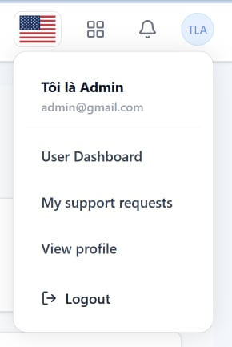
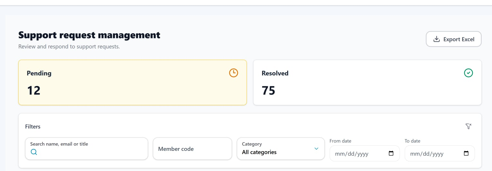
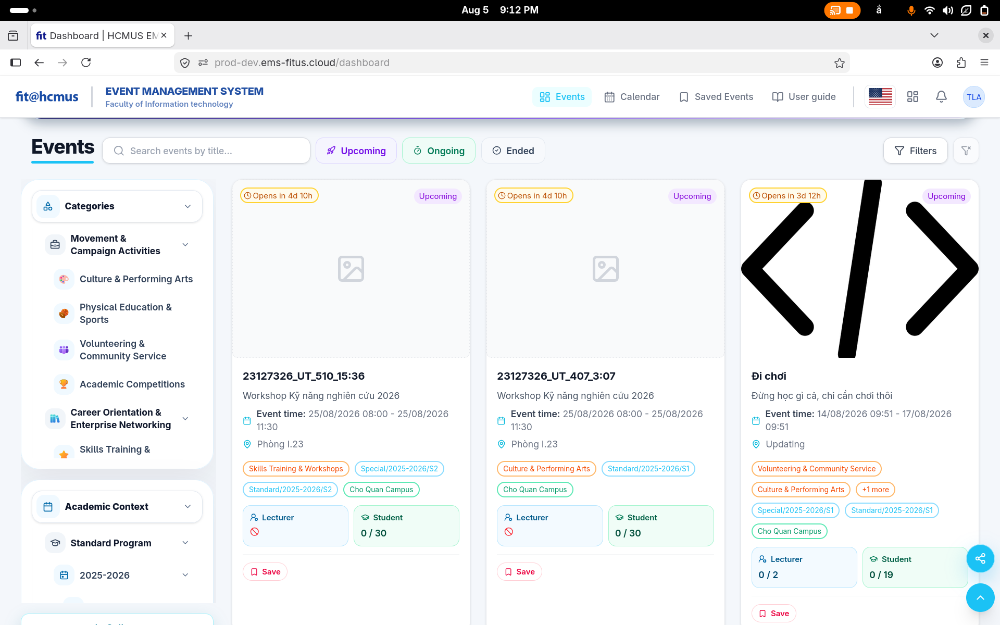
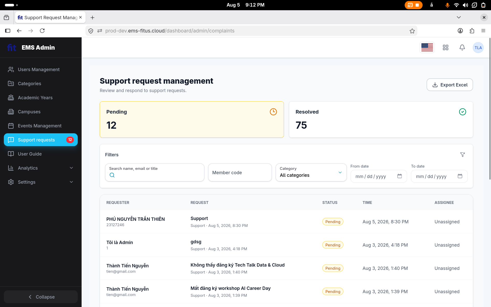

# Task 2 - Session Notes Template

File này dành cho người điều phối/interviewer ghi chú, không đưa participant tự điền. Participant chỉ đọc `../participant_brief.md`; các quan sát, metric, câu trả lời và SUS raw score sẽ do Lê Trung Kiên ghi lại trong file session tương ứng.

## 1. Thông tin phiên

| Trường             | Giá trị                                       |
| -------------------- | ----------------------------------------------- |
| Participant ID       | `P05`                                         |
| Họ tên             | Nguyễn Trần Thiên Phú                       |
| Số điện thoại    | 0948245045                                      |
| OS/browser           | Windows 11 - Chrome                             |
| Ngày giờ           | `2026-08-05 20:28`                            |
| Người điều phối | Lê Trung Kiên                                 |
| Scenario             | D - User requests Support and Admin resolves it |
| Consent              | Yes                                             |
| Recording            | `N/A`                                         |

## 2. Setup đã đưa cho participant

| Hạng mục         | Giá trị                                                         |
| ------------------ | ----------------------------------------------------------------- |
| Participant brief  | `../participant_brief.md`                         |
| Website EMS        | `https://prod-dev.ems-fitus.cloud`                              |
| User account D1-D2 | `ltkien23@clc.fitus.edu.vn` / `Nothing2k@5`                   |
| Admin account D3   | `admin@gmail.com` / `Admin@123`                               |
| Màn hình D1      | User tạo support request có image attachment                    |
| Màn hình D2      | User xem My Requests list/detail có response                     |
| Màn hình D3      | Admin xem Support Requests list, Pending/Resolved tabs và search |

Ghi chú kiểm soát:

- Không hướng dẫn từng cú click.
- Chỉ can thiệp nếu participant bị kẹt hoàn toàn.
- Không để participant đổi mật khẩu, email, profile hoặc sửa dữ liệu ngoài phạm vi test.
- Với D3, nếu không muốn đưa admin password cho participant, người điều phối đăng nhập sẵn admin session rồi cho participant thao tác dưới giám sát.

## 3. Task scenario đã đọc cho participant

```text
Bạn đang dùng hệ thống EMS của khoa. Bạn gặp một vấn đề khi tham gia hoặc đăng ký sự kiện và muốn gửi yêu cầu hỗ trợ kèm ảnh minh chứng.

Hãy gửi một yêu cầu hỗ trợ, sau đó kiểm tra lại yêu cầu của mình trong danh sách support requests và cho biết bạn thấy trạng thái/phản hồi ở đâu.
```

Phần admin D3:

```text
Sau khi trải nghiệm phía user, hãy dùng màn hình admin đã được chuẩn bị để tìm request theo tiêu đề, member code, category hoặc trạng thái, rồi cho biết bạn tìm thấy request ở tab nào.
```

## 4. Checklist quan sát nhanh

| Màn hình                              | Hoàn tất?   | Quan sát chính                                                                                                                      | Lỗi/nhầm lẫn                                                                                                                                            | Do dự                                                                             | Có can thiệp? |
| --------------------------------------- | ------------- | ------------------------------------------------------------------------------------------------------------------------------------- | ---------------------------------------------------------------------------------------------------------------------------------------------------------- | ---------------------------------------------------------------------------------- | --------------- |
| D1 - Create support request             | `Completed` | Tạo được support request; participant hiểu form nhưng xem đây là bước chậm nhất.                                         | Không gặp lỗi thao tác rõ rệt.                                                                                                                       | 1 - Chậm ở bước tạo request.                                                  | `Không`      |
| D2 - My Requests/detail                 | `Completed` | Tìm lại được request vừa tạo vì request nằm ở đầu danh sách và thấy trạng thái`Pending`.                           | Không gặp lỗi thao tác rõ rệt.                                                                                                                       | 0 - Không do dự đáng kể.                                                      | `Không`      |
| D3 - Admin Support Requests list/search | `Completed` | Tìm được request trong admin, nhưng bị lẫn giữa danh sách support request của user và khu vực xử lý request của admin. | Menu/tên mục trong admin vẫn có`User Dashboard` và `My support requests`; filter trạng thái dễ bị hiểu như card tổng quan hơn là filter. | 2 - Do dự khi xác định đúng khu vực admin và cách lọc theo trạng thái. | `Không`      |

## 5. Timeline/quan sát chi tiết

| Thời điểm | Màn hình | Hành động/quan sát                                                                                                                                          | Có lỗi/nhầm lẫn? | Có do dự? | Quote/ghi chú                                                              |
| ------------ | ---------- | --------------------------------------------------------------------------------------------------------------------------------------------------------------- | -------------------- | ----------- | --------------------------------------------------------------------------- |
| 00:00        | Start      | Bắt đầu task.                                                                                                                                                | No                   | No          |                                                                             |
| 00:25        | D1         | Hoàn tất tạo support request; participant trả lời đây là bước làm chậm nhất.                                                                       | No                   | Yes         | `Tạo request`                                                            |
| 00:29        | D2         | Mở danh sách request phía user, tìm lại được request vừa tạo vì nằm ở đầu và xác nhận hệ thống đã ghi nhận nhờ trạng thái`Pending`. | No                   | No          | `Có. Nằm trên đầu`; `Có. Vì có status Pending`                  |
| 01:50        | D3         | Tìm request trong admin; participant bị lẫn sang danh sách support request của user và nhận xét filter status dễ gây nhầm lẫn.                      | Yes                  | Yes         | `Lộn qua danh sách request user`; `Filter status dễ gây nhầm lẫn` |

## 6. Kết quả task

| Metric        | Giá trị                                                                                                                                                                                                                                                    |
| ------------- | ------------------------------------------------------------------------------------------------------------------------------------------------------------------------------------------------------------------------------------------------------------ |
| Success       | `Completed`                                                                                                                                                                                                                                                |
| Time on task  | 01:50                                                                                                                                                                                                                                                        |
| Errors        | 2                                                                                                                                                                                                                                                            |
| Hesitations   | 3                                                                                                                                                                                                                                                            |
| Interventions | `Không`                                                                                                                                                                                                                                                   |
| Key friction  | Participant chậm nhất ở bước tạo request; ở D3, admin navigation còn lẫn với luồng user, filter status tách khỏi cụm filter còn lại nên dễ bị hiểu như card tổng quan, và participant ghi nhận giao diện user/admin chưa đồng nhất về màu sắc, đặc biệt sidebar user sáng còn sidebar admin tối. |
| Evidence      | `image/P05_session_notes/1785938625303.png`; `image/P05_session_notes/1785938635976.png`                                                                                                   |

## 7. Câu trả lời sau task

| Câu hỏi                                                                                                   | Trả lời participant                                                                                                                  |
| ----------------------------------------------------------------------------------------------------------- | -------------------------------------------------------------------------------------------------------------------------------------- |
| Phần nào giúp bạn hiểu đang cần làm gì? Phần nào gây khó hiểu?                                | Dễ hiểu: Các tab trong drop down khi ấn vào profile<br />Khó hiểu: Bên admin bị lộn qua danh sách support request của user |
| Nếu nhập sai hoặc muốn quay lại, bạn có thấy cách sửa/khôi phục rõ không?                     | Không sửa được. Trở về thì dễ                                                                                                 |
| Bước nào làm bạn chậm nhất?                                                                          | Tạo request                                                                                                                           |
| Sau khi gửi request hoặc xem response, bạn có tin là hệ thống đã ghi nhận/xử lý chưa? Vì sao? | Có. Vì có status Pending                                                                                                            |
| Bạn có dễ tìm lại request vừa tạo không?                                                            | Có. Nằm trên đầu                                                                                                                  |
| Nếu phải tìm request để xử lý, bạn sẽ dùng title, member code, category hay status?               | Status > category > title > member code                                                                                                |
| Ở D3, bạn có tìm được đúng request trong Pending/Resolved tab không?                              | Dễ. Filter status dễ gây nhầm lẫn                                                                                                |
| Bạn có nhận thấy vấn đề nào về layout mobile/desktop không?                                       | Giao diện màu sắc giữa user và admin không đồng nhất; sidebar của user màu sáng còn sidebar của admin màu tối.                  |

## 8. SUS raw score

| Điểm | Ý nghĩa             |
| -----: | --------------------- |
|      1 | Rất không đồng ý |
|      2 | Không đồng ý      |
|      3 | Trung lập            |
|      4 | Đồng ý             |
|      5 | Rất đồng ý        |

| Mã             | Câu hỏi                                                                                                                  | Điểm 1-5 |
| --------------- | -------------------------------------------------------------------------------------------------------------------------- | ---------: |
| SUS-01          | Tôi nghĩ tôi muốn sử dụng hệ thống này thường xuyên nếu có nhu cầu gửi hoặc theo dõi yêu cầu hỗ trợ. |          3 |
| SUS-02          | Tôi thấy hệ thống này phức tạp không cần thiết.                                                                  |          2 |
| SUS-03          | Tôi thấy hệ thống này dễ sử dụng.                                                                                  |          3 |
| SUS-04          | Tôi nghĩ tôi cần người có kỹ thuật hỗ trợ thì mới dùng được hệ thống này.                              |          2 |
| SUS-05          | Tôi thấy các chức năng trong flow support request được liên kết với nhau hợp lý.                              |          4 |
| SUS-06          | Tôi thấy hệ thống có quá nhiều điểm không nhất quán.                                                           |          5 |
| SUS-07          | Tôi nghĩ hầu hết mọi người có thể học cách dùng flow này rất nhanh.                                          |          2 |
| SUS-08          | Tôi thấy hệ thống này rườm rà hoặc bất tiện khi sử dụng.                                                      |          3 |
| SUS-09          | Tôi cảm thấy tự tin khi sử dụng flow support request này.                                                           |          4 |
| SUS-10          | Tôi cần học thêm nhiều thứ trước khi có thể sử dụng flow này thành thạo.                                    |          2 |
| SUS score 0-100 | `50.0`                                                                                                                   |            |

## 9. Candidate findings từ phiên này

| ID tạm    | Screen    | Type          | Description                                                                                                                                                                                                                                          | Evidence                                                                                                                                   | Severity 0-4 | Có submit Google Form? |
| ---------- | --------- | ------------- | ---------------------------------------------------------------------------------------------------------------------------------------------------------------------------------------------------------------------------------------------------- | ------------------------------------------------------------------------------------------------------------------------------------------ | -----------: | ----------------------- |
| UT-P05-001 | `D3`    | `Usability` | Khi đăng nhập bằng admin, menu tài khoản vẫn hiển thị các lựa chọn mang tính user như`User Dashboard` và `My support requests`, làm participant lẫn giữa danh sách request của user và khu vực xử lý request của admin. | `image/P05_session_notes/1785938625303.png`; ghi chú: `Lộn qua danh sách request user`               |            2 | `No`                  |
| UT-P05-002 | `D3`    | `Usability` | Trong màn hình admin, trạng thái`Pending`/`Resolved` nằm dạng card phía trên thay vì cùng cụm filter, khiến participant dễ hiểu đây là thống kê tổng quan hơn là bộ lọc trạng thái.                                    | `image/P05_session_notes/1785938635976.png`; participant trả lời: `Filter status dễ gây nhầm lẫn` |            2 | `No`                  |
| UT-P05-003 | `D2/D3` | `Usability` | Giao diện màu sắc giữa dashboard user và admin chưa đồng nhất: sidebar/filter phía user dùng nền sáng, trong khi sidebar admin dùng nền tối, làm hai khu vực có cảm giác thuộc hai hệ giao diện khác nhau. | `image/P05_session_notes/1785939135603.png`; `image/P05_session_notes/1785939155583.png`; participant trả lời: `Layout user và admin không đồng nhất` |            1 | `No`                  |

- Lẫn lộn danh sách support request của user và admin khi đăng nhập bằng admin



- Danh sách support requests bên admin, filter status nên nằm chung với các filter còn lại vì user có thể không để ý nó là filter mà chỉ là overview.



- Giao diện màu sắc giữa dashboard user và admin không đồng nhất: sidebar của user màu sáng, sidebar của admin màu tối.




