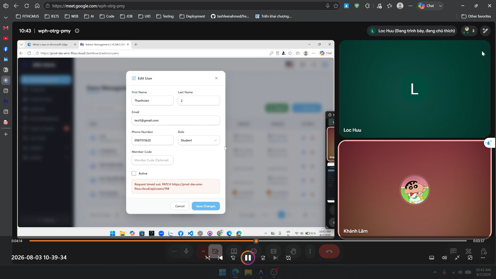
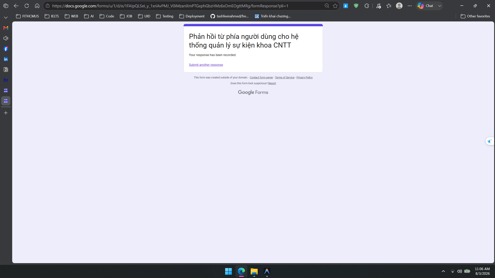
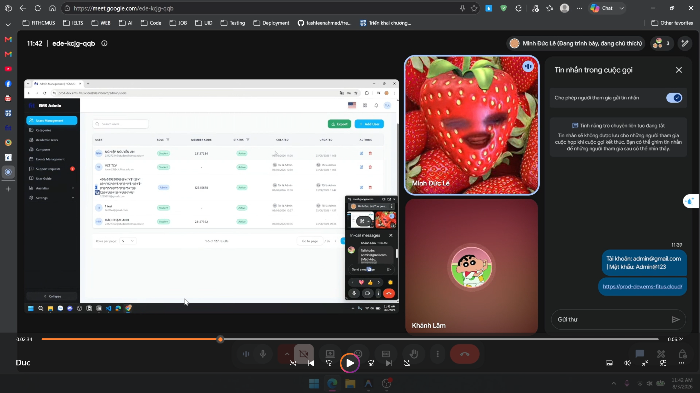
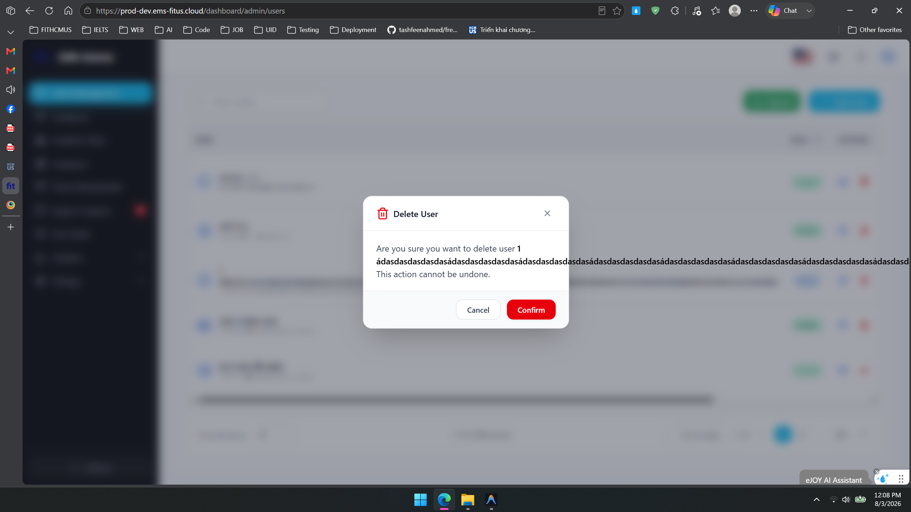
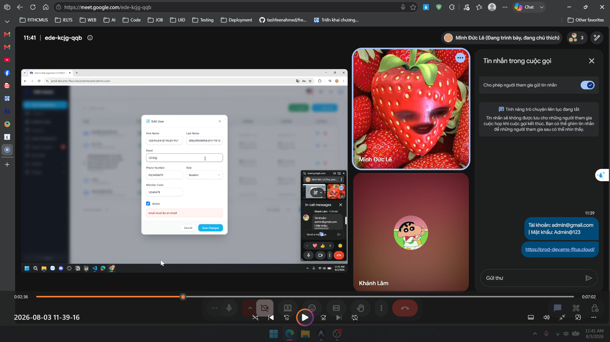
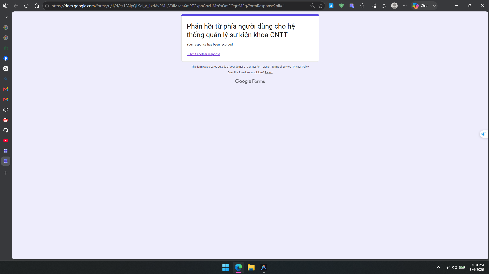
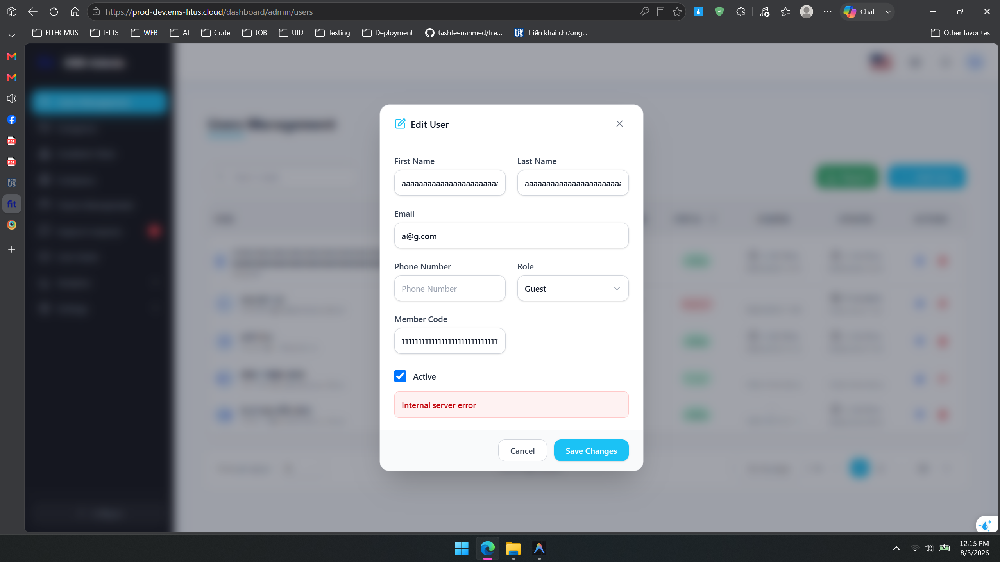
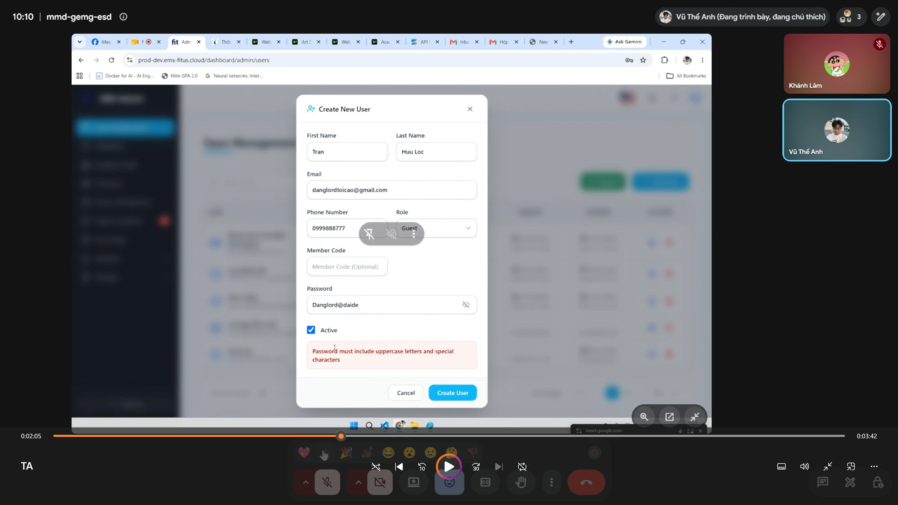
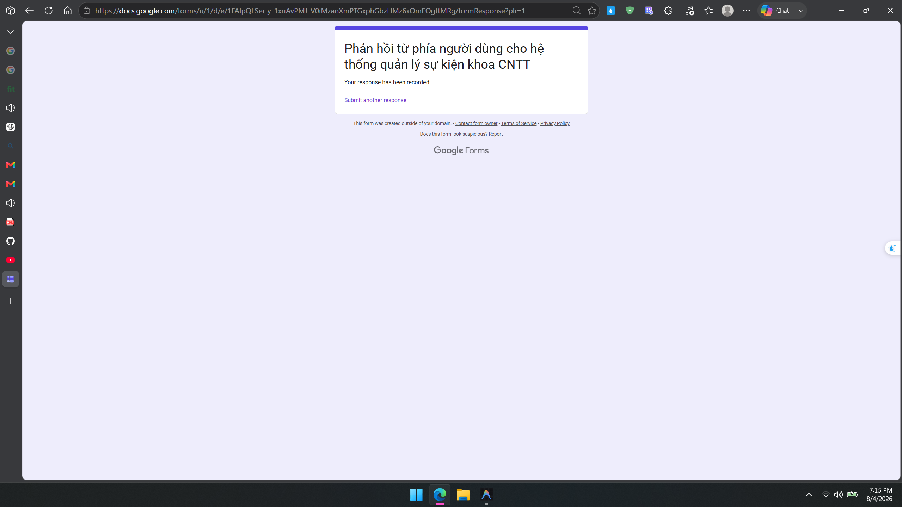

# Log tổng hợp bug và usability findings

| Trường      | Giá trị                             |
| ----------- | ----------------------------------- |
| Sinh viên   | Lâm Hữu Khánh - 23127205            |
| Kịch bản    | C - Admin quản lý người dùng        |
| Google Form | https://forms.gle/CJQFQCAXcsDbXDMM9 |

Mọi defect hoặc đề xuất cải thiện tính khả dụng từ checklist execution, user testing và cross-platform testing phải xuất hiện ở cả file này và Google Form. Cột `Timestamp form` là khóa đối chiếu.

## Thang mức độ nghiêm trọng

| Mức độ | Ý nghĩa                                                                         |
| ------ | ------------------------------------------------------------------------------- |
| 1      | Lỗi thẩm mỹ hoặc gây khó chịu nhẹ                                               |
| 2      | Vấn đề usability nhỏ, có workaround                                             |
| 3      | Vấn đề lớn gây chậm, nhầm lẫn hoặc lỗi thao tác đáng kể                         |
| 4      | Vấn đề nghiêm trọng chặn hoàn thành nhiệm vụ hoặc có rủi ro mất dữ liệu/bảo mật |

## Bảng tổng hợp finding

| ID     | Màn hình                              | Loại      | Mức độ | Tóm tắt                                                                                          | Timestamp form                     |
| ------ | ------------------------------------- | --------- | ------ | ------------------------------------------------------------------------------------------------ | ---------------------------------- |
| C-F001 | C1 Danh sách người dùng               | Usability | 3      | Layout Users Management không responsive tốt trên mobile/tablet.                                 | Phản ánh lúc 22:43 ngày 02/08/2026 |
| C-F002 | C1 Danh sách người dùng               | Usability | 2      | Empty state search thiếu hành động phục hồi.                                                     | Phản ánh lúc 22:45 ngày 02/08/2026 |
| C-F003 | C2 Gán vai trò / chỉnh sửa người dùng | Usability | 3      | Dialog Edit User/admin layout không responsive tốt trên mobile/tablet.                           | Phản ánh lúc 22:49 ngày 02/08/2026 |
| C-F004 | C2 Gán vai trò / chỉnh sửa người dùng | Usability | 2      | Add User form đảo placeholder/thông báo lỗi First Name và Last Name.                             | Phản ánh lúc 22:50 ngày 02/08/2026 |
| C-F005 | C2 Gán vai trò / chỉnh sửa người dùng | Usability | 2      | Password validation không nhất quán và lỗi tiếng Anh khi đang ở VI.                              | Phản ánh lúc 22:51 ngày 02/08/2026 |
| C-F006 | C2 Gán vai trò / chỉnh sửa người dùng | Bug       | 3      | Email validation cho phép submit email không hợp lệ dạng `@g`.                                   | Phản ánh lúc 22:54 ngày 02/08/2026 |
| C-F007 | C2 Gán vai trò / chỉnh sửa người dùng | Usability | 2      | Phone Number thiếu gợi ý quy tắc 10 số bắt đầu bằng 0.                                           | Phản ánh lúc 22:55 ngày 02/08/2026 |
| C-F008 | C2 Gán vai trò / chỉnh sửa người dùng | Usability | 2      | Phone Number cho nhập chữ, chỉ báo lỗi sau submit.                                               | Phản ánh lúc 22:57 ngày 02/08/2026 |
| C-F009 | C2 Gán vai trò / chỉnh sửa người dùng | Usability | 2      | Role dropdown cho chọn placeholder như option thật rồi mới báo lỗi.                              | Phản ánh lúc 22:58 ngày 02/08/2026 |
| C-F010 | C2 Gán vai trò / chỉnh sửa người dùng | Usability | 3      | Xóa user rồi tạo lại email cũ báo`email already use` bằng tiếng Anh.                             | Phản ánh lúc 22:58 ngày 02/08/2026 |
| C-F011 | C2 Gán vai trò / chỉnh sửa người dùng | Usability | 2      | Member Code trùng được chặn đúng nhưng lỗi hiển thị tiếng Anh khi đang ở VI.                     | Phản ánh lúc 22:59 ngày 02/08/2026 |
| C-F012 | C3 Block/Unblock và Reset Password    | Usability | 3      | Block/Unblock bị biểu diễn mơ hồ qua Active/Inactive và không thấy Reset Password action.        | Phản ánh lúc 23:00 ngày 02/08/2026 |
| C-F013 | C3 Block/Unblock và Reset Password    | Usability | 3      | Đổi trạng thái Active/Inactive thiếu xác nhận nguy hiểm riêng.                                   | Phản ánh lúc 23:01 ngày 02/08/2026 |
| C-F014 | C2/C3 Chỉnh sửa user và Active status | Bug       | 3      | Sau khi đổi email rồi chỉnh Active/Inactive, request PATCH cập nhật user bị timed out.           | Phản ánh lúc 11:07 ngày 03/08/2026 |
| C-F015 | C2 chỉnh sửa user; delete dialog      | Bug       | 3      | Tên hoặc email quá dài được hệ thống chấp nhận, dẫn đến tràn UI trong user UI và dialog.         | Phản ánh lúc 19:08 ngày 04/08/2026 |
| C-F016 | C2 Gán vai trò / chỉnh sửa người dùng | Bug       | 2      | Email dài dạng `@g.com` bị báo sai `email must be an email` dù email ngắn cùng domain hợp lệ.    | Phản ánh lúc 19:10 ngày 04/08/2026 |
| C-F017 | C2 Gán vai trò / chỉnh sửa người dùng | Bug       | 3      | Member Code quá dài không bị validate và gây lỗi Internal Server Error.                          | Phản ánh lúc 19:12 ngày 04/08/2026 |
| C-F018 | C2 Gán vai trò / chỉnh sửa người dùng | Bug       | 2      | Cảnh báo Mật khẩu chỉ báo cần 8 ký tự, chữ hoa và ký tự đặc biệt nhưng vẫn lỗi nếu thiếu chữ số. | Phản ánh lúc 19:15 ngày 04/08/2026 |

## Chi tiết finding

### C-F001 - Layout Users Management không responsive tốt

**Nguồn:** Checklist execution C1

**Màn hình:** C1 Danh sách người dùng

**Loại:** Usability

**Mức độ:** 3

**Mô tả:** Layout Users Management không responsive tốt trên mobile 375x667 và iPad Pro 1024x1366.

**Bước tái hiện / minh chứng:**

1. Đăng nhập admin.
2. Mở Users Management trên viewport 375x667 hoặc iPad Pro 1024x1366.
3. Quan sát sidebar, header, table và pagination.

**Kết quả mong đợi:**

Mobile/tablet layout không làm mất nội dung, không che nút chính và không buộc cuộn ngang quá mức ngoài vùng bảng hợp lý.

**Kết quả thực tế:**

Trên mobile, sidebar vẫn chiếm phần lớn chiều ngang và nội dung chính bị ép hẹp; trên iPad Pro 1024x1366, layout bảng/sidebar cũng không thích ứng đúng.

**Đề xuất sửa:**

Dùng mobile/tablet drawer hoặc collapsed sidebar mặc định, cho table có responsive card layout hoặc horizontal scroll confined trong vùng bảng, không làm toàn trang tràn ngang.

**Ảnh minh chứng:**

**Timestamp form:**

Phản ánh lúc 22:43 ngày 02/08/2026

### C-F002 - Empty state search thiếu hành động phục hồi

**Nguồn:** Checklist execution C1

**Màn hình:** C1 Danh sách người dùng

**Loại:** Usability

**Mức độ:** 2

**Mô tả:** Empty state khi search không có kết quả thiếu hành động phục hồi rõ ràng.

**Bước tái hiện / minh chứng:**

1. Đăng nhập admin.
2. Vào Users Management.
3. Nhập `zzzz-no-user-23127205` vào Search users.

**Kết quả mong đợi:**

Empty state giải thích ngắn gọn và cung cấp hành động tiếp theo như Clear search hoặc Reset filters.

**Kết quả thực tế:**

Hệ thống hiển thị `No users found matching your filters.` nhưng không có nút Clear/Reset rõ ràng trong empty state.

**Đề xuất sửa:**

Thêm nút `Clear search` hoặc `Reset filters` ngay trong empty state và hiển thị tiêu chí đang áp dụng.

**Ảnh minh chứng:**

**Timestamp form:**
Phản ánh lúc 22:45 ngày 02/08/2026

### C-F003 - Dialog Edit User không responsive tốt

**Nguồn:** Checklist execution C2

**Màn hình:** C2 Gán vai trò / chỉnh sửa người dùng

**Loại:** Usability

**Mức độ:** 3

**Mô tả:** Dialog Edit User và admin layout không responsive tốt trên mobile 375x667 và iPad Pro 1024x1366.

**Bước tái hiện / minh chứng:**

1. Đăng nhập admin.
2. Vào Users Management trên viewport 375x667 hoặc iPad Pro 1024x1366.
3. Bấm Edit user ở dòng đầu tiên và quan sát dialog/nền admin.

**Kết quả mong đợi:**

Dialog chỉnh sửa user và nền admin không làm mất nội dung, không che hành động chính và không buộc cuộn ngang toàn trang trên mobile/tablet.

**Kết quả thực tế:**

Trên mobile, Playwright ghi nhận`scrollWidth=1018` trong viewport 375px; trên iPad Pro 1024x1366, layout/dialog cũng không thích ứng đúng.

**Đề xuất sửa:**

Dùng mobile/tablet drawer hoặc collapsed sidebar, giới hạn chiều rộng dialog bằng`max-width: calc(100vw - 32px)`, và cho bảng phía sau scroll trong container thay vì làm toàn trang tràn ngang.

**Ảnh minh chứng:**

**Timestamp form:**

Phản ánh lúc 22:49 ngày 02/08/2026

### C-F004 - Add User form đảo First Name và Last Name

**Nguồn:** Checklist execution C2

**Màn hình:** C2 Gán vai trò / chỉnh sửa người dùng

**Loại:** Usability

**Mức độ:** 2

**Mô tả:** Add User form đảo placeholder/thông báo lỗi giữa First Name và Last Name.

**Bước tái hiện / minh chứng:**

1. Đăng nhập admin.
2. Vào Users Management.
3. Bấm Add User.
4. Bấm Create User khi form trống trong lượt kiểm Playwright đã abort mọi request ghi dữ liệu.

**Kết quả mong đợi:**

Label, placeholder và validation message của từng trường phải khớp đúng ý nghĩa field để admin biết cần nhập gì và sửa lỗi nào.

**Kết quả thực tế:**

Trường label First Name hiển thị placeholder`Last Name` và lỗi `Last name is required`; trường label Last Name hiển thị placeholder `First Name` và lỗi `First name is required`.

**Đề xuất sửa:**

Sửa mapping label/placeholder/schema validation để First Name dùng placeholder và lỗi First Name, Last Name dùng placeholder và lỗi Last Name; thêm dấu hiệu required trước submit nếu có thể.

**Ảnh minh chứng:**

**Timestamp form:**

Phản ánh lúc 22:50 ngày 02/08/2026

### C-F005 - Password validation không nhất quán và chưa đồng bộ ngôn ngữ

**Nguồn:** Checklist execution C2

**Màn hình:** C2 Gán vai trò / chỉnh sửa người dùng

**Loại:** Usability

**Mức độ:** 2

**Mô tả:** Password validation không nhất quán giữa hướng dẫn ban đầu và lỗi sau khi nhập, đồng thời lỗi vẫn hiển thị tiếng Anh khi giao diện đang ở VI.

**Bước tái hiện / minh chứng:**

1. Chuyển giao diện sang VI.
2. Vào Users Management.
3. Bấm Add User.
4. Nhập password `12345678` và submit/ra khỏi trường để kích hoạt validation.

**Kết quả mong đợi:**

Form phải nêu đầy đủ password policy trước khi người dùng nhập và thông báo lỗi phải theo đúng ngôn ngữ đang chọn.

**Kết quả thực tế:**

Ban đầu form chỉ thể hiện yêu cầu tối thiểu 8 ký tự; sau khi nhập`12345678`, hệ thống báo thêm `Password must include uppercase letters and special characters` bằng tiếng Anh dù giao diện đang ở VI.

**Đề xuất sửa:**

Hiển thị helper text password policy đầy đủ ngay dưới trường Password; dịch toàn bộ validation message theo VI/EN đồng bộ với nút đổi ngôn ngữ.

**Ảnh minh chứng:**

**Timestamp form:**

Phản ánh lúc 22:51 ngày 02/08/2026

### C-F006 - Email validation cho phép email `@g`

**Nguồn:** Checklist execution C2

**Màn hình:** C2 Gán vai trò / chỉnh sửa người dùng

**Loại:** Bug

**Mức độ:** 3

**Mô tả:** Email validation cho phép submit thành công với email không hợp lệ dạng `@g`.

**Bước tái hiện / minh chứng:**

1. Vào Users Management.
2. Bấm Add User hoặc Edit User.
3. Nhập email `@g` cùng các trường bắt buộc khác hợp lệ.
4. Submit form.

**Kết quả mong đợi:**

Form phải chặn email sai định dạng và hiển thị lỗi rõ ràng trước khi gửi dữ liệu.

**Kết quả thực tế:**

Hệ thống vẫn cho submit thành công dù email chỉ là`@g`, không đủ định dạng email hợp lệ.

**Đề xuất sửa:**

Bổ sung validation email ở cả client và server theo định dạng email hợp lệ; hiển thị thông báo lỗi ngay tại trường Email và không cho lưu khi email không hợp lệ.

**Ảnh minh chứng:**

**Timestamp form:**

Phản ánh lúc 22:54 ngày 02/08/2026

### C-F007 - Phone Number thiếu gợi ý định dạng

**Nguồn:** Checklist execution C2

**Màn hình:** C2 Gán vai trò / chỉnh sửa người dùng

**Loại:** Usability

**Mức độ:** 2

**Mô tả:** Phone Number field không giải thích trước quy tắc số điện thoại phải gồm 10 số và bắt đầu bằng 0.

**Bước tái hiện / minh chứng:**

1. Vào Users Management.
2. Bấm Add User hoặc Edit User.
3. Quan sát trường Phone Number trước khi nhập hoặc nhập sai định dạng để thấy rule chỉ xuất hiện muộn/không được gợi ý rõ.

**Kết quả mong đợi:**

Field Phone Number nên nêu rõ định dạng hợp lệ trước khi admin nhập, ví dụ 10 chữ số và bắt đầu bằng 0.

**Kết quả thực tế:**

Placeholder chỉ là`Phone Number`, không có helper text về rule 10 số/bắt đầu bằng 0, khiến admin phải đoán hoặc thử sai.

**Đề xuất sửa:**

Thêm helper text hoặc placeholder cụ thể như`VD: 0912345678 - 10 số, bắt đầu bằng 0`; nếu nhập sai, thông báo lỗi cần nói rõ quy tắc và giữ lại dữ liệu đã nhập.

**Ảnh minh chứng:**

**Timestamp form:**
Phản ánh lúc 22:55 ngày 02/08/2026

### C-F008 - Phone Number cho nhập chữ

**Nguồn:** Checklist execution C2

**Màn hình:** C2 Gán vai trò / chỉnh sửa người dùng

**Loại:** Usability

**Mức độ:** 2

**Mô tả:** Phone Number field cho phép nhập ký tự chữ, chỉ báo lỗi sau khi submit.

**Bước tái hiện / minh chứng:**

1. Vào Users Management.
2. Bấm Add User hoặc Edit User.
3. Nhập chữ vào trường Phone Number.
4. Submit form.

**Kết quả mong đợi:**

Trường Phone Number nên hạn chế hoặc cảnh báo sớm khi người dùng nhập ký tự không phải số, trước khi submit.

**Kết quả thực tế:**

Field vẫn nhận ký tự chữ; hệ thống chỉ báo lỗi sau khi submit nên admin phải sửa theo kiểu thử-sai.

**Đề xuất sửa:**

Dùng input mode numeric/tel, lọc ký tự không hợp lệ hoặc validate inline khi blur/typing; vẫn giữ validation server-side khi submit.

**Ảnh minh chứng:**

**Timestamp form:**

Phản ánh lúc 22:57 ngày 02/08/2026

### C-F009 - Role dropdown cho chọn placeholder

**Nguồn:** Checklist execution C2

**Màn hình:** C2 Gán vai trò / chỉnh sửa người dùng

**Loại:** Usability

**Mức độ:** 2

**Mô tả:** Role dropdown hiển thị placeholder chọn vai trò cùng cấp với các role thật và cho chọn rồi mới báo lỗi.

**Bước tái hiện / minh chứng:**

1. Vào Users Management.
2. Bấm Add User hoặc Edit User.
3. Mở dropdown Role.
4. Chọn option placeholder như `Phần chọn vai trò`/`Select a Role`.
5. Submit form.

**Kết quả mong đợi:**

Placeholder của dropdown Role chỉ nên là gợi ý không chọn được, hoặc nếu chọn lại thì phải được xử lý như trạng thái rỗng rõ ràng trước submit.

**Kết quả thực tế:**

Placeholder nằm cùng cấp với Admin/Guest/Lecturer/Student hoặc Sinh viên/Giảng viên và có thể chọn; hệ thống chỉ báo lỗi sau khi submit.

**Đề xuất sửa:**

Đặt placeholder Role thành option disabled/hidden, hiển thị helper text`Chọn một vai trò hợp lệ`, và validate inline khi dropdown quay về giá trị rỗng.

**Ảnh minh chứng:**

**Timestamp form:**

Phản ánh lúc 22:58 ngày 02/08/2026

### C-F010 - Email của user đã xóa vẫn báo đang dùng

**Nguồn:** Checklist execution C2

**Màn hình:** C2 Gán vai trò / chỉnh sửa người dùng

**Loại:** Usability

**Mức độ:** 3

**Mô tả:** Sau khi xóa user, tạo user mới bằng email của user đã xóa vẫn báo`email already use` và lỗi hiển thị tiếng Anh khi giao diện đang VI.

**Bước tái hiện / minh chứng:**

1. Chuyển giao diện sang VI.
2. Xóa một user trong Users Management.
3. Bấm Add User.
4. Nhập email của user vừa xóa cùng các trường bắt buộc hợp lệ.
5. Submit form.

**Kết quả mong đợi:**

Nếu email sau khi xóa không được tái sử dụng, UI phải giải thích rõ đây là soft delete/định danh bị giữ; thông báo lỗi phải hiển thị bằng tiếng Việt.

**Kết quả thực tế:**

Hệ thống báo`email already use` bằng tiếng Anh dù giao diện đang ở VI, và không giải thích email của user đã xóa có bị giữ lại hay cách khôi phục.

**Đề xuất sửa:**

Làm rõ hậu quả trong dialog xóa user; nếu giữ email do soft delete, cung cấp đường khôi phục hoặc thông báo tiếng Việt rõ ràng; nếu delete thật, giải phóng email sau khi xóa.

**Ảnh minh chứng:**

**Timestamp form:**

Phản ánh lúc 22:58 ngày 02/08/2026

### C-F011 - Member Code trùng báo lỗi tiếng Anh khi đang ở VI

**Nguồn:** Checklist execution C2

**Màn hình:** C2 Gán vai trò / chỉnh sửa người dùng

**Loại:** Usability

**Mức độ:** 2

**Mô tả:** Member Code trùng được chặn đúng, nhưng thông báo lỗi hiển thị tiếng Anh khi giao diện đang VI.

**Bước tái hiện / minh chứng:**

1. Chuyển giao diện sang VI.
2. Vào Users Management.
3. Bấm Add User.
4. Nhập một Member Code đã được user khác dùng cùng các trường bắt buộc hợp lệ.
5. Submit form.

**Kết quả mong đợi:**

Hệ thống nên chặn Member Code đã tồn tại và hiển thị thông báo lỗi theo đúng ngôn ngữ đang chọn.

**Kết quả thực tế:**

Hệ thống chặn đúng Member Code đã tồn tại nhưng hiển thị `this member code is already in use` bằng tiếng Anh dù giao diện đang ở VI.

**Đề xuất sửa:**

Dịch validation message Member Code sang tiếng Việt khi giao diện ở VI, ví dụ`Mã thành viên này đã được sử dụng`; giữ logic chặn trùng ở client/server.

**Ảnh minh chứng:**

**Timestamp form:**

Phản ánh lúc 22:59 ngày 02/08/2026

### C-F012 - Block/Unblock mơ hồ qua Active và thiếu Reset Password action

**Nguồn:** Checklist execution C3

**Màn hình:** C3 Hộp thoại chặn/bỏ chặn và đặt lại mật khẩu

**Loại:** Usability

**Mức độ:** 3

**Mô tả:** Theo phạm vi Scenario C, màn hình Users Management cần hỗ trợ Block/Unblock và Reset Password dialogs. Trong lượt kiểm Playwright, UI có trạng thái Active/Inactive và checkbox Active trong Edit User, có thể là cơ chế Block/Unblock hiện tại, nhưng wording không nói rõ điều đó; đồng thời không thấy action Reset Password riêng.

**Bước tái hiện / minh chứng:**

1. Đăng nhập EMS bằng tài khoản admin.
2. Vào `https://prod-dev.ems-fitus.cloud/dashboard/admin/users`.
3. Quan sát cột Actions của các dòng user.
4. Bấm Edit user ở dòng đầu tiên.
5. Quan sát các control trong dialog Edit User.

**Kết quả mong đợi:**

Admin phải thấy action/label rõ ràng cho Block/Unblock và Reset Password, hoặc UI phải giải thích trực tiếp rằng Active/Inactive tương ứng với trạng thái unblock/block.

**Kết quả thực tế:**

Cột Actions chỉ có Edit/Delete; Edit User có checkbox Active nhưng không giải thích Active/Inactive là Block/Unblock hay hậu quả khi đổi trạng thái. Không thấy Reset Password action.

**Đề xuất sửa:**

Thêm action riêng `Block`/`Unblock` và `Reset Password`, hoặc đổi wording/helper text để Active/Inactive được hiểu rõ là trạng thái block/unblock; Reset Password cần có entry point và confirmation dialog riêng.

**Ảnh minh chứng:**

**Timestamp form:**

Phản ánh lúc 23:00 ngày 02/08/2026

### C-F013 - Active/Inactive thiếu xác nhận nguy hiểm riêng

**Nguồn:** Checklist execution C3

**Màn hình:** C3 Hộp thoại chặn/bỏ chặn và đặt lại mật khẩu

**Loại:** Usability

**Mức độ:** 3

**Mô tả:** Checkbox Active trong Edit User phản ánh trạng thái tài khoản hiện tại: user Active được tick và user Inactive không được tick. Tuy nhiên thao tác đổi trạng thái Active/Inactive có thể ảnh hưởng quyền truy cập của user nhưng không có confirmation riêng trước khi lưu.

**Bước tái hiện / minh chứng:**

1. Đăng nhập EMS bằng tài khoản admin.
2. Vào Users Management.
3. Lọc Status = Inactive.
4. Bấm Edit user ở một dòng Inactive.
5. Quan sát checkbox Active đang không được tick và nút Save Changes.
6. Không bấm Save trong lượt kiểm an toàn để tránh thay đổi dữ liệu thật.

**Kết quả mong đợi:**

Thao tác đổi trạng thái tài khoản phải có label trực tiếp như `Block user`/`Unblock user` hoặc helper text nêu hậu quả, đồng thời có confirmation dialog trước khi lưu.

**Kết quả thực tế:**

UI chỉ có checkbox `Active` trong Edit User; với user Inactive checkbox không được tick đúng trạng thái, nhưng UI không giải thích trạng thái này ảnh hưởng quyền truy cập thế nào và không có confirmation riêng trước nút Save Changes.

**Đề xuất sửa:**

Tách Block/Unblock khỏi form Edit User thành action riêng hoặc bổ sung confirmation khi checkbox Active thay đổi; dialog cần hiển thị tên/email user, trạng thái trước-sau và hậu quả đăng nhập.

**Ảnh minh chứng:**

**Timestamp form:**

Phản ánh lúc 23:01 ngày 02/08/2026

### C-F014 - PATCH cập nhật user bị timed out sau khi đổi email và Active/Inactive

**Nguồn:** Task 2 user testing Scenario C - IA-04 Feedback / State

**Màn hình:** C2/C3 Chỉnh sửa user và trạng thái Active/Inactive

**Loại:** Bug

**Mức độ:** 3

**Mô tả:** Trong phiên phỏng vấn người dùng Task 2, khi participant thao tác chỉnh email ban đầu của một user rồi tiếp tục thay đổi trạng thái Active/Inactive, request `PATCH` để cập nhật user bị lỗi timed out. Đây là lỗi kỹ thuật trong luồng cập nhật user, làm người dùng/admin không biết thao tác đã được lưu hay chưa.

**Bước tái hiện / minh chứng:**

1. Đăng nhập EMS bằng tài khoản admin.
2. Vào Users Management.
3. Chọn một user test an toàn và mở Edit User.
4. Thay đổi email hiện tại của user sang một email hợp lệ khác.
5. Thay đổi trạng thái Active/Inactive của user.
6. Lưu thay đổi.
7. Quan sát request `PATCH` trong Network tab hoặc thông báo lỗi trên giao diện trong phiên user testing.

**Kết quả mong đợi:**

Hệ thống phải cập nhật email và trạng thái Active/Inactive thành công, hoặc nếu không thể cập nhật thì phải trả về lỗi rõ ràng, không để request bị timed out.

**Kết quả thực tế:**

Request `PATCH` cập nhật user bị timed out sau khi thay đổi email rồi chỉnh Active/Inactive trong phiên phỏng vấn người dùng. Participant/admin không nhận được phản hồi đáng tin cậy để biết thao tác đã lưu thành công hay thất bại.

**Đề xuất sửa:**

Kiểm tra API cập nhật user khi payload chứa đồng thời email mới và trạng thái Active/Inactive; bổ sung timeout handling, rollback hoặc thông báo lỗi rõ ràng. UI nên disable nút Save khi request đang chạy và hiển thị trạng thái thất bại có thể thử lại.

**Ảnh minh chứng:**

**Timestamp form:**

Phản ánh lúc 11:07 ngày 03/08/2026

### C-F015 - Tên hoặc email quá dài được chấp nhận và làm tràn UI

**Nguồn:** Task 2 user testing Scenario C - Participant P01

**Màn hình:** C2 Gán vai trò / chỉnh sửa người dùng; delete confirmation dialog

**Loại:** Bug

**Mức độ:** 3

**Mô tả:** Trong phiên phỏng vấn người dùng P01, participant nhập tên hoặc email quá dài trong form chỉnh sửa/tạo user. Hệ thống không kiểm tra giới hạn độ dài hoặc không chặn dữ liệu quá dài, vẫn chấp nhận giá trị này. Sau khi dữ liệu dài được lưu, nội dung user bị tràn UI khi hiển thị và tiếp tục làm tràn layout ở delete confirmation dialog.

**Bước tái hiện / minh chứng:**

1. Đăng nhập EMS bằng tài khoản admin.
2. Vào Users Management.
3. Mở Add User hoặc Edit User cho một user test an toàn.
4. Nhập tên hoặc email với chuỗi rất dài vượt quá độ dài hiển thị hợp lý.
5. Lưu thay đổi.
6. Quan sát hệ thống chấp nhận dữ liệu và hiển thị tên/email bị tràn UI trong form hoặc danh sách user.
7. Mở thao tác delete trên user có tên/email dài.
8. Quan sát delete confirmation dialog cũng bị tràn layout do hiển thị lại dữ liệu quá dài.

**Kết quả mong đợi:**

Hệ thống phải validate giới hạn độ dài cho tên/email, hiển thị lỗi rõ ràng nếu vượt quá giới hạn, hoặc ít nhất phải xử lý hiển thị bằng truncate/wrap để không làm vỡ layout.

**Kết quả thực tế:**

Hệ thống chấp nhận tên hoặc email quá dài mà không verify độ dài. Khi hiển thị lại, nội dung dài làm tràn UI ở màn hình quản lý user và delete confirmation dialog, ảnh hưởng khả năng đọc, xác nhận đúng target user và bố cục thao tác.

**Đề xuất sửa:**

Bổ sung validation độ dài tối đa cho First Name, Last Name và Email ở cả client/server; hiển thị thông báo lỗi tại field khi vượt quá giới hạn. Với dữ liệu đã tồn tại, UI nên dùng word-break, wrap hoặc truncate kèm tooltip ở danh sách user, form chỉnh sửa và các dialog xác nhận như delete để tránh tràn layout.

**Ảnh minh chứng:**

**Timestamp form:**

Phản ánh lúc 19:08 ngày 04/08/2026

### C-F016 - Email dài dạng @g.com bị báo lỗi email không hợp lệ không nhất quán

**Nguồn:** Task 2 user testing Scenario C - Participants P01/P02

**Màn hình:** C2 Gán vai trò / chỉnh sửa người dùng

**Loại:** Bug

**Mức độ:** 2

**Mô tả:** Trong phiên phỏng vấn người dùng P01/P02, participants gặp lỗi validation với email quá dài. Trong một trường hợp, khi participant nhập email rất dài có domain `@g.com`, hệ thống báo lỗi `email must be an email`. Tuy nhiên khi nhập email ngắn hơn với cùng domain `@g.com`, hệ thống lại chấp nhận là hợp lệ. Điều này cho thấy validation email không nhất quán và thông báo lỗi không phản ánh đúng nguyên nhân, vì vấn đề có vẻ liên quan đến độ dài nhưng message lại nói email không đúng định dạng.

**Bước tái hiện / minh chứng:**

1. Đăng nhập EMS bằng tài khoản admin.
2. Vào Users Management.
3. Mở Add User hoặc Edit User cho một user test an toàn.
4. Nhập email rất dài có domain `@g.com`.
5. Submit hoặc chuyển focus để quan sát validation.
6. Quan sát lỗi `email must be an email`.
7. Rút ngắn phần local-part của email nhưng vẫn giữ domain `@g.com`.
8. Quan sát email ngắn hơn lại được hệ thống chấp nhận.

**Kết quả mong đợi:**

Validation phải nhất quán. Nếu email vượt quá giới hạn độ dài, hệ thống cần báo lỗi về độ dài tối đa; nếu email đúng định dạng thì không nên báo `email must be an email`.

**Kết quả thực tế:**

Cùng domain `@g.com` nhưng email dài bị báo sai là không đúng định dạng, còn email ngắn lại được chấp nhận. Participant/admin khó hiểu rule thật sự của field Email.

**Đề xuất sửa:**

Tách rule validation email format và max length; hiển thị message đúng nguyên nhân, ví dụ email quá dài thì báo giới hạn ký tự. Đồng bộ validation ở client và server để cùng một giá trị không cho kết quả khác nhau theo nhánh xử lý.

**Ảnh minh chứng:**

**Timestamp form:**

Phản ánh lúc 19:10 ngày 04/08/2026

### C-F017 - Member Code quá dài không bị validate và gây Internal Server Error

**Nguồn:** Manual test Scenario C

**Màn hình:** C2 Gán vai trò / chỉnh sửa người dùng

**Loại:** Bug

**Mức độ:** 3

**Mô tả:** Trong quá trình kiểm tra thủ công, khi nhập Member Code quá dài, hệ thống không verify giới hạn độ dài trước khi submit. Sau khi gửi form, hệ thống trả lỗi Internal Server Error thay vì chặn input hoặc hiển thị lỗi validation rõ ràng tại field.

**Bước tái hiện / minh chứng:**

1. Đăng nhập EMS bằng tài khoản admin.
2. Vào Users Management.
3. Mở Add User hoặc Edit User cho một user test an toàn.
4. Nhập Member Code với chuỗi rất dài vượt quá độ dài hợp lý.
5. Submit form.
6. Quan sát hệ thống không chặn input trước khi gửi và trả lỗi Internal Server Error.

**Kết quả mong đợi:**

Hệ thống phải validate độ dài Member Code ở client/server, hiển thị lỗi rõ ràng tại field và không để lỗi server nội bộ lộ ra cho admin.

**Kết quả thực tế:**

Member Code quá dài được gửi lên server và gây Internal Server Error, làm admin không biết dữ liệu sai ở đâu và thao tác không hoàn tất đáng tin cậy.

**Đề xuất sửa:**

Bổ sung max-length cho Member Code ở UI và API; trả về lỗi validation 4xx có message rõ ràng thay vì lỗi 500/Internal Server Error. UI nên hiển thị lỗi tại field Member Code.

**Ảnh minh chứng:**

**Timestamp form:**

Đã phản ánh lúc 19:12 ngày 04/08/2026

### C-F018 - Thông báo gợi ý Mật khẩu không hiển thị đầy đủ điều kiện (thiếu chữ số)

**Nguồn:** Task 2 user testing Scenario C - Participants interview

**Màn hình:** C2 Gán vai trò / chỉnh sửa người dùng

**Loại:** Bug

**Mức độ:** 2

**Mô tả:** Trong phiên phỏng vấn người dùng thật, khi tạo/sửa người dùng, người tham gia quan sát cảnh báo tại trường Password và nhập đúng theo gợi ý (tối thiểu 8 ký tự, có chữ hoa và ký tự đặc biệt, ví dụ `Password!`). Tuy nhiên form vẫn báo lỗi không cho lưu. Chỉ sau khi thử nghiệm và tìm hiểu sâu mới biết hệ thống yêu cầu bắt buộc phải có thêm ít nhất 1 chữ số (digit), nhưng thông báo cảnh báo ban đầu không liệt kê tiêu chí này.

**Bước tái hiện / minh chứng:**

1. Đăng nhập EMS bằng tài khoản admin.
2. Vào Users Management -> Mở Add User hoặc Edit User dialog.
3. Nhập mật khẩu thỏa mãn cảnh báo ban đầu hiển thị: 8 ký tự, có chữ hoa, có ký tự đặc biệt (ví dụ `Password!`).
4. Quan sát hệ thống vẫn báo lỗi không cho submit form.
5. Thử nhập thêm chữ số vào mật khẩu (ví dụ `Password1!`).
6. Quan sát lúc này form mới chấp nhận mật khẩu hợp lệ.

**Kết quả mong đợi:**

Thông báo gợi ý/cảnh báo quy tắc mật khẩu phải minh bạch và liệt kê đầy đủ toàn bộ tiêu chí bắt buộc (tối thiểu 8 ký tự, 1 chữ hoa, 1 ký tự đặc biệt VÀ 1 chữ số).

**Kết quả thực tế:**

Thông báo gợi ý thiếu điều kiện chữ số, làm người dùng nhập đúng theo hướng dẫn hiển thị trên giao diện nhưng vẫn bị từ chối và bối rối không biết vì sao lỗi.

**Đề xuất sửa:**

Cập nhật thông báo gợi ý/lỗi của trường Password ở cả client và server hiển thị đầy đủ 4 điều kiện: độ dài >= 8, chữ hoa, ký tự đặc biệt và chữ số. Hiển thị live checklist các điều kiện thỏa mãn ngay khi người dùng đang nhập.

**Ảnh minh chứng:**

**Timestamp form:**

Đã phản ánh lúc 19:15 ngày 04/08/2026

