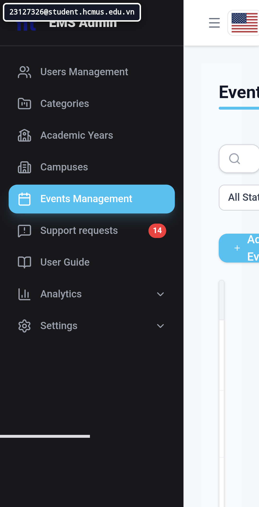
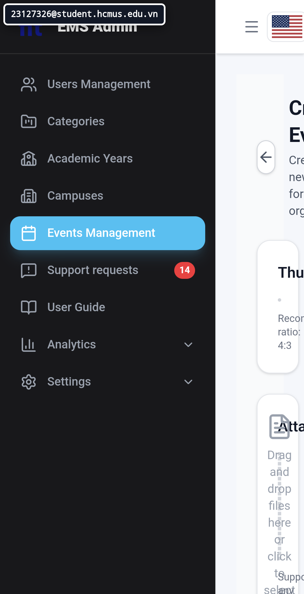
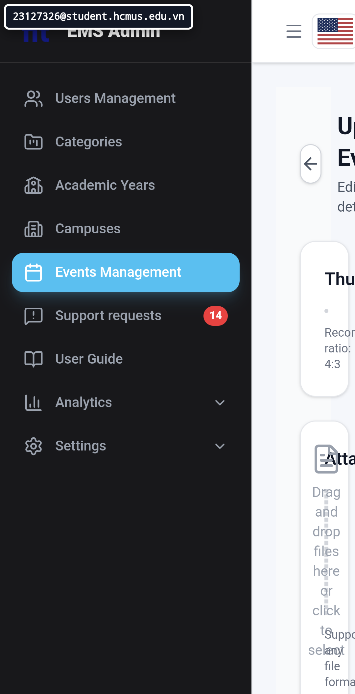

# Nhật ký lỗi và phát hiện về tính khả dụng - Kịch bản A

## 1. Quy tắc ghi nhật ký

- Mỗi lỗi hoặc đề xuất cải thiện tính khả dụng trong Task 1-3 phải được gửi lên Google Form: https://forms.gle/CJQFQCAXcsDbXDMM9
- Tệp này phải khớp số lượng và nội dung với Google Form.
- Không ghi phát hiện nếu chưa có bằng chứng thật từ EMS, kiểm thử người dùng hoặc lần chạy đa nền tảng.

## 2. Thang mức độ nghiêm trọng

| Mức độ nghiêm trọng | Ý nghĩa |
| ---: | --- |
| 0 | Lỗi thẩm mỹ, không ảnh hưởng tác vụ |
| 1 | Nhẹ, gây khó chịu nhẹ |
| 2 | Trung bình, làm chậm hoặc gây nhầm lẫn đáng kể |
| 3 | Nghiêm trọng, cản trở nhiều người dùng hoàn thành tác vụ |
| 4 | Chặn hoàn toàn, không thể hoàn thành tác vụ chính |

## 3. Nhật ký tổng hợp

| ID | Kịch bản/Màn hình | Loại | Mô tả | Các bước/Heuristic | Kết quả mong đợi | Kết quả thực tế | Mức độ nghiêm trọng | Đề xuất khắc phục | Ảnh minh chứng | Tác vụ nguồn | Thời điểm gửi biểu mẫu |
| --- | --- | --- | --- | --- | --- | --- | ---: | --- | --- | --- | --- |
| T1B-A1-01 | A1 Danh sách sự kiện | Tính khả dụng | Trạng thái tìm kiếm rỗng không có hành động đặt lại/xóa bộ lọc. | 1. Mở `Events`. 2. Nhập truy vấn không khớp sự kiện nào. 3. Quan sát trạng thái rỗng. | Trạng thái rỗng giải thích kết quả và có hành động `Reset`/xóa bộ lọc trực tiếp. | Thông báo giải thích không có sự kiện phù hợp nhưng không có hành động xóa truy vấn/bộ lọc. | 2 | Thêm nút `Reset filters` nổi bật trong trạng thái rỗng và trả tiêu điểm về ô tìm kiếm sau khi đặt lại. |  | Task 1B | Chờ đồng bộ sau khi Bảo gửi |
| T1B-A1-03 | A1 Danh sách sự kiện | Tính khả dụng | Bảng sự kiện yêu cầu cuộn ngang trong cửa sổ Safari 1171×768. | 1. Mở `Events` trong cửa sổ Safari 1171×768. 2. Quan sát bảng và cạnh dưới. | Các cột và hành động cốt lõi hiển thị mà không cần cuộn ngang không cần thiết. | Bảng rộng tràn ngang, che các cột/hành động phía sau cho đến khi người dùng cuộn ngang. | 2 | Ưu tiên cột cốt lõi, cho phép xuống dòng có kiểm soát và chuyển dữ liệu phụ sang phần chi tiết ở chiều rộng hẹp. |  | Task 1B | Chờ đồng bộ sau khi Bảo gửi |
| T1B-A1-04 | A1 Danh sách sự kiện | Lỗi | Bảng thông báo tiếng Anh còn văn bản tiếng Việt chưa dịch. | 1. Giữ giao diện ở tiếng Anh. 2. Mở `Notifications`. 3. Đọc các thông báo. | Toàn bộ nội dung thông báo dùng ngôn ngữ tiếng Anh đã chọn. | Bảng hiển thị `Phản hồi khiếu nại` trong khi phần giao diện xung quanh là tiếng Anh. | 1 | Đưa mọi mẫu thông báo qua cùng tài nguyên bản địa hóa và bổ sung kiểm thử hồi quy EN/VI. |  | Task 1B | Chờ đồng bộ sau khi Bảo gửi |
| T1B-A1-05 | A1 Danh sách sự kiện | Tính khả dụng | Hành động sự kiện chỉ có biểu tượng không hiển thị chú giải khi có tiêu điểm. | 1. Di chuyển tiêu điểm bàn phím tới hành động chỉ có biểu tượng. 2. Dừng tại phần tử. 3. Quan sát phần giải thích trực quan. | Hành động chỉ có biểu tượng hiển thị nhãn/chú giải rõ khi di chuột hoặc có tiêu điểm. | Biểu tượng `Delete` có viền tiêu điểm nhưng không hiển thị nhãn/chú giải. | 2 | Thêm tên hỗ trợ truy cập bền vững và chú giải được kích hoạt bằng cả di chuột lẫn tiêu điểm bàn phím. |  | Task 1B | Chờ đồng bộ sau khi Bảo gửi |
| T1B-A1-06 | A1 Danh sách sự kiện | Lỗi | Trạng thái tìm kiếm/bộ lọc bị mất sau khi mở sự kiện và quay lại. | 1. Tìm bản nháp Task 1B có tên duy nhất. 2. Mở chi tiết. 3. Dùng nút Quay lại của trình duyệt. | Danh sách `Events` khôi phục truy vấn, các dòng đã lọc và vị trí danh sách trước đó. | Toàn bộ danh sách trở lại với ô tìm kiếm bị xóa. | 2 | Lưu trạng thái truy vấn/bộ lọc/trang trong URL hoặc trạng thái điều hướng và khôi phục khi quay lại. | Trước: ; sau:  | Task 1B | Chờ đồng bộ sau khi Bảo gửi |
| T1B-A2-01 | A2 Thêm/Sửa sự kiện | Lỗi | Phần tải ảnh `Thumbnail` chấp nhận tệp `.txt` như một ảnh. | 1. Mở biểu mẫu Thêm/Sửa sự kiện. 2. Chọn `upload_invalid.txt` trong phần `Thumbnail`. 3. Quan sát phần xem trước. | Tệp không phải ảnh bị từ chối trước khi xem trước/tải lên và có thông báo kiểm tra hợp lệ cụ thể. | Tệp `.txt` được chấp nhận và phần xem trước bị hỏng hiển thị mà không có lỗi. | 2 | Giới hạn bộ chọn tệp và kiểm tra MIME, chữ ký tệp, phần mở rộng và kích thước trước khi tạo phần xem trước. |  | Task 1B | Chờ đồng bộ sau khi Bảo gửi |
| T1B-A2-02 | A2 Thêm/Sửa sự kiện | Lỗi | Rời biểu mẫu chỉnh sửa đã có dữ liệu không có cảnh báo thay đổi chưa lưu và làm mất tiêu đề chưa lưu (IA-02-11, IA-03-09). | 1. Đổi tiêu đề trong biểu mẫu chỉnh sửa. 2. Dùng `Back` trước khi lưu. 3. Quan sát điều hướng và ngữ cảnh chỉnh sửa bị xóa. | Ứng dụng yêu cầu xác nhận và giữ thay đổi chưa lưu cho đến khi người dùng chọn hủy bỏ rõ ràng. | Điều hướng xảy ra ngay, không có cảnh báo; tiêu đề chưa lưu bị mất. | 3 | Theo dõi trạng thái biểu mẫu đã thay đổi và hiển thị hộp thoại xác nhận cho điều hướng trong ứng dụng/trình duyệt. | Trước: ; sau:  | Task 1B | Chờ đồng bộ sau khi Bảo gửi |
| T1B-A2-03 | A2 Thêm/Sửa sự kiện | Tính khả dụng | Các nút chỉ có biểu tượng `Back`, `Thumbnail` và `Banner` không có nhãn/chú giải khi di chuột hoặc dùng bàn phím (IA-01-07); biểu tượng soạn thảo văn bản có chú giải. | 1. Mở biểu mẫu chỉnh sửa đã giữ lại. 2. Di chuột trên `Back` và các nút máy ảnh. 3. Dùng bàn phím đưa tiêu điểm tới nút máy ảnh `Thumbnail` và dừng lại. | Mọi hành động chỉ có biểu tượng cung cấp nhãn/chú giải rõ khi di chuột và có tiêu điểm. | `Back` và các nút máy ảnh `Thumbnail`/`Banner` không hiển thị nhãn/chú giải trong các trạng thái đã kiểm thử. | 2 | Thêm tên hỗ trợ truy cập và chú giải kích hoạt bằng di chuột/tiêu điểm, hoặc thêm nhãn hiển thị. | ; ; ;  | Task 1B | Chờ đồng bộ sau khi Bảo gửi |
| T1B-A3-01 | A3 Đăng ký và vai trò | Lỗi | `Max Slots` vẫn hoạt động khi bật `Is Unlimited`. | 1. Bật `Student Registration`. 2. Bật `Is Unlimited`. 3. Kiểm tra và chỉnh sửa `Max Slots`. | Khi không giới hạn số lượng, điều khiển `Max Slots` mâu thuẫn phải bị vô hiệu hóa, xóa hoặc ẩn. | `Max Slots` vẫn hiển thị và chỉnh sửa được khi `Is Unlimited` đang bật. | 2 | Vô hiệu hóa và xóa `Max Slots` khi bật `Is Unlimited`; chỉ khôi phục khi tắt `Is Unlimited`. |  | Task 1B | Chờ đồng bộ sau khi Bảo gửi |
| T1B-A3-03 | A3 Đăng ký và vai trò | Lỗi | `Waitlist` vẫn bật sau khi tắt `Student Registration`. | 1. Bật `Student Registration` và `Waitlist`. 2. Tắt `Student Registration`. 3. Quan sát `Waitlist`. | Khi tắt chế độ đăng ký cha, trạng thái `Waitlist` phụ thuộc phải bị vô hiệu hóa hoặc xóa. | Các điều khiển vai trò `Student` biến mất nhưng `Waitlist` vẫn bật. | 3 | Xác định rõ quan hệ phụ thuộc: xóa/vô hiệu hóa `Waitlist` khi `Student Registration` tắt và kiểm tra lại khi lưu. |  | Task 1B | Chờ đồng bộ sau khi Bảo gửi |
| T1B-A3-04 | A3 Đăng ký và vai trò | Lỗi | Thay đổi chưa lưu trong `Registration & Roles` bị mất mà không có cảnh báo (IA-02-11, IA-03-09). | 1. Đổi `Reminder` từ 24 thành 25. 2. Dùng `Back` mà không lưu. 3. Mở lại bản nháp. | Ứng dụng cảnh báo trước khi điều hướng và giữ thay đổi cho đến khi người dùng chọn hủy bỏ rõ ràng. | Điều hướng quay về `Events` ngay; khi mở lại, giá trị đã lưu là 24, nên giá trị 25 chưa lưu bị mất. | 3 | Thêm cơ chế bảo vệ biểu mẫu đã thay đổi dùng chung, bao quát trạng thái vai trò/tùy chọn lồng nhau và điều hướng trong ứng dụng/trình duyệt. | ; ;  | Task 1B | Chờ đồng bộ sau khi Bảo gửi |
| UX-001 | A1/A2/A3 | Tính khả dụng | [Mô tả vấn đề tính khả dụng] | [Quan sát từ người tham gia hoặc câu hỏi thăm dò] | [ ] | [ ] | [0-4] | [ ] | [screenshots/...] | Task 2 | [YYYY-MM-DD HH:mm] |
| CP-BUG-001 | A1 Danh sách sự kiện | Lỗi tương thích | Layout không responsive trên Samsung Internet phone; sidebar chiếm phần lớn chiều rộng và cắt vùng danh sách. | A1-CP-04: Android 14, Samsung Internet 29, Samsung Galaxy S24 phone. | Navigation và danh sách vừa viewport hoặc chuyển sang bố cục mobile, không cuộn ngang toàn trang. | Nội dung bên phải bị cắt; page-level horizontal overflow 664 px. | 3 | Chuyển sidebar thành drawer tại breakpoint phone và bỏ fixed/min-width gây tràn. |  | Task 3 | Chờ Bảo gửi; nội dung tại `task3_form_entries.md` |
| CP-BUG-002 | A2 Thêm/Sửa sự kiện | Lỗi tương thích | Form Create Event không responsive trên Samsung Internet phone; chữ và điều khiển bị ép hẹp/cắt. | A2-CP-04: Android 14, Samsung Internet 29, Samsung Galaxy S24 phone. | Trường, nhãn và khu vực upload xuống hàng/co giãn trong viewport phone. | Form phải cuộn ngang; page-level horizontal overflow 156 px. | 3 | Đổi grid/form sang một cột trên phone và bỏ min-width gây tràn. |  | Task 3 | Chờ Bảo gửi; nội dung tại `task3_form_entries.md` |
| CP-BUG-003 | A3 Đăng ký và vai trò | Lỗi tương thích | Registration & Roles panel không responsive trên Samsung Internet phone. | A3-CP-04: Android 14, Samsung Internet 29, Samsung Galaxy S24 phone. | Panel và điều khiển vừa viewport phone, không cuộn ngang toàn trang. | Panel/form bị cắt; page-level horizontal overflow 216 px. | 3 | Chuyển panel sang một cột và dùng width/max-width responsive ở breakpoint phone. |  | Task 3 | Chờ Bảo gửi; nội dung tại `task3_form_entries.md` |

## 4. Đối soát với Google Form

| Tổng phát hiện trong tệp | Tổng đã gửi biểu mẫu | Chênh lệch | Ghi chú xử lý |
| ---: | ---: | ---: | --- |
| 14 | 0 | 14 | Có 11 phát hiện Task 1B và 3 compatibility defects Task 3 đã có bằng chứng thật. Bảo tự gửi form; nội dung ba lần gửi Task 3 nằm trong `task3_form_entries.md`. Dòng Task 2 vẫn là chỗ trống và không tính vào tổng. Sau khi gửi, thay trạng thái chờ bằng timestamp nhận từ Google Form. |
