# Báo cáo chính HW03 - Kiểm thử giao diện và tính khả dụng trên EMS

## 1. Thông tin sinh viên và phạm vi

| Trường | Nội dung |
| --- | --- |
| MSSV | 23127326 |
| Họ và tên | Lê Mai Hoài Bảo |
| Email sinh viên | Bảo cần xác nhận email sinh viên thật; không tìm thấy email trong kho mã nguồn |
| Nhóm | [Điền tên/mã nhóm] |
| Kịch bản phụ trách | Kịch bản A - Quản trị viên tạo và quản lý sự kiện |
| Nhóm chức năng | A - Quản trị sự kiện |
| URL EMS | https://prod-dev.ems-fitus.cloud/ (đường dẫn ngrok trong đề trả về 404 khi Task 1B được chạy lại ngày 2026-08-02) |
| Tài khoản sử dụng | Quản trị viên (`Admin`) |

## 2. Kịch bản đã chọn và các màn hình kiểm thử

### 2.1 Kịch bản A - Quản trị viên tạo và quản lý sự kiện

Kịch bản A tập trung vào vòng đời quản trị sự kiện trên EMS: xem danh sách, tạo/chỉnh sửa sự kiện, cấu hình đăng ký và vai trò, sau đó có thể xuất bản, xem trước, duyệt người tham gia/đánh giá và điểm danh.

### 2.2 Danh sách màn hình

| ID | Màn hình | Lý do chọn | Vai trò | URL/đường dẫn | Minh chứng tổng quan |
| --- | --- | --- | --- | --- | --- |
| A1 | Danh sách sự kiện có bộ lọc trạng thái và chấm thông báo | Đây là màn hình trung tâm để quản trị viên xem, lọc và quản lý trạng thái sự kiện. | Quản trị viên | [Danh sách sự kiện](https://prod-dev.ems-fitus.cloud/dashboard/admin/events) |  |
| A2 | Biểu mẫu Thêm/Sửa sự kiện - tải ảnh, văn bản định dạng và kiểm tra ngày/giờ | Đây là biểu mẫu phức tạp nhất của nhóm chức năng A, có tải ảnh, văn bản định dạng và kiểm tra ngày giờ. | Quản trị viên | [Tạo mới](https://prod-dev.ems-fitus.cloud/dashboard/admin/events/create); [bản nháp được giữ lại, ID 80](https://prod-dev.ems-fitus.cloud/dashboard/admin/events/edit?id=80) | 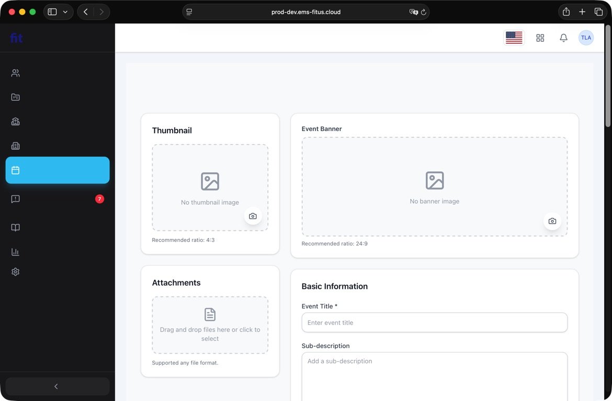 |
| A3 | Bảng cấu hình Đăng ký và vai trò - `Max Slots`, `Waitlist`, vai trò bổ sung | Đây là phần cấu hình đăng ký có nhiều công tắc, số chỗ tối đa, danh sách chờ và vai trò bổ sung. | Quản trị viên | [Bản nháp được giữ lại, ID 80](https://prod-dev.ems-fitus.cloud/dashboard/admin/events/edit?id=80) | 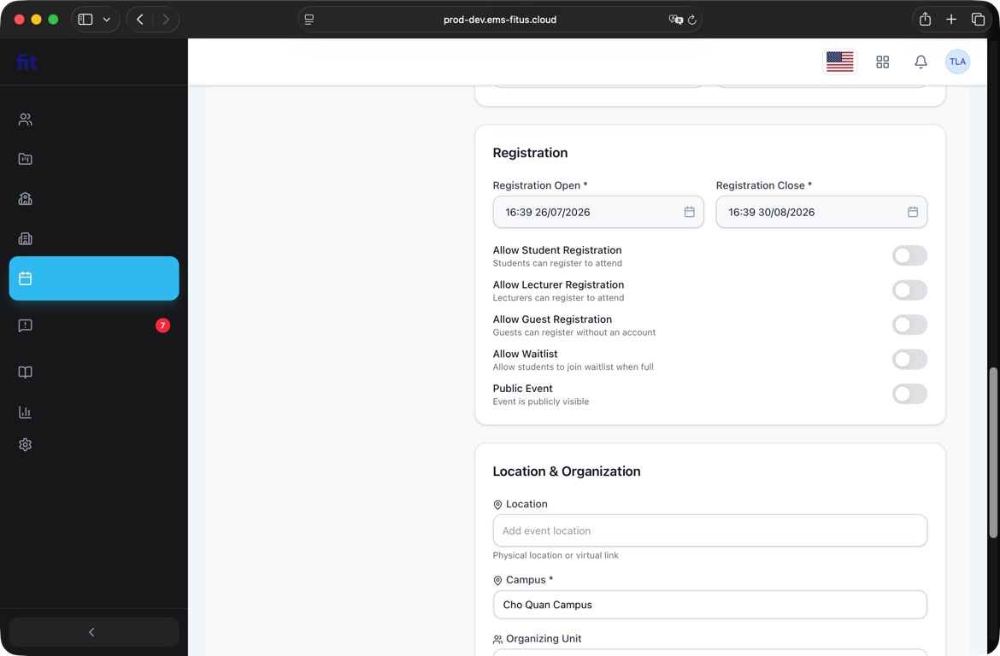 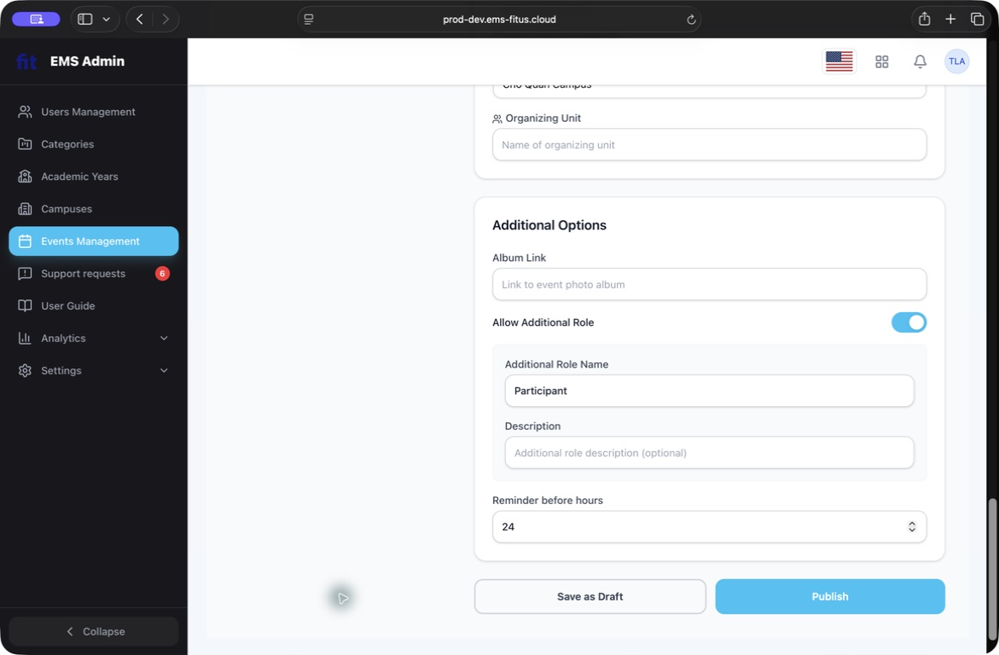 |

> Nếu thay đổi màn hình, màn hình mới vẫn phải thuộc nhóm chức năng A và cần giải thích lý do chọn.

## 3. Task 1B - Thực thi checklist trên Kịch bản A

> Kết quả dưới đây đồng bộ nguyên văn 153 dòng checklist với `submission/checklist_execution.md`. Minh chứng cũ được giữ lại để tham chiếu; `submission/screenshots/task1b/` là nguồn minh chứng chính thức cho lần kiểm thử lại trực tiếp ngày 2026-08-02.

### 3.1 Thông tin phiên kiểm thử

| Trường | Giá trị |
| --- | --- |
| Người phụ trách | Bảo — MSSV `23127326` |
| Hệ thống triển khai | `https://prod-dev.ems-fitus.cloud/` |
| URL A1 | `https://prod-dev.ems-fitus.cloud/dashboard/admin/events` |
| URL A2 | `https://prod-dev.ems-fitus.cloud/dashboard/admin/events/create`; `https://prod-dev.ems-fitus.cloud/dashboard/admin/events/edit?id=80` |
| URL A3 | `https://prod-dev.ems-fitus.cloud/dashboard/admin/events/edit?id=80` |
| Đường dẫn trong đề | Đường dẫn ngrok trả 404; không dùng làm nguồn kết quả |
| Tài khoản/vai trò | Tài khoản Quản trị viên được cung cấp; không ghi thông tin đăng nhập vào tài liệu |
| Ngày/giờ | 2026-08-02, Asia/Ho_Chi_Minh |
| Trình duyệt | Safari được điều khiển qua Computer Use; toàn bộ minh chứng chính thức, gồm ảnh tổng quan A1, được chụp trong Safari |
| Bản nháp | `23127326_TASK1B_20260802_163308`, id=80; đã lưu dưới dạng bản nháp, không xuất bản, không xóa |
| Bộ minh chứng chính thức | `submission/screenshots/task1b/` |

### 3.2 Phạm vi màn hình

| Màn hình | Kiểm thử trực tiếp | Ảnh tổng quan chính thức |
| --- | --- | --- |
| A1 | Tìm kiếm/bộ lọc/đặt lại, phân trang, huy hiệu, thông báo, chú giải và tiêu điểm của hành động, EN/VI, kết quả rỗng, chi tiết/quay lại, khả năng thích ứng |  |
| A2 | `Publish` khi trống/không hợp lệ, thứ tự ngày, lỗi trường/kiểu nhập/thứ tự Tab, tải TXT/PNG, văn bản định dạng, chú giải/tiêu điểm biểu tượng, giao diện gọn, `Back` khi chưa lưu, trạng thái xử lý, `Save`/mở lại |  |
| A3 | Giới hạn/`Max Slots`, vai trò, `Waitlist`, `Additional Role`, `Reminder`, quan hệ phụ thuộc, tiêu điểm bàn phím, giao diện gọn, `Back` khi chưa lưu, kiểm tra hợp lệ, `Save`/mở lại | ;  |

### 3.3 Cách đánh dấu kết quả

- `Đạt`: tiêu chí áp dụng và đã được kiểm thử trực tiếp đầy đủ mà không thấy vi phạm.
- `Không đạt`: có ghi chú cụ thể, mã phát hiện và ảnh minh chứng thật.
- `Không áp dụng`: có lý do riêng theo màn hình.
- Các bảng thực thi dùng đúng cấu trúc sáu cột tại commit `d655d24e9dc92adb3b09783d18ec56cb84852189`.

### 3.4 Kết quả thực thi checklist theo màn hình

#### 3.4.1 A1 Danh sách sự kiện

| Mã checklist | Khía cạnh giao diện | Nội dung kiểm tra | Kết quả | Ghi chú cho mục Không đạt / lý do Không áp dụng | Ảnh minh chứng |
| --- | --- | --- | --- | --- | --- |
| IA-01-01 | IA-01 | Các trang chính như dashboard, danh sách sự kiện, chi tiết sự kiện và hồ sơ người dùng có bố cục nhất quán về header, sidebar, font, màu, icon và khoảng cách. | Đạt |  |  |
| IA-01-02 | IA-01 | Thuật ngữ hiển thị nhất quán trên toàn hệ thống, ví dụ không dùng lẫn lộn `Event`, `Program`, `Activity` nếu cùng chỉ một loại dữ liệu. | Đạt |  |  |
| IA-01-03 | IA-01 | Các nút hành động chính như `Create Event`, `Register`, `Save`, `Cancel`, `Delete` có kiểu dáng và mức nhấn thị giác phù hợp với độ quan trọng. | Đạt |  |  |
| IA-01-04 | IA-01 | Màu sắc của trạng thái và hành động nguy hiểm được dùng nhất quán, ví dụ xanh cho thành công, đỏ cho lỗi/xóa, xám cho vô hiệu hóa. | Đạt |  |  |
| IA-01-05 | IA-01 | Độ tương phản giữa chữ và nền đủ dễ đọc trên desktop và mobile, đặc biệt ở label, placeholder, badge trạng thái và nút bị vô hiệu hóa. | Đạt |  |  |
| IA-01-06 | IA-01 | Nội dung trên card hoặc dòng sự kiện hiển thị thông tin thiết yếu trước: tên sự kiện, thời gian, địa điểm, trạng thái và hành động chính. | Đạt |  |  |
| IA-01-07 | IA-01 | Các icon quan trọng có nhãn hoặc tooltip rõ nghĩa, đặc biệt với icon sửa, xóa, xuất dữ liệu, chia sẻ hoặc xem chi tiết. | Không đạt | Dùng Option+Tab theo thứ tự Search → Status → Time → Add Event → dòng → `Delete`; `Delete` có viền báo tiêu điểm nhưng không hiện chú giải, nên người dùng nhìn bằng bàn phím vẫn phải đoán ý nghĩa biểu tượng. Mã phát hiện: T1B-A1-05. |  |
| IA-01-08 | IA-01 | Các phần tử có thể tương tác thể hiện rõ trạng thái hover, focus, active và disabled. | Đạt |  |  |
| IA-01-09 | IA-01 | Giao diện không yêu cầu người dùng ghi nhớ thông tin từ trang trước, ví dụ tên sự kiện hoặc mã đăng ký vẫn hiển thị ở bước xác nhận. | Không áp dụng | A1 Danh sách sự kiện không có/không thực hiện bước xác nhận dùng dữ liệu từ trang trước trong luồng được giao; tiêu chí không áp dụng cho màn hình này. |  |
| IA-01-10 | IA-01 | Giao diện responsive không làm mất nội dung, che nút, vỡ bảng hoặc buộc cuộn ngang không cần thiết trên mobile/tablet. | Không đạt | Ở cửa sổ Safari 1171×768, bảng vẫn cần cuộn ngang và các cột thông tin cốt lõi bị khuất khỏi vùng nhìn ban đầu. Mã phát hiện: T1B-A1-03. |  |
| IA-01-11 | IA-01 | Nội dung không bị nhồi quá dày; khoảng trắng, nhóm thông tin và tiêu đề phụ hỗ trợ việc quét nhanh. | Đạt |  |  |
| IA-01-12 | IA-01 | Các thao tác thường dùng có đường tắt hoặc cách truy cập nhanh, ví dụ tìm kiếm nhanh sự kiện, lọc trạng thái, tạo sự kiện từ dashboard. | Đạt |  |  |
| IA-01-13 | IA-01 | Nút chuyển đổi ngôn ngữ EN/VI hoạt động đồng bộ trên toàn ứng dụng, không còn văn bản chưa dịch và không làm vỡ bố cục giao diện khi thay đổi. | Không đạt | Trong giao diện tiếng Anh, bảng `Notifications` vẫn hiển thị tiếng Việt `Phản hồi khiếu nại`. Mã phát hiện: T1B-A1-04. | 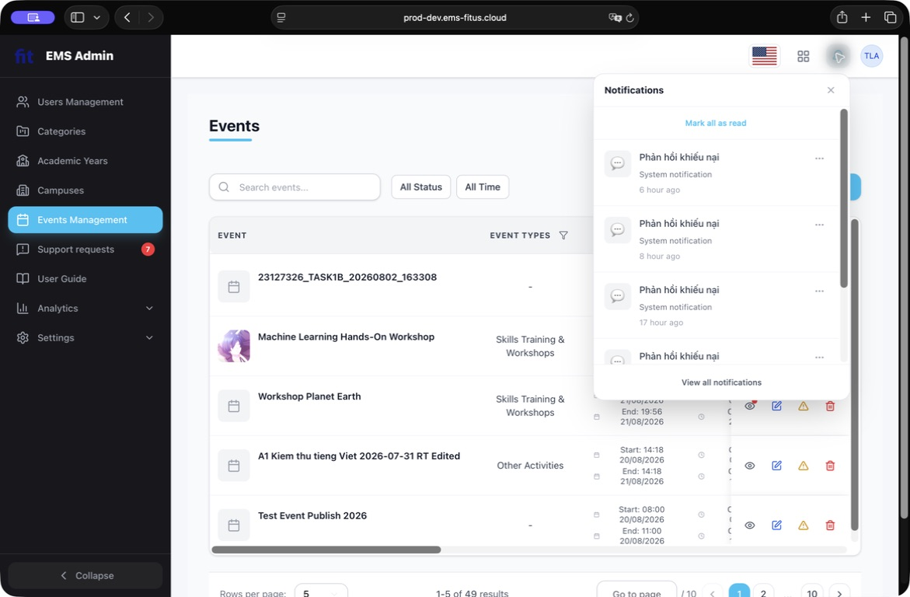 |
| IA-02-01 | IA-02 | Các trường bắt buộc trong form đăng ký/tạo sự kiện được đánh dấu rõ ràng và có giải thích khi cần. | Không áp dụng | A1 Danh sách sự kiện không có/không thực hiện biểu mẫu có trường bắt buộc trong luồng được giao; tiêu chí không áp dụng cho màn hình này. |  |
| IA-02-02 | IA-02 | Label của input rõ ràng, đặt gần trường nhập và không chỉ dựa vào placeholder để giải thích ý nghĩa trường. | Không áp dụng | A1 Danh sách sự kiện không có/không thực hiện nhãn của trường nhập trong biểu mẫu trong luồng được giao; tiêu chí không áp dụng cho màn hình này. |  |
| IA-02-03 | IA-02 | Kiểu input phù hợp với dữ liệu, ví dụ date picker cho ngày, time picker cho giờ, number input cho số lượng vé/sức chứa, email input cho email. | Không áp dụng | A1 Danh sách sự kiện không có/không thực hiện trường nhập ngày/giờ/số/email trong luồng được giao; tiêu chí không áp dụng cho màn hình này. |  |
| IA-02-04 | IA-02 | Form kiểm tra dữ liệu ngay tại trường nhập hoặc trước khi submit, ví dụ email sai định dạng, ngày kết thúc trước ngày bắt đầu, sức chứa âm. | Không áp dụng | A1 Danh sách sự kiện không có/không thực hiện kiểm tra hợp lệ dữ liệu biểu mẫu trong luồng được giao; tiêu chí không áp dụng cho màn hình này. |  |
| IA-02-05 | IA-02 | Thông báo lỗi form chỉ rõ trường nào lỗi, vì sao lỗi và cách sửa cụ thể. | Không áp dụng | A1 Danh sách sự kiện không có/không thực hiện thông báo lỗi theo từng trường trong luồng được giao; tiêu chí không áp dụng cho màn hình này. |  |
| IA-02-06 | IA-02 | Dữ liệu người dùng đã nhập không bị mất sau khi submit thất bại hoặc reload do lỗi hợp lệ hóa. | Không áp dụng | A1 Danh sách sự kiện không có/không thực hiện giữ dữ liệu sau khi gửi không thành công trong luồng được giao; tiêu chí không áp dụng cho màn hình này. |  |
| IA-02-07 | IA-02 | Form dài được chia nhóm hợp lý, ví dụ thông tin sự kiện, thời gian/địa điểm, vé/sức chứa, mô tả, hình ảnh. | Không áp dụng | A1 Danh sách sự kiện không có/không thực hiện biểu mẫu dài cần chia nhóm trong luồng được giao; tiêu chí không áp dụng cho màn hình này. |  |
| IA-02-08 | IA-02 | Thứ tự tab/focus trong form đi theo luồng đọc tự nhiên và không bỏ qua trường quan trọng. | Không áp dụng | A1 Danh sách sự kiện không có/không thực hiện thứ tự Tab của biểu mẫu trong luồng được giao; tiêu chí không áp dụng cho màn hình này. |  |
| IA-02-09 | IA-02 | Nút `Submit`/`Save` bị vô hiệu hóa hoặc có cảnh báo rõ khi form chưa đủ điều kiện gửi. | Không áp dụng | A1 Danh sách sự kiện không có/không thực hiện `Submit`/`Save` trên biểu mẫu chưa hợp lệ trong luồng được giao; tiêu chí không áp dụng cho màn hình này. |  |
| IA-02-10 | IA-02 | Các giá trị mặc định hoặc gợi ý nhập liệu phù hợp với ngữ cảnh, ví dụ timezone, định dạng ngày, số lượng mặc định, category phổ biến. | Không áp dụng | A1 Danh sách sự kiện không có/không thực hiện giá trị mặc định/gợi ý của biểu mẫu trong luồng được giao; tiêu chí không áp dụng cho màn hình này. |  |
| IA-02-11 | IA-02 | Hành động hủy, quay lại hoặc reset form có xác nhận nếu có nguy cơ làm mất dữ liệu đã nhập. | Không áp dụng | A1 Danh sách sự kiện không có/không thực hiện `Back`/`Cancel`/`Reset` trên biểu mẫu có dữ liệu trong luồng được giao; tiêu chí không áp dụng cho màn hình này. |  |
| IA-02-12 | IA-02 | Form upload ảnh/tài liệu sự kiện nêu rõ định dạng, kích thước tối đa, tiến trình upload và lỗi upload nếu có. | Không áp dụng | A1 Danh sách sự kiện không có/không thực hiện tải ảnh/tài liệu lên trong luồng được giao; tiêu chí không áp dụng cho màn hình này. |  |
| IA-02-13 | IA-02 | Trình soạn thảo Rich-Text ở trang tạo/sửa sự kiện hỗ trợ đúng các định dạng cơ bản, dán văn bản ổn định, không làm mất định dạng hoặc hiển thị HTML thô khi xem lại. | Không áp dụng | A1 Danh sách sự kiện không có/không thực hiện trình soạn thảo văn bản định dạng trong luồng được giao; tiêu chí không áp dụng cho màn hình này. |  |
| IA-03-01 | IA-03 | Menu chính hiển thị các khu vực quan trọng như Dashboard, Events, My Registrations, Reports/Management, Profile theo vai trò người dùng. | Đạt |  |  |
| IA-03-02 | IA-03 | Người dùng luôn biết mình đang ở đâu thông qua tiêu đề trang, trạng thái menu active hoặc breadcrumb. | Đạt |  |  |
| IA-03-03 | IA-03 | Từ danh sách sự kiện, người dùng có thể dễ dàng mở chi tiết sự kiện và quay lại danh sách với bộ lọc/trang hiện tại được giữ nguyên. | Không đạt | Tìm kiếm bản nháp duy nhất → `Details` → nút Quay lại của trình duyệt; nội dung tìm kiếm bị xóa và toàn bộ danh sách thay cho ngữ cảnh lọc. Mã phát hiện: T1B-A1-06. | ; 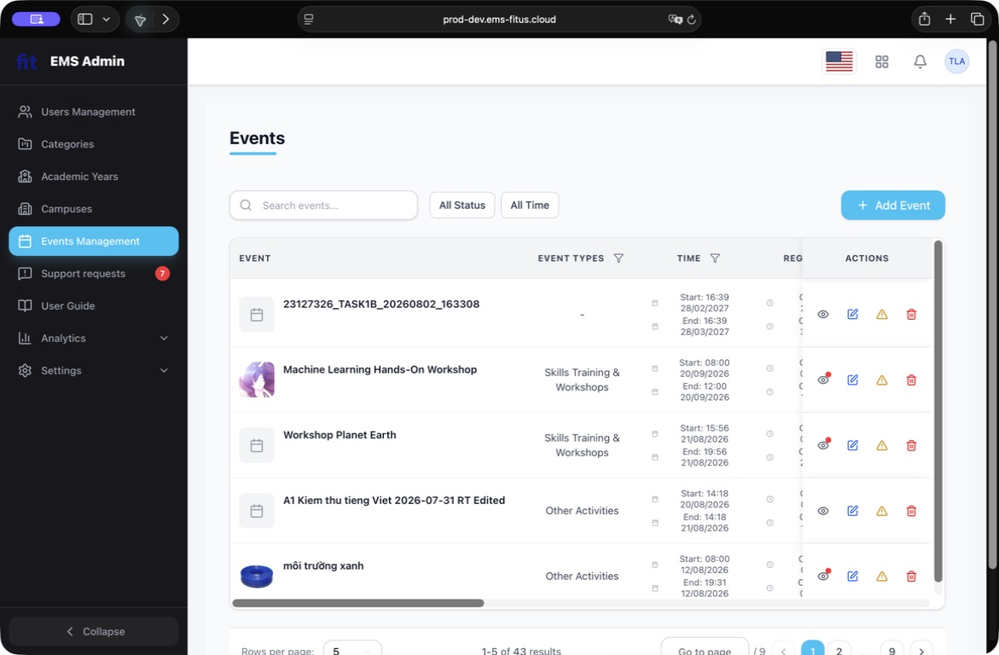 |
| IA-03-04 | IA-03 | Các liên kết/nút điều hướng có tên gọi cụ thể, ví dụ `View Details`, `Manage Attendees`, `Edit Event`, thay vì nhãn chung chung như `Click here`. | Đạt |  |  |
| IA-03-05 | IA-03 | Các trang không truy cập được theo vai trò hiển thị thông báo phù hợp hoặc bị ẩn khỏi menu thay vì dẫn tới lỗi khó hiểu. | Không áp dụng | A1 Danh sách sự kiện không có/không thực hiện trang bị giới hạn quyền trong luồng được giao; tiêu chí không áp dụng cho màn hình này. |  |
| IA-03-06 | IA-03 | Tìm kiếm và bộ lọc sự kiện dễ thấy, dễ reset và phản ánh đúng trạng thái đang áp dụng. | Không đạt | Đã kiểm thử tìm kiếm chính xác, không có kết quả và xóa thủ công; trạng thái không có kết quả cho biết không có sự kiện nhưng không cung cấp hành động `Reset`/xóa bộ lọc. Mã phát hiện: T1B-A1-01. | 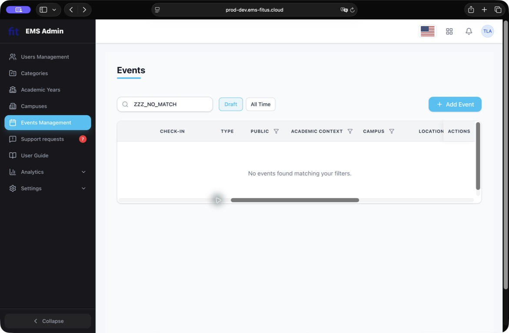 |
| IA-03-07 | IA-03 | Phân trang hoặc infinite scroll cho danh sách sự kiện có chỉ báo rõ về số trang, số kết quả hoặc trạng thái đã tải hết. | Đạt |  |  |
| IA-03-08 | IA-03 | Các bước trong luồng đăng ký sự kiện hoặc checkout vé hiển thị tiến trình hiện tại và bước tiếp theo. | Không áp dụng | A1 Danh sách sự kiện không có/không thực hiện đăng ký/thanh toán nhiều bước trong luồng được giao; tiêu chí không áp dụng cho màn hình này. |  |
| IA-03-09 | IA-03 | Nút quay lại, breadcrumb hoặc tab không gây mất dữ liệu chưa lưu trong form hoặc bộ lọc quan trọng. | Không đạt | nút Quay lại của trình duyệt sau khi mở bản nháp từ kết quả tìm kiếm làm mất bộ lọc quan trọng và trả về toàn bộ danh sách. Mã phát hiện: T1B-A1-06. | ;  |
| IA-03-10 | IA-03 | Điều hướng trên mobile dùng pattern quen thuộc và không che nội dung hoặc hành động chính. | Đạt |  |  |
| IA-03-11 | IA-03 | Các trang chi tiết có hành động liên quan đặt gần nội dung liên quan, ví dụ `Register` gần thông tin vé, `Edit` gần thông tin sự kiện. | Không áp dụng | A1 Danh sách sự kiện không có/không thực hiện hành động trên trang chi tiết trong luồng được giao; tiêu chí không áp dụng cho màn hình này. |  |
| IA-03-12 | IA-03 | Khi truy cập URL không tồn tại hoặc sự kiện đã bị xóa, hệ thống hiển thị trang 404/empty state có đường dẫn quay về khu vực phù hợp. | Không áp dụng | A1 Danh sách sự kiện không có/không thực hiện URL không tồn tại/sự kiện đã xóa trong luồng được giao; tiêu chí không áp dụng cho màn hình này. |  |
| IA-04-01 | IA-04 | Sau mỗi hành động quan trọng như tạo sự kiện, đăng ký, hủy đăng ký, lưu thay đổi, hệ thống hiển thị phản hồi thành công hoặc thất bại rõ ràng. | Không áp dụng | A1 Danh sách sự kiện không có/không thực hiện phản hồi sau hành động thay đổi dữ liệu trong luồng được giao; tiêu chí không áp dụng cho màn hình này. |  |
| IA-04-02 | IA-04 | Các thao tác mất thời gian như tải danh sách, upload ảnh, gửi đăng ký hoặc xuất báo cáo có loading indicator/progress phù hợp. | Không áp dụng | A1 Danh sách sự kiện không có/không thực hiện tác vụ dài cần chỉ báo tải/tiến trình trong luồng được giao; tiêu chí không áp dụng cho màn hình này. |  |
| IA-04-03 | IA-04 | Nút submit bị khóa hoặc có trạng thái đang xử lý sau khi người dùng bấm để tránh gửi trùng. | Không áp dụng | A1 Danh sách sự kiện không có/không thực hiện xử lý gửi/chống gửi trùng trong luồng được giao; tiêu chí không áp dụng cho màn hình này. |  |
| IA-04-04 | IA-04 | Thông báo lỗi hệ thống dùng ngôn ngữ dễ hiểu, không chỉ hiển thị mã lỗi kỹ thuật hoặc stack trace. | Đạt |  |  |
| IA-04-05 | IA-04 | Thông báo toast/banner đủ nổi bật nhưng không che mất nút hoặc dữ liệu quan trọng. | Không áp dụng | A1 Danh sách sự kiện không có/không thực hiện thông báo nổi/băng thông báo trong luồng được giao; tiêu chí không áp dụng cho màn hình này. |  |
| IA-04-06 | IA-04 | Trạng thái sự kiện như Draft, Published, Closed, Cancelled, Full hiển thị rõ bằng text và màu/badge nhất quán. | Đạt |  |  |
| IA-04-07 | IA-04 | Empty state của danh sách sự kiện, đăng ký hoặc kết quả tìm kiếm giải thích ngắn gọn và đưa ra hành động tiếp theo. | Không đạt | Trạng thái tìm kiếm rỗng giải thích `No sự kiệns found` nhưng không có `Reset`/xóa bộ lọc hoặc hành động tiếp theo. Mã phát hiện: T1B-A1-01. |  |
| IA-04-08 | IA-04 | Các hành động nguy hiểm như xóa sự kiện, hủy sự kiện hoặc hủy đăng ký có hộp xác nhận nêu rõ hậu quả. | Đạt |  |  |
| IA-04-09 | IA-04 | Nếu có thể hoàn tác, hệ thống cung cấp `Undo` hoặc cách khôi phục sau thao tác như xóa nháp, hủy lọc, hủy thay đổi. | Đạt |  |  |
| IA-04-10 | IA-04 | Trạng thái quyền truy cập hoặc phiên đăng nhập hết hạn được thông báo rõ và dẫn người dùng tới bước đăng nhập lại. | Không áp dụng | A1 Danh sách sự kiện không có/không thực hiện hết hạn phiên trong luồng được giao; tiêu chí không áp dụng cho màn hình này. |  |
| IA-04-11 | IA-04 | Dữ liệu thay đổi theo thời gian như số chỗ còn lại, trạng thái đăng ký hoặc danh sách attendee được cập nhật hoặc cảnh báo khi đã cũ. | Không áp dụng | A1 Danh sách sự kiện không có/không thực hiện dữ liệu thời gian thực/dữ liệu cũ trong luồng được giao; tiêu chí không áp dụng cho màn hình này. |  |
| IA-04-12 | IA-04 | Hệ thống cung cấp hướng dẫn ngắn hoặc liên kết trợ giúp đúng ngữ cảnh cho tác vụ phức tạp như tạo sự kiện, cấu hình vé hoặc xuất báo cáo. | Không áp dụng | A1 Danh sách sự kiện không có/không thực hiện hướng dẫn cho tác vụ phức tạp trong luồng được giao; tiêu chí không áp dụng cho màn hình này. |  |
| IA-04-13 | IA-04 | Các quy trình dài hoặc phức tạp như tạo sự kiện mới, đăng ký/mua vé số lượng lớn kết thúc bằng màn hình hoặc thông báo xác nhận rõ ràng, nêu kết quả và gợi ý bước tiếp theo phù hợp. | Không áp dụng | A1 Danh sách sự kiện không có/không thực hiện điểm kết thúc của quy trình dài trong luồng được giao; tiêu chí không áp dụng cho màn hình này. |  |

#### 3.4.2 A2 Thêm/Sửa sự kiện

| Mã checklist | Khía cạnh giao diện | Nội dung kiểm tra | Kết quả | Ghi chú cho mục Không đạt / lý do Không áp dụng | Ảnh minh chứng |
| --- | --- | --- | --- | --- | --- |
| IA-01-01 | IA-01 | Các trang chính như dashboard, danh sách sự kiện, chi tiết sự kiện và hồ sơ người dùng có bố cục nhất quán về header, sidebar, font, màu, icon và khoảng cách. | Đạt |  |  |
| IA-01-02 | IA-01 | Thuật ngữ hiển thị nhất quán trên toàn hệ thống, ví dụ không dùng lẫn lộn `Event`, `Program`, `Activity` nếu cùng chỉ một loại dữ liệu. | Đạt |  |  |
| IA-01-03 | IA-01 | Các nút hành động chính như `Create Event`, `Register`, `Save`, `Cancel`, `Delete` có kiểu dáng và mức nhấn thị giác phù hợp với độ quan trọng. | Đạt |  |  |
| IA-01-04 | IA-01 | Màu sắc của trạng thái và hành động nguy hiểm được dùng nhất quán, ví dụ xanh cho thành công, đỏ cho lỗi/xóa, xám cho vô hiệu hóa. | Đạt |  |  |
| IA-01-05 | IA-01 | Độ tương phản giữa chữ và nền đủ dễ đọc trên desktop và mobile, đặc biệt ở label, placeholder, badge trạng thái và nút bị vô hiệu hóa. | Đạt |  |  |
| IA-01-06 | IA-01 | Nội dung trên card hoặc dòng sự kiện hiển thị thông tin thiết yếu trước: tên sự kiện, thời gian, địa điểm, trạng thái và hành động chính. | Không áp dụng | A2 Thêm/Sửa sự kiện không có/không thực hiện thẻ hoặc dòng sự kiện trong luồng được giao; tiêu chí không áp dụng cho màn hình này. |  |
| IA-01-07 | IA-01 | Các icon quan trọng có nhãn hoặc tooltip rõ nghĩa, đặc biệt với icon sửa, xóa, xuất dữ liệu, chia sẻ hoặc xem chi tiết. | Không đạt | Kiểm thử lại khi di chuột/đưa tiêu điểm: các nút biểu tượng không có chữ `Back`, `Thumbnail` và `Banner` không hiện chú giải hoặc nhãn nhìn thấy; các biểu tượng soạn thảo văn bản có chú giải. Người dùng thị giác vẫn phải đoán các biểu tượng máy ảnh/`Back`. Mã phát hiện: T1B-A2-03. | ; 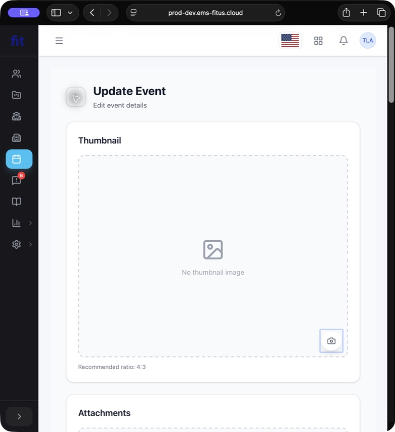; ; 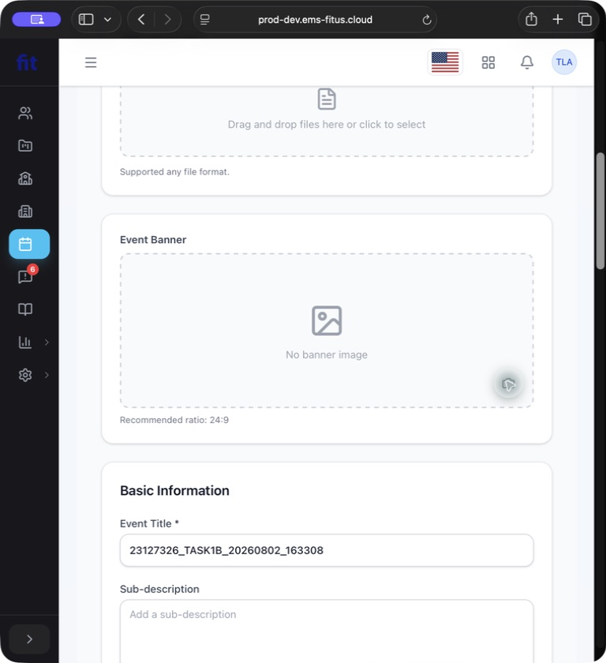 |
| IA-01-08 | IA-01 | Các phần tử có thể tương tác thể hiện rõ trạng thái hover, focus, active và disabled. | Đạt |  |  |
| IA-01-09 | IA-01 | Giao diện không yêu cầu người dùng ghi nhớ thông tin từ trang trước, ví dụ tên sự kiện hoặc mã đăng ký vẫn hiển thị ở bước xác nhận. | Đạt |  |  |
| IA-01-10 | IA-01 | Giao diện responsive không làm mất nội dung, che nút, vỡ bảng hoặc buộc cuộn ngang không cần thiết trên mobile/tablet. | Đạt |  |  |
| IA-01-11 | IA-01 | Nội dung không bị nhồi quá dày; khoảng trắng, nhóm thông tin và tiêu đề phụ hỗ trợ việc quét nhanh. | Đạt |  |  |
| IA-01-12 | IA-01 | Các thao tác thường dùng có đường tắt hoặc cách truy cập nhanh, ví dụ tìm kiếm nhanh sự kiện, lọc trạng thái, tạo sự kiện từ dashboard. | Không áp dụng | A2 Thêm/Sửa sự kiện không có/không thực hiện phím tắt hoặc cách truy cập nhanh cho tác vụ thường dùng trong luồng được giao; tiêu chí không áp dụng cho màn hình này. |  |
| IA-01-13 | IA-01 | Nút chuyển đổi ngôn ngữ EN/VI hoạt động đồng bộ trên toàn ứng dụng, không còn văn bản chưa dịch và không làm vỡ bố cục giao diện khi thay đổi. | Đạt |  |  |
| IA-02-01 | IA-02 | Các trường bắt buộc trong form đăng ký/tạo sự kiện được đánh dấu rõ ràng và có giải thích khi cần. | Đạt |  |  |
| IA-02-02 | IA-02 | Label của input rõ ràng, đặt gần trường nhập và không chỉ dựa vào placeholder để giải thích ý nghĩa trường. | Đạt |  |  |
| IA-02-03 | IA-02 | Kiểu input phù hợp với dữ liệu, ví dụ date picker cho ngày, time picker cho giờ, number input cho số lượng vé/sức chứa, email input cho email. | Đạt |  |  |
| IA-02-04 | IA-02 | Form kiểm tra dữ liệu ngay tại trường nhập hoặc trước khi submit, ví dụ email sai định dạng, ngày kết thúc trước ngày bắt đầu, sức chứa âm. | Đạt |  |  |
| IA-02-05 | IA-02 | Thông báo lỗi form chỉ rõ trường nào lỗi, vì sao lỗi và cách sửa cụ thể. | Đạt |  |  |
| IA-02-06 | IA-02 | Dữ liệu người dùng đã nhập không bị mất sau khi submit thất bại hoặc reload do lỗi hợp lệ hóa. | Đạt |  |  |
| IA-02-07 | IA-02 | Form dài được chia nhóm hợp lý, ví dụ thông tin sự kiện, thời gian/địa điểm, vé/sức chứa, mô tả, hình ảnh. | Đạt |  |  |
| IA-02-08 | IA-02 | Thứ tự tab/focus trong form đi theo luồng đọc tự nhiên và không bỏ qua trường quan trọng. | Đạt |  |  |
| IA-02-09 | IA-02 | Nút `Submit`/`Save` bị vô hiệu hóa hoặc có cảnh báo rõ khi form chưa đủ điều kiện gửi. | Đạt |  |  |
| IA-02-10 | IA-02 | Các giá trị mặc định hoặc gợi ý nhập liệu phù hợp với ngữ cảnh, ví dụ timezone, định dạng ngày, số lượng mặc định, category phổ biến. | Đạt |  |  |
| IA-02-11 | IA-02 | Hành động hủy, quay lại hoặc reset form có xác nhận nếu có nguy cơ làm mất dữ liệu đã nhập. | Không đạt | Trên biểu mẫu `Update Event` đã có dữ liệu, bấm `Back` chuyển thẳng về danh sách `Events` mà không có hộp thoại xác nhận cho thay đổi chưa lưu. Mã phát hiện: T1B-A2-02. | 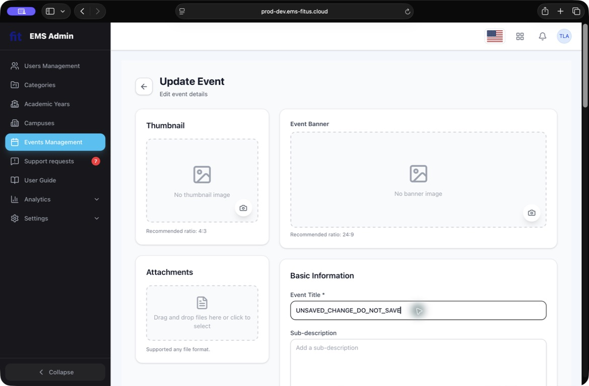;  |
| IA-02-12 | IA-02 | Form upload ảnh/tài liệu sự kiện nêu rõ định dạng, kích thước tối đa, tiến trình upload và lỗi upload nếu có. | Không đạt | Chọn `upload_invalid.txt` làm Thumbnail; biểu mẫu chấp nhận và hiển thị xem trước thay vì từ chối, trong khi tệp PNG hợp lệ cũng được chấp nhận. Mã phát hiện: T1B-A2-01. | 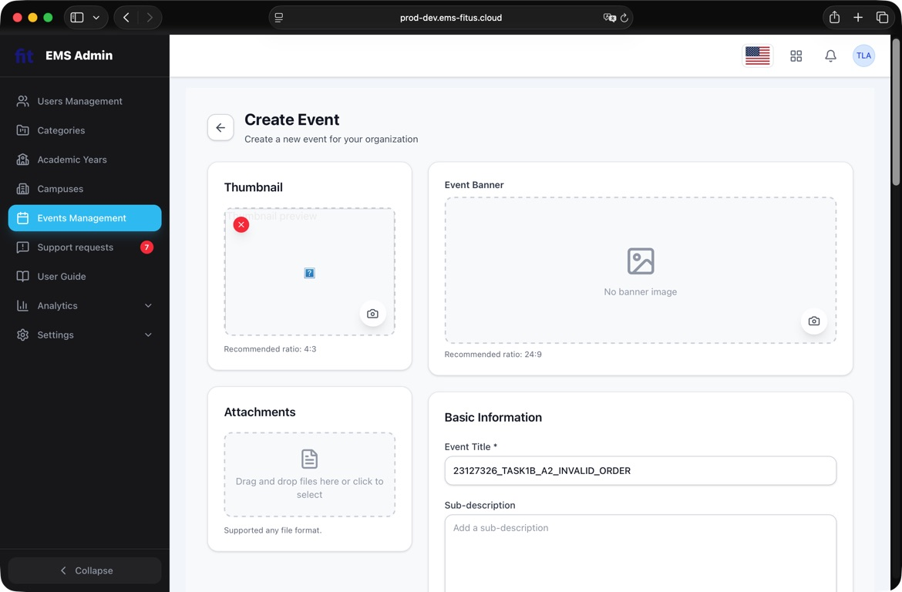 |
| IA-02-13 | IA-02 | Trình soạn thảo Rich-Text ở trang tạo/sửa sự kiện hỗ trợ đúng các định dạng cơ bản, dán văn bản ổn định, không làm mất định dạng hoặc hiển thị HTML thô khi xem lại. | Đạt |  |  |
| IA-03-01 | IA-03 | Menu chính hiển thị các khu vực quan trọng như Dashboard, Events, My Registrations, Reports/Management, Profile theo vai trò người dùng. | Đạt |  |  |
| IA-03-02 | IA-03 | Người dùng luôn biết mình đang ở đâu thông qua tiêu đề trang, trạng thái menu active hoặc breadcrumb. | Đạt |  |  |
| IA-03-03 | IA-03 | Từ danh sách sự kiện, người dùng có thể dễ dàng mở chi tiết sự kiện và quay lại danh sách với bộ lọc/trang hiện tại được giữ nguyên. | Không áp dụng | A2 Thêm/Sửa sự kiện không có/không thực hiện danh sách → chi tiết → quay lại có giữ bộ lọc trong luồng được giao; tiêu chí không áp dụng cho màn hình này. |  |
| IA-03-04 | IA-03 | Các liên kết/nút điều hướng có tên gọi cụ thể, ví dụ `View Details`, `Manage Attendees`, `Edit Event`, thay vì nhãn chung chung như `Click here`. | Đạt |  |  |
| IA-03-05 | IA-03 | Các trang không truy cập được theo vai trò hiển thị thông báo phù hợp hoặc bị ẩn khỏi menu thay vì dẫn tới lỗi khó hiểu. | Không áp dụng | A2 Thêm/Sửa sự kiện không có/không thực hiện trang bị giới hạn quyền trong luồng được giao; tiêu chí không áp dụng cho màn hình này. |  |
| IA-03-06 | IA-03 | Tìm kiếm và bộ lọc sự kiện dễ thấy, dễ reset và phản ánh đúng trạng thái đang áp dụng. | Không áp dụng | A2 Thêm/Sửa sự kiện không có/không thực hiện tìm kiếm/bộ lọc sự kiện trong luồng được giao; tiêu chí không áp dụng cho màn hình này. |  |
| IA-03-07 | IA-03 | Phân trang hoặc infinite scroll cho danh sách sự kiện có chỉ báo rõ về số trang, số kết quả hoặc trạng thái đã tải hết. | Không áp dụng | A2 Thêm/Sửa sự kiện không có/không thực hiện phân trang/cuộn vô hạn trong luồng được giao; tiêu chí không áp dụng cho màn hình này. |  |
| IA-03-08 | IA-03 | Các bước trong luồng đăng ký sự kiện hoặc checkout vé hiển thị tiến trình hiện tại và bước tiếp theo. | Không áp dụng | A2 Thêm/Sửa sự kiện không có/không thực hiện đăng ký/thanh toán nhiều bước trong luồng được giao; tiêu chí không áp dụng cho màn hình này. |  |
| IA-03-09 | IA-03 | Nút quay lại, breadcrumb hoặc tab không gây mất dữ liệu chưa lưu trong form hoặc bộ lọc quan trọng. | Không đạt | Trên biểu mẫu `Update Event` đã có dữ liệu, bấm `Back` chuyển thẳng về danh sách `Events`; tiêu đề chưa lưu rời khỏi biểu mẫu mà không có cảnh báo bảo vệ ngữ cảnh. Mã phát hiện: T1B-A2-02. | ;  |
| IA-03-10 | IA-03 | Điều hướng trên mobile dùng pattern quen thuộc và không che nội dung hoặc hành động chính. | Đạt |  |  |
| IA-03-11 | IA-03 | Các trang chi tiết có hành động liên quan đặt gần nội dung liên quan, ví dụ `Register` gần thông tin vé, `Edit` gần thông tin sự kiện. | Không áp dụng | A2 Thêm/Sửa sự kiện không có/không thực hiện hành động trên trang chi tiết trong luồng được giao; tiêu chí không áp dụng cho màn hình này. |  |
| IA-03-12 | IA-03 | Khi truy cập URL không tồn tại hoặc sự kiện đã bị xóa, hệ thống hiển thị trang 404/empty state có đường dẫn quay về khu vực phù hợp. | Không áp dụng | A2 Thêm/Sửa sự kiện không có/không thực hiện URL không tồn tại/sự kiện đã xóa trong luồng được giao; tiêu chí không áp dụng cho màn hình này. |  |
| IA-04-01 | IA-04 | Sau mỗi hành động quan trọng như tạo sự kiện, đăng ký, hủy đăng ký, lưu thay đổi, hệ thống hiển thị phản hồi thành công hoặc thất bại rõ ràng. | Đạt |  |  |
| IA-04-02 | IA-04 | Các thao tác mất thời gian như tải danh sách, upload ảnh, gửi đăng ký hoặc xuất báo cáo có loading indicator/progress phù hợp. | Đạt |  |  |
| IA-04-03 | IA-04 | Nút submit bị khóa hoặc có trạng thái đang xử lý sau khi người dùng bấm để tránh gửi trùng. | Đạt |  |  |
| IA-04-04 | IA-04 | Thông báo lỗi hệ thống dùng ngôn ngữ dễ hiểu, không chỉ hiển thị mã lỗi kỹ thuật hoặc stack trace. | Đạt |  |  |
| IA-04-05 | IA-04 | Thông báo toast/banner đủ nổi bật nhưng không che mất nút hoặc dữ liệu quan trọng. | Đạt |  |  |
| IA-04-06 | IA-04 | Trạng thái sự kiện như Draft, Published, Closed, Cancelled, Full hiển thị rõ bằng text và màu/badge nhất quán. | Đạt |  |  |
| IA-04-07 | IA-04 | Empty state của danh sách sự kiện, đăng ký hoặc kết quả tìm kiếm giải thích ngắn gọn và đưa ra hành động tiếp theo. | Không áp dụng | A2 Thêm/Sửa sự kiện không có/không thực hiện trạng thái rỗng của danh sách/tìm kiếm trong luồng được giao; tiêu chí không áp dụng cho màn hình này. |  |
| IA-04-08 | IA-04 | Các hành động nguy hiểm như xóa sự kiện, hủy sự kiện hoặc hủy đăng ký có hộp xác nhận nêu rõ hậu quả. | Không áp dụng | A2 Thêm/Sửa sự kiện không có/không thực hiện hành động `Delete`/`Cancel` nguy hiểm trong luồng được giao; tiêu chí không áp dụng cho màn hình này. |  |
| IA-04-09 | IA-04 | Nếu có thể hoàn tác, hệ thống cung cấp `Undo` hoặc cách khôi phục sau thao tác như xóa nháp, hủy lọc, hủy thay đổi. | Đạt |  |  |
| IA-04-10 | IA-04 | Trạng thái quyền truy cập hoặc phiên đăng nhập hết hạn được thông báo rõ và dẫn người dùng tới bước đăng nhập lại. | Không áp dụng | A2 Thêm/Sửa sự kiện không có/không thực hiện hết hạn phiên trong luồng được giao; tiêu chí không áp dụng cho màn hình này. |  |
| IA-04-11 | IA-04 | Dữ liệu thay đổi theo thời gian như số chỗ còn lại, trạng thái đăng ký hoặc danh sách attendee được cập nhật hoặc cảnh báo khi đã cũ. | Không áp dụng | A2 Thêm/Sửa sự kiện không có/không thực hiện dữ liệu thời gian thực/dữ liệu cũ trong luồng được giao; tiêu chí không áp dụng cho màn hình này. |  |
| IA-04-12 | IA-04 | Hệ thống cung cấp hướng dẫn ngắn hoặc liên kết trợ giúp đúng ngữ cảnh cho tác vụ phức tạp như tạo sự kiện, cấu hình vé hoặc xuất báo cáo. | Đạt |  |  |
| IA-04-13 | IA-04 | Các quy trình dài hoặc phức tạp như tạo sự kiện mới, đăng ký/mua vé số lượng lớn kết thúc bằng màn hình hoặc thông báo xác nhận rõ ràng, nêu kết quả và gợi ý bước tiếp theo phù hợp. | Đạt |  |  |

#### 3.4.3 A3 Đăng ký và vai trò

| Mã checklist | Khía cạnh giao diện | Nội dung kiểm tra | Kết quả | Ghi chú cho mục Không đạt / lý do Không áp dụng | Ảnh minh chứng |
| --- | --- | --- | --- | --- | --- |
| IA-01-01 | IA-01 | Các trang chính như dashboard, danh sách sự kiện, chi tiết sự kiện và hồ sơ người dùng có bố cục nhất quán về header, sidebar, font, màu, icon và khoảng cách. | Đạt |  |  |
| IA-01-02 | IA-01 | Thuật ngữ hiển thị nhất quán trên toàn hệ thống, ví dụ không dùng lẫn lộn `Event`, `Program`, `Activity` nếu cùng chỉ một loại dữ liệu. | Đạt |  |  |
| IA-01-03 | IA-01 | Các nút hành động chính như `Create Event`, `Register`, `Save`, `Cancel`, `Delete` có kiểu dáng và mức nhấn thị giác phù hợp với độ quan trọng. | Đạt |  |  |
| IA-01-04 | IA-01 | Màu sắc của trạng thái và hành động nguy hiểm được dùng nhất quán, ví dụ xanh cho thành công, đỏ cho lỗi/xóa, xám cho vô hiệu hóa. | Đạt |  |  |
| IA-01-05 | IA-01 | Độ tương phản giữa chữ và nền đủ dễ đọc trên desktop và mobile, đặc biệt ở label, placeholder, badge trạng thái và nút bị vô hiệu hóa. | Đạt |  |  |
| IA-01-06 | IA-01 | Nội dung trên card hoặc dòng sự kiện hiển thị thông tin thiết yếu trước: tên sự kiện, thời gian, địa điểm, trạng thái và hành động chính. | Không áp dụng | A3 Đăng ký và vai trò không có/không thực hiện thẻ hoặc dòng sự kiện trong luồng được giao; tiêu chí không áp dụng cho màn hình này. |  |
| IA-01-07 | IA-01 | Các icon quan trọng có nhãn hoặc tooltip rõ nghĩa, đặc biệt với icon sửa, xóa, xuất dữ liệu, chia sẻ hoặc xem chi tiết. | Không áp dụng | A3 Đăng ký và vai trò không có/không thực hiện hành động biểu tượng quan trọng trong luồng được giao; tiêu chí không áp dụng cho màn hình này. |  |
| IA-01-08 | IA-01 | Các phần tử có thể tương tác thể hiện rõ trạng thái hover, focus, active và disabled. | Đạt |  |  |
| IA-01-09 | IA-01 | Giao diện không yêu cầu người dùng ghi nhớ thông tin từ trang trước, ví dụ tên sự kiện hoặc mã đăng ký vẫn hiển thị ở bước xác nhận. | Không áp dụng | A3 Đăng ký và vai trò không có/không thực hiện bước xác nhận dùng dữ liệu từ trang trước trong luồng được giao; tiêu chí không áp dụng cho màn hình này. |  |
| IA-01-10 | IA-01 | Giao diện responsive không làm mất nội dung, che nút, vỡ bảng hoặc buộc cuộn ngang không cần thiết trên mobile/tablet. | Đạt |  |  |
| IA-01-11 | IA-01 | Nội dung không bị nhồi quá dày; khoảng trắng, nhóm thông tin và tiêu đề phụ hỗ trợ việc quét nhanh. | Đạt |  |  |
| IA-01-12 | IA-01 | Các thao tác thường dùng có đường tắt hoặc cách truy cập nhanh, ví dụ tìm kiếm nhanh sự kiện, lọc trạng thái, tạo sự kiện từ dashboard. | Không áp dụng | A3 Đăng ký và vai trò không có/không thực hiện phím tắt hoặc cách truy cập nhanh cho tác vụ thường dùng trong luồng được giao; tiêu chí không áp dụng cho màn hình này. |  |
| IA-01-13 | IA-01 | Nút chuyển đổi ngôn ngữ EN/VI hoạt động đồng bộ trên toàn ứng dụng, không còn văn bản chưa dịch và không làm vỡ bố cục giao diện khi thay đổi. | Đạt |  |  |
| IA-02-01 | IA-02 | Các trường bắt buộc trong form đăng ký/tạo sự kiện được đánh dấu rõ ràng và có giải thích khi cần. | Đạt |  |  |
| IA-02-02 | IA-02 | Label của input rõ ràng, đặt gần trường nhập và không chỉ dựa vào placeholder để giải thích ý nghĩa trường. | Đạt |  |  |
| IA-02-03 | IA-02 | Kiểu input phù hợp với dữ liệu, ví dụ date picker cho ngày, time picker cho giờ, number input cho số lượng vé/sức chứa, email input cho email. | Đạt |  |  |
| IA-02-04 | IA-02 | Form kiểm tra dữ liệu ngay tại trường nhập hoặc trước khi submit, ví dụ email sai định dạng, ngày kết thúc trước ngày bắt đầu, sức chứa âm. | Không đạt | Hai quan hệ phụ thuộc lỗi: `Is Unlimited` của Student đang bật vẫn để `Max Slots` hiển thị và chỉnh sửa được; tắt `Student Registration` sau khi bật `Waitlist` vẫn giữ `Waitlist` bật. `Max Slots` = -1 riêng lẻ được chặn đúng. Mã phát hiện: T1B-A3-01, T1B-A3-03. | ; 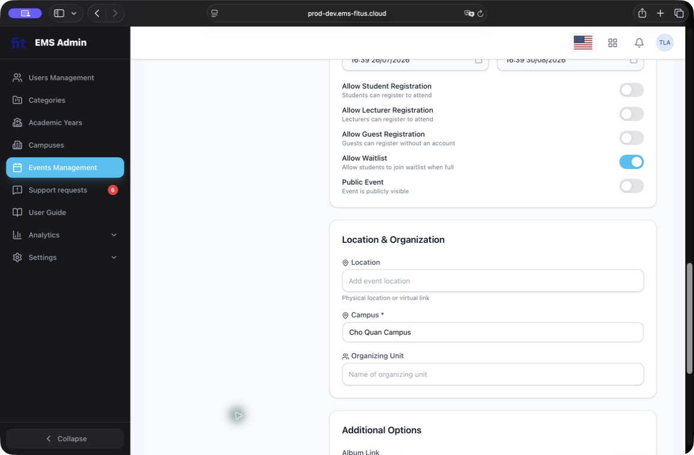; 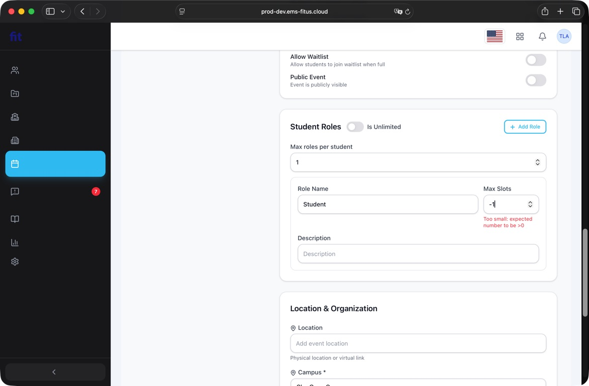 |
| IA-02-05 | IA-02 | Thông báo lỗi form chỉ rõ trường nào lỗi, vì sao lỗi và cách sửa cụ thể. | Đạt |  |  |
| IA-02-06 | IA-02 | Dữ liệu người dùng đã nhập không bị mất sau khi submit thất bại hoặc reload do lỗi hợp lệ hóa. | Đạt |  |  |
| IA-02-07 | IA-02 | Form dài được chia nhóm hợp lý, ví dụ thông tin sự kiện, thời gian/địa điểm, vé/sức chứa, mô tả, hình ảnh. | Đạt |  |  |
| IA-02-08 | IA-02 | Thứ tự tab/focus trong form đi theo luồng đọc tự nhiên và không bỏ qua trường quan trọng. | Đạt |  |  |
| IA-02-09 | IA-02 | Nút `Submit`/`Save` bị vô hiệu hóa hoặc có cảnh báo rõ khi form chưa đủ điều kiện gửi. | Đạt |  |  |
| IA-02-10 | IA-02 | Các giá trị mặc định hoặc gợi ý nhập liệu phù hợp với ngữ cảnh, ví dụ timezone, định dạng ngày, số lượng mặc định, category phổ biến. | Đạt |  |  |
| IA-02-11 | IA-02 | Hành động hủy, quay lại hoặc reset form có xác nhận nếu có nguy cơ làm mất dữ liệu đã nhập. | Không đạt | Đổi `Reminder` từ 24 thành 25 rồi bấm `Back`; hệ thống rời biểu mẫu ngay, không hiện cảnh báo xác nhận. Mở lại bản nháp id=80 vẫn là 24, xác nhận thay đổi chưa lưu bị mất. Mã phát hiện: T1B-A3-04. | 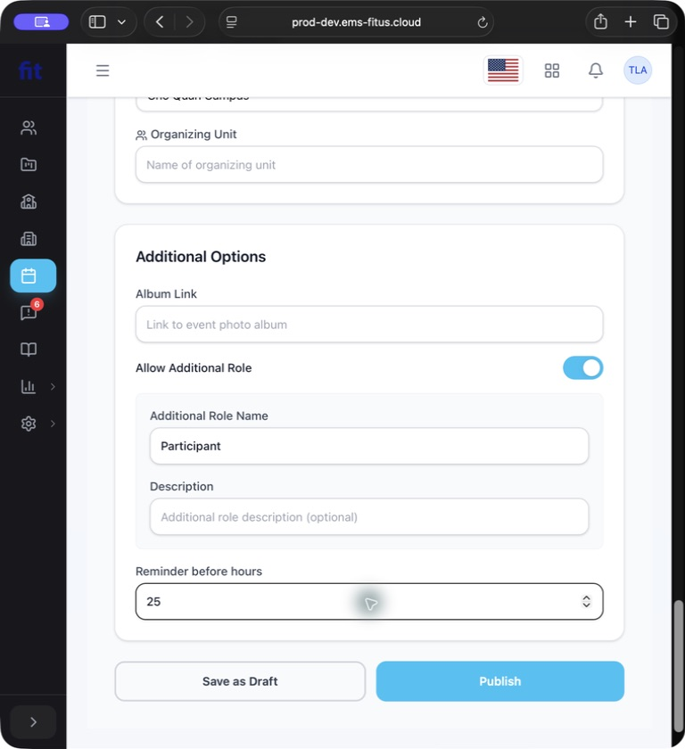; 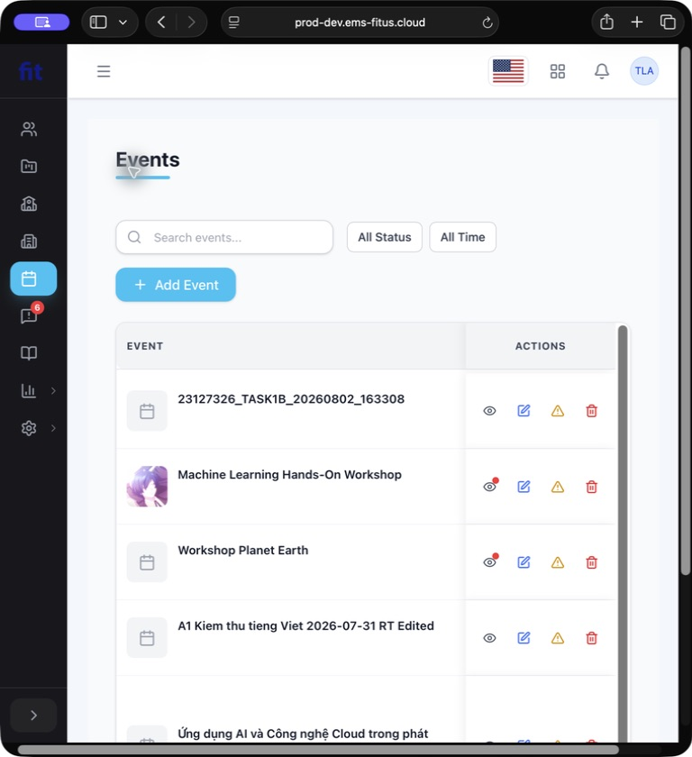; 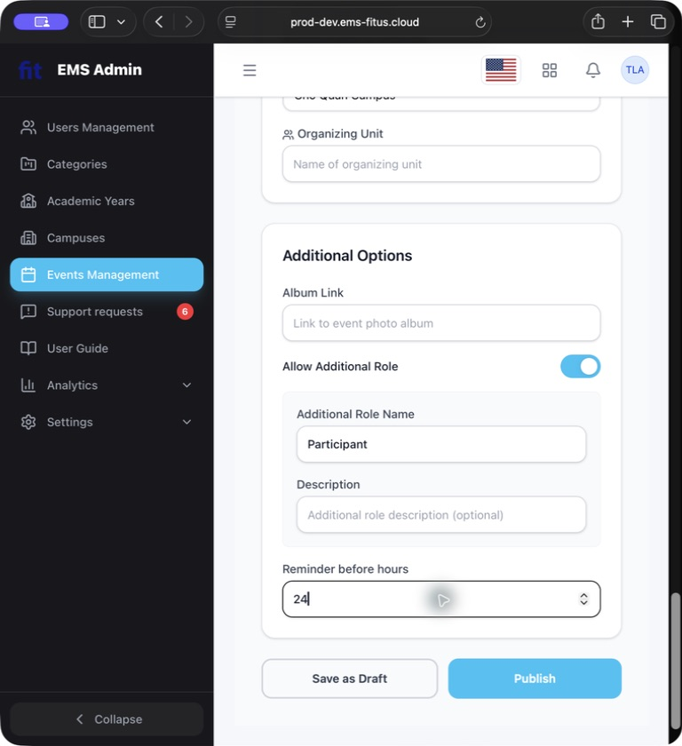 |
| IA-02-12 | IA-02 | Form upload ảnh/tài liệu sự kiện nêu rõ định dạng, kích thước tối đa, tiến trình upload và lỗi upload nếu có. | Không áp dụng | A3 Đăng ký và vai trò không có/không thực hiện tải ảnh/tài liệu lên trong luồng được giao; tiêu chí không áp dụng cho màn hình này. |  |
| IA-02-13 | IA-02 | Trình soạn thảo Rich-Text ở trang tạo/sửa sự kiện hỗ trợ đúng các định dạng cơ bản, dán văn bản ổn định, không làm mất định dạng hoặc hiển thị HTML thô khi xem lại. | Không áp dụng | A3 Đăng ký và vai trò không có/không thực hiện trình soạn thảo văn bản định dạng trong luồng được giao; tiêu chí không áp dụng cho màn hình này. |  |
| IA-03-01 | IA-03 | Menu chính hiển thị các khu vực quan trọng như Dashboard, Events, My Registrations, Reports/Management, Profile theo vai trò người dùng. | Đạt |  |  |
| IA-03-02 | IA-03 | Người dùng luôn biết mình đang ở đâu thông qua tiêu đề trang, trạng thái menu active hoặc breadcrumb. | Đạt |  |  |
| IA-03-03 | IA-03 | Từ danh sách sự kiện, người dùng có thể dễ dàng mở chi tiết sự kiện và quay lại danh sách với bộ lọc/trang hiện tại được giữ nguyên. | Không áp dụng | A3 Đăng ký và vai trò không có/không thực hiện danh sách → chi tiết → quay lại có giữ bộ lọc trong luồng được giao; tiêu chí không áp dụng cho màn hình này. |  |
| IA-03-04 | IA-03 | Các liên kết/nút điều hướng có tên gọi cụ thể, ví dụ `View Details`, `Manage Attendees`, `Edit Event`, thay vì nhãn chung chung như `Click here`. | Đạt |  |  |
| IA-03-05 | IA-03 | Các trang không truy cập được theo vai trò hiển thị thông báo phù hợp hoặc bị ẩn khỏi menu thay vì dẫn tới lỗi khó hiểu. | Không áp dụng | A3 Đăng ký và vai trò không có/không thực hiện trang bị giới hạn quyền trong luồng được giao; tiêu chí không áp dụng cho màn hình này. |  |
| IA-03-06 | IA-03 | Tìm kiếm và bộ lọc sự kiện dễ thấy, dễ reset và phản ánh đúng trạng thái đang áp dụng. | Không áp dụng | A3 Đăng ký và vai trò không có/không thực hiện tìm kiếm/bộ lọc sự kiện trong luồng được giao; tiêu chí không áp dụng cho màn hình này. |  |
| IA-03-07 | IA-03 | Phân trang hoặc infinite scroll cho danh sách sự kiện có chỉ báo rõ về số trang, số kết quả hoặc trạng thái đã tải hết. | Không áp dụng | A3 Đăng ký và vai trò không có/không thực hiện phân trang/cuộn vô hạn trong luồng được giao; tiêu chí không áp dụng cho màn hình này. |  |
| IA-03-08 | IA-03 | Các bước trong luồng đăng ký sự kiện hoặc checkout vé hiển thị tiến trình hiện tại và bước tiếp theo. | Không áp dụng | A3 Đăng ký và vai trò không có/không thực hiện đăng ký/thanh toán nhiều bước trong luồng được giao; tiêu chí không áp dụng cho màn hình này. |  |
| IA-03-09 | IA-03 | Nút quay lại, breadcrumb hoặc tab không gây mất dữ liệu chưa lưu trong form hoặc bộ lọc quan trọng. | Không đạt | Sau khi đổi `Reminder` 24→25, `Back` điều hướng ngay về Events không cảnh báo; mở lại bản nháp id=80 trả `Reminder` về 24, nên dữ liệu A3 chưa lưu đã mất. Mã phát hiện: T1B-A3-04. | ; ;  |
| IA-03-10 | IA-03 | Điều hướng trên mobile dùng pattern quen thuộc và không che nội dung hoặc hành động chính. | Đạt |  |  |
| IA-03-11 | IA-03 | Các trang chi tiết có hành động liên quan đặt gần nội dung liên quan, ví dụ `Register` gần thông tin vé, `Edit` gần thông tin sự kiện. | Đạt |  |  |
| IA-03-12 | IA-03 | Khi truy cập URL không tồn tại hoặc sự kiện đã bị xóa, hệ thống hiển thị trang 404/empty state có đường dẫn quay về khu vực phù hợp. | Không áp dụng | A3 Đăng ký và vai trò không có/không thực hiện URL không tồn tại/sự kiện đã xóa trong luồng được giao; tiêu chí không áp dụng cho màn hình này. |  |
| IA-04-01 | IA-04 | Sau mỗi hành động quan trọng như tạo sự kiện, đăng ký, hủy đăng ký, lưu thay đổi, hệ thống hiển thị phản hồi thành công hoặc thất bại rõ ràng. | Đạt |  |  |
| IA-04-02 | IA-04 | Các thao tác mất thời gian như tải danh sách, upload ảnh, gửi đăng ký hoặc xuất báo cáo có loading indicator/progress phù hợp. | Đạt |  |  |
| IA-04-03 | IA-04 | Nút submit bị khóa hoặc có trạng thái đang xử lý sau khi người dùng bấm để tránh gửi trùng. | Đạt |  |  |
| IA-04-04 | IA-04 | Thông báo lỗi hệ thống dùng ngôn ngữ dễ hiểu, không chỉ hiển thị mã lỗi kỹ thuật hoặc stack trace. | Đạt |  |  |
| IA-04-05 | IA-04 | Thông báo toast/banner đủ nổi bật nhưng không che mất nút hoặc dữ liệu quan trọng. | Đạt |  |  |
| IA-04-06 | IA-04 | Trạng thái sự kiện như Draft, Published, Closed, Cancelled, Full hiển thị rõ bằng text và màu/badge nhất quán. | Không áp dụng | A3 Đăng ký và vai trò không có/không thực hiện huy hiệu trạng thái sự kiện trong luồng được giao; tiêu chí không áp dụng cho màn hình này. |  |
| IA-04-07 | IA-04 | Empty state của danh sách sự kiện, đăng ký hoặc kết quả tìm kiếm giải thích ngắn gọn và đưa ra hành động tiếp theo. | Không áp dụng | A3 Đăng ký và vai trò không có/không thực hiện trạng thái rỗng của danh sách/tìm kiếm trong luồng được giao; tiêu chí không áp dụng cho màn hình này. |  |
| IA-04-08 | IA-04 | Các hành động nguy hiểm như xóa sự kiện, hủy sự kiện hoặc hủy đăng ký có hộp xác nhận nêu rõ hậu quả. | Không áp dụng | A3 Đăng ký và vai trò không có/không thực hiện hành động `Delete`/`Cancel` nguy hiểm trong luồng được giao; tiêu chí không áp dụng cho màn hình này. |  |
| IA-04-09 | IA-04 | Nếu có thể hoàn tác, hệ thống cung cấp `Undo` hoặc cách khôi phục sau thao tác như xóa nháp, hủy lọc, hủy thay đổi. | Không áp dụng | A3 Đăng ký và vai trò không có/không thực hiện Undo/khôi phục trong luồng được giao; tiêu chí không áp dụng cho màn hình này. |  |
| IA-04-10 | IA-04 | Trạng thái quyền truy cập hoặc phiên đăng nhập hết hạn được thông báo rõ và dẫn người dùng tới bước đăng nhập lại. | Không áp dụng | A3 Đăng ký và vai trò không có/không thực hiện hết hạn phiên trong luồng được giao; tiêu chí không áp dụng cho màn hình này. |  |
| IA-04-11 | IA-04 | Dữ liệu thay đổi theo thời gian như số chỗ còn lại, trạng thái đăng ký hoặc danh sách attendee được cập nhật hoặc cảnh báo khi đã cũ. | Không áp dụng | A3 Đăng ký và vai trò không có/không thực hiện dữ liệu thời gian thực/dữ liệu cũ trong luồng được giao; tiêu chí không áp dụng cho màn hình này. |  |
| IA-04-12 | IA-04 | Hệ thống cung cấp hướng dẫn ngắn hoặc liên kết trợ giúp đúng ngữ cảnh cho tác vụ phức tạp như tạo sự kiện, cấu hình vé hoặc xuất báo cáo. | Đạt |  |  |
| IA-04-13 | IA-04 | Các quy trình dài hoặc phức tạp như tạo sự kiện mới, đăng ký/mua vé số lượng lớn kết thúc bằng màn hình hoặc thông báo xác nhận rõ ràng, nêu kết quả và gợi ý bước tiếp theo phù hợp. | Đạt |  |  |

### 3.5 Tổng hợp

| Màn hình | Tổng tiêu chí áp dụng | Đạt | Không đạt | Không áp dụng | Tỷ lệ đạt | Nhận xét chính |
| --- | ---: | ---: | ---: | ---: | ---: | --- |
| A1 | 25 | 18 | 7 | 26 | 72.0% | Xác nhận lỗi ở trạng thái rỗng, khả năng thích ứng, EN/VI, chú giải biểu tượng và khả năng giữ bộ lọc. |
| A2 | 38 | 34 | 4 | 13 | 89.5% | Xác nhận lỗi tải tệp không hợp lệ, cảnh báo thay đổi chưa lưu và chú giải cho nút chỉ có biểu tượng. |
| A3 | 33 | 30 | 3 | 18 | 90.9% | Xác nhận lỗi quan hệ phụ thuộc và mất thay đổi chưa lưu trong phần Đăng ký và vai trò. |
| **Tổng cộng** | **96** | **82** | **14** | **57** | **85.4%** | **153 dòng checklist; 11 phát hiện được xác nhận bằng tương tác.** |

- Mỗi màn hình A1/A2/A3 có đúng 51 mã checklist duy nhất; tổng cộng 153 dòng.
- 14 dòng `Không đạt` ánh xạ tới 11 phát hiện được xác nhận bằng tương tác; IA-02-04/A3 chứa hai phát hiện về quan hệ phụ thuộc.
- Google Form chưa được gửi; Bảo sẽ gửi bằng email sinh viên. Thời điểm gửi: `Chờ Bảo gửi bằng email sinh viên`.

### 3.6 Các phát hiện được xác nhận bằng tương tác

Chỉ 11 phát hiện được xác nhận bằng thao tác trực tiếp được đưa vào nhật ký; 14 dòng `Không đạt` cùng ánh xạ tới 11 phát hiện vì một số phát hiện vi phạm nhiều tiêu chí, và IA-02-04/A3 chứa hai lỗi quan hệ phụ thuộc riêng.

| Mã lỗi | Màn hình | Các bước tái hiện | Kết quả mong đợi | Kết quả thực tế | Mức độ nghiêm trọng | Ảnh minh chứng | Thời điểm gửi Google Form |
| --- | --- | --- | --- | --- | ---: | --- | --- |
| T1B-A1-01 | A1 Danh sách sự kiện | Trạng thái tìm kiếm rỗng không có hành động đặt lại/xóa bộ lọc. Các bước: 1. Mở `Events`. 2. Nhập truy vấn không khớp sự kiện nào. 3. Quan sát trạng thái rỗng. | Trạng thái rỗng giải thích kết quả và có hành động `Reset`/xóa bộ lọc trực tiếp. | Thông báo giải thích không có sự kiện phù hợp nhưng không có hành động xóa truy vấn/bộ lọc. | 2 |  | Chờ đồng bộ sau khi Bảo gửi |
| T1B-A1-03 | A1 Danh sách sự kiện | Bảng sự kiện yêu cầu cuộn ngang trong cửa sổ Safari 1171×768. Các bước: 1. Mở `Events` trong cửa sổ Safari 1171×768. 2. Quan sát bảng và cạnh dưới. | Các cột và hành động cốt lõi hiển thị mà không cần cuộn ngang không cần thiết. | Bảng rộng tràn ngang, che các cột/hành động phía sau cho đến khi người dùng cuộn ngang. | 2 |  | Chờ đồng bộ sau khi Bảo gửi |
| T1B-A1-04 | A1 Danh sách sự kiện | Bảng thông báo tiếng Anh còn văn bản tiếng Việt chưa dịch. Các bước: 1. Giữ giao diện ở tiếng Anh. 2. Mở `Notifications`. 3. Đọc các thông báo. | Toàn bộ nội dung thông báo dùng ngôn ngữ tiếng Anh đã chọn. | Bảng hiển thị `Phản hồi khiếu nại` trong khi phần giao diện xung quanh là tiếng Anh. | 1 |  | Chờ đồng bộ sau khi Bảo gửi |
| T1B-A1-05 | A1 Danh sách sự kiện | Hành động sự kiện chỉ có biểu tượng không hiển thị chú giải khi có tiêu điểm. Các bước: 1. Di chuyển tiêu điểm bàn phím tới hành động chỉ có biểu tượng. 2. Dừng tại phần tử. 3. Quan sát phần giải thích trực quan. | Hành động chỉ có biểu tượng hiển thị nhãn/chú giải rõ khi di chuột hoặc có tiêu điểm. | Biểu tượng `Delete` có viền tiêu điểm nhưng không hiển thị nhãn/chú giải. | 2 |  | Chờ đồng bộ sau khi Bảo gửi |
| T1B-A1-06 | A1 Danh sách sự kiện | Trạng thái tìm kiếm/bộ lọc bị mất sau khi mở sự kiện và quay lại. Các bước: 1. Tìm bản nháp Task 1B có tên duy nhất. 2. Mở chi tiết. 3. Dùng nút Quay lại của trình duyệt. | Danh sách `Events` khôi phục truy vấn, các dòng đã lọc và vị trí danh sách trước đó. | Toàn bộ danh sách trở lại với ô tìm kiếm bị xóa. | 2 | Trước: ; sau:  | Chờ đồng bộ sau khi Bảo gửi |
| T1B-A2-01 | A2 Thêm/Sửa sự kiện | Phần tải ảnh `Thumbnail` chấp nhận tệp `.txt` như một ảnh. Các bước: 1. Mở biểu mẫu Thêm/Sửa sự kiện. 2. Chọn `upload_invalid.txt` trong phần `Thumbnail`. 3. Quan sát phần xem trước. | Tệp không phải ảnh bị từ chối trước khi xem trước/tải lên và có thông báo kiểm tra hợp lệ cụ thể. | Tệp `.txt` được chấp nhận và phần xem trước bị hỏng hiển thị mà không có lỗi. | 2 |  | Chờ đồng bộ sau khi Bảo gửi |
| T1B-A2-02 | A2 Thêm/Sửa sự kiện | Rời biểu mẫu chỉnh sửa đã có dữ liệu không có cảnh báo thay đổi chưa lưu và làm mất tiêu đề chưa lưu (IA-02-11, IA-03-09). Các bước: 1. Đổi tiêu đề trong biểu mẫu chỉnh sửa. 2. Dùng `Back` trước khi lưu. 3. Quan sát điều hướng và ngữ cảnh chỉnh sửa bị xóa. | Ứng dụng yêu cầu xác nhận và giữ thay đổi chưa lưu cho đến khi người dùng chọn hủy bỏ rõ ràng. | Điều hướng xảy ra ngay, không có cảnh báo; tiêu đề chưa lưu bị mất. | 3 | Trước: ; sau:  | Chờ đồng bộ sau khi Bảo gửi |
| T1B-A2-03 | A2 Thêm/Sửa sự kiện | Các nút chỉ có biểu tượng `Back`, `Thumbnail` và `Banner` không có nhãn/chú giải khi di chuột hoặc dùng bàn phím (IA-01-07); biểu tượng soạn thảo văn bản có chú giải. Các bước: 1. Mở biểu mẫu chỉnh sửa đã giữ lại. 2. Di chuột trên `Back` và các nút máy ảnh. 3. Dùng bàn phím đưa tiêu điểm tới nút máy ảnh `Thumbnail` và dừng lại. | Mọi hành động chỉ có biểu tượng cung cấp nhãn/chú giải rõ khi di chuột và có tiêu điểm. | `Back` và các nút máy ảnh `Thumbnail`/`Banner` không hiển thị nhãn/chú giải trong các trạng thái đã kiểm thử. | 2 | ; ; ;  | Chờ đồng bộ sau khi Bảo gửi |
| T1B-A3-01 | A3 Đăng ký và vai trò | `Max Slots` vẫn hoạt động khi bật `Is Unlimited`. Các bước: 1. Bật `Student Registration`. 2. Bật `Is Unlimited`. 3. Kiểm tra và chỉnh sửa `Max Slots`. | Khi không giới hạn số lượng, điều khiển `Max Slots` mâu thuẫn phải bị vô hiệu hóa, xóa hoặc ẩn. | `Max Slots` vẫn hiển thị và chỉnh sửa được khi `Is Unlimited` đang bật. | 2 |  | Chờ đồng bộ sau khi Bảo gửi |
| T1B-A3-03 | A3 Đăng ký và vai trò | `Waitlist` vẫn bật sau khi tắt `Student Registration`. Các bước: 1. Bật `Student Registration` và `Waitlist`. 2. Tắt `Student Registration`. 3. Quan sát `Waitlist`. | Khi tắt chế độ đăng ký cha, trạng thái `Waitlist` phụ thuộc phải bị vô hiệu hóa hoặc xóa. | Các điều khiển vai trò `Student` biến mất nhưng `Waitlist` vẫn bật. | 3 |  | Chờ đồng bộ sau khi Bảo gửi |
| T1B-A3-04 | A3 Đăng ký và vai trò | Thay đổi chưa lưu trong `Registration & Roles` bị mất mà không có cảnh báo (IA-02-11, IA-03-09). Các bước: 1. Đổi `Reminder` từ 24 thành 25. 2. Dùng `Back` mà không lưu. 3. Mở lại bản nháp. | Ứng dụng cảnh báo trước khi điều hướng và giữ thay đổi cho đến khi người dùng chọn hủy bỏ rõ ràng. | Điều hướng quay về `Events` ngay; khi mở lại, giá trị đã lưu là 24, nên giá trị 25 chưa lưu bị mất. | 3 | ; ;  | Chờ đồng bộ sau khi Bảo gửi |

- Google Form chưa được gửi. Bảo phải nhập/xác nhận email sinh viên thật; email này không tìm thấy trong kho mã nguồn.
- Thời điểm gửi biểu mẫu: `Chờ đồng bộ sau khi Bảo gửi`.
- Bản sao để nhập vào Google Form: `submission/task1b_google_form_entries.md`.

### 3.7 Nhật ký kiểm thử trực tiếp

| Thời điểm ICT | Màn hình | Tương tác đã hoàn tất | Minh chứng/kết quả |
| --- | --- | --- | --- |
| 2026-08-02 16:45–16:46 | A1 | Tìm kiếm chính xác bản nháp, tìm kiếm không có kết quả, xóa nội dung thủ công | ;  |
| 2026-08-02 16:49–17:17 | A1 | Số dòng mỗi trang, trang 2, bộ lọc `Status`/`Time`, tổng quan toàn danh sách, khả năng thích ứng |  |
| 2026-08-02 17:23–17:26 | A1 | Thông báo; tiêu điểm/chú giải bằng Option+Tab; bản nháp → `Details` → `Back` | ; ;  |
| 2026-08-02 16:58–17:00 | A2 | `Publish` khi trống, thứ tự ngày, tải tệp TXT không hợp lệ/PNG hợp lệ | 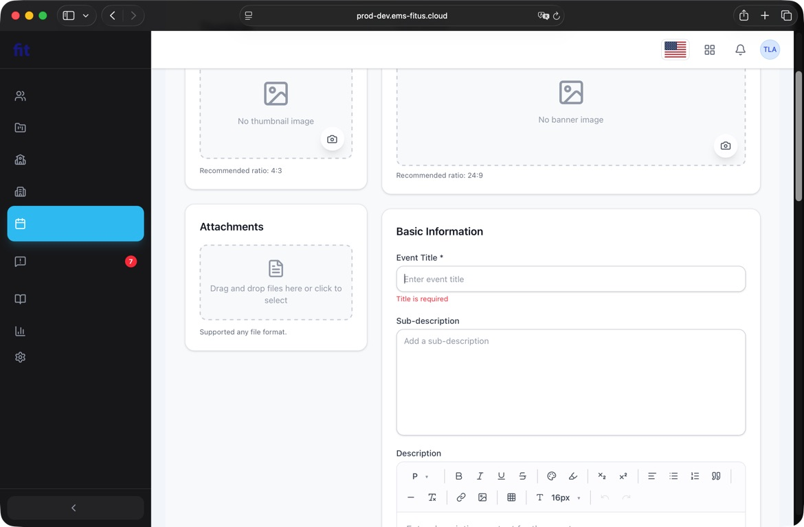; 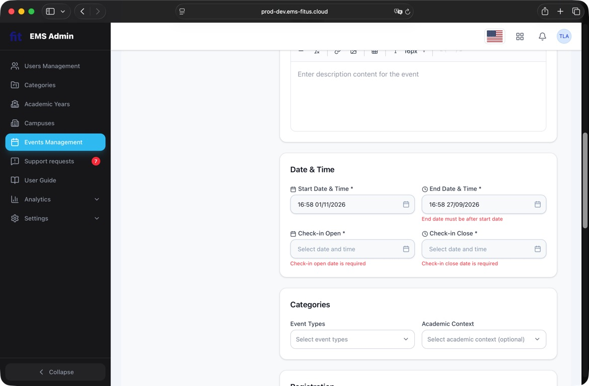;  |
| 2026-08-02 17:04–17:38 | A2 | Biểu mẫu `Update` đã có dữ liệu → `Back`; kiểm thử lại khả năng lưu giữ | ;  |
| 2026-08-02 17:39–17:40 | A2 | Mở lại id=80; kiểm tra lưu giữ tiêu đề/ngày giờ/văn bản định dạng và hiển thị `Details` | 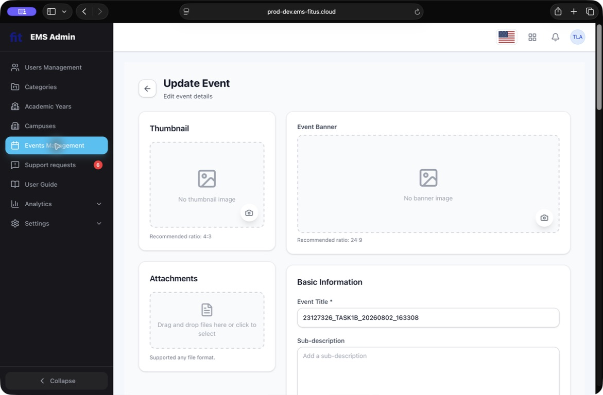; 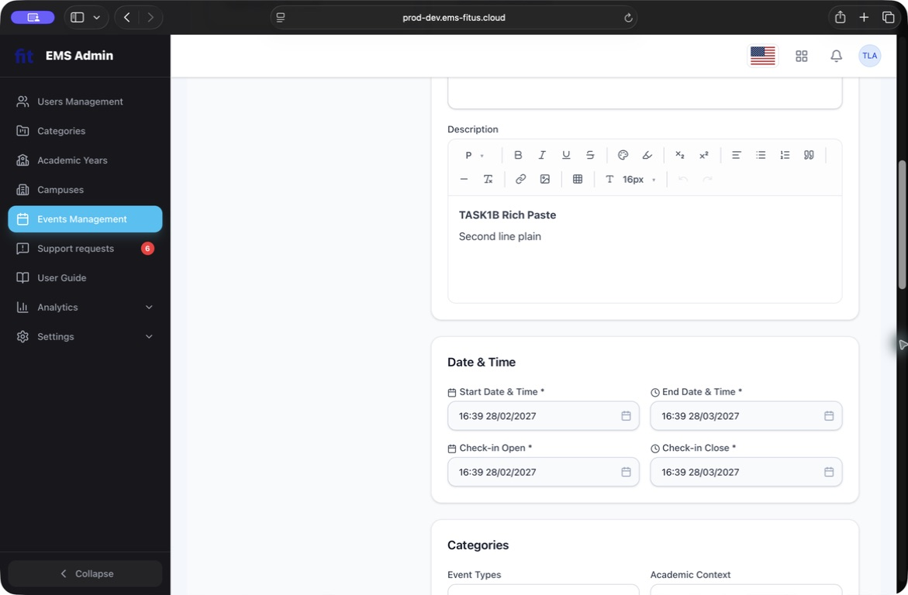; ; 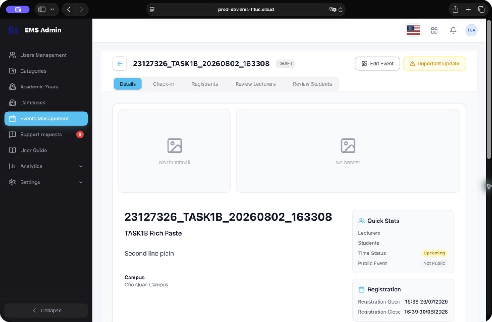 |
| 2026-08-02 17:07–17:15 | A3 | Các bảng vai trò, tiêu điểm bàn phím, `Max Slots` = -1, `Save`/mở lại | ; ; ; 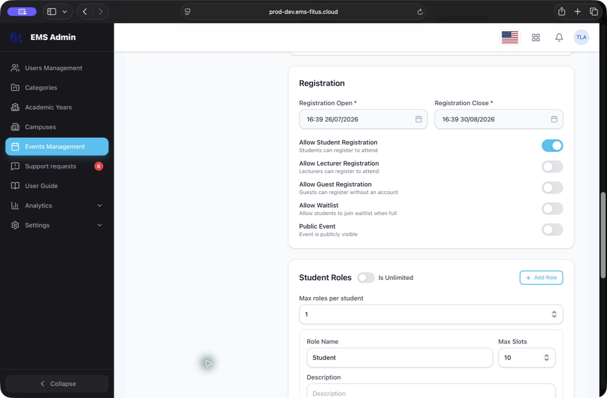 |
| 2026-08-02 17:41 | A3 | Kiểm thử lại quan hệ phụ thuộc `Is Unlimited`/`Max Slots` và `Waitlist`/`Student Registration` | ;  |
| 2026-08-02 18:14 | A1 | Mở hộp thoại xác nhận `Delete` cho đúng bản nháp, đọc hậu quả, chọn `Cancel` và xác nhận bản nháp còn tồn tại | 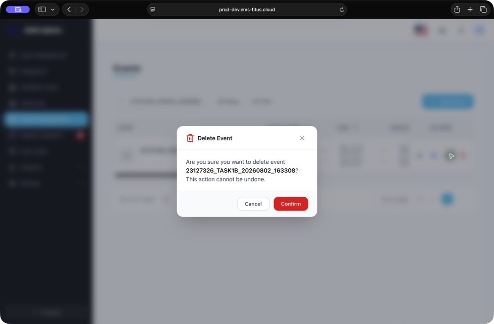; 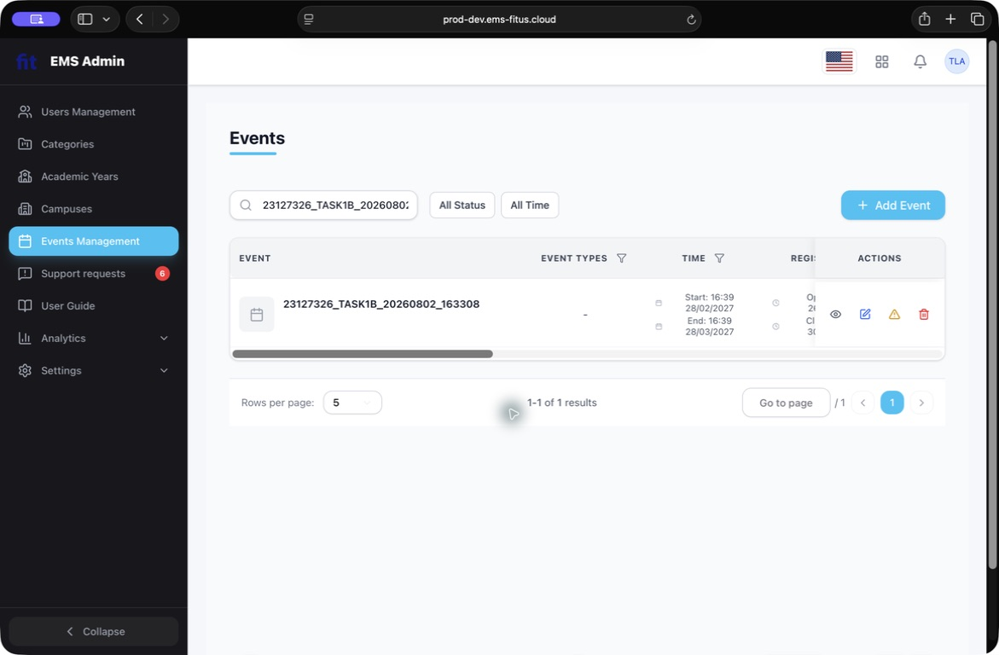 |
| 2026-08-02 18:21–18:23 | A1 | Các trạng thái di chuột/tiêu điểm/hoạt động/vô hiệu hóa và điều hướng gọn 768×840 | ; ; 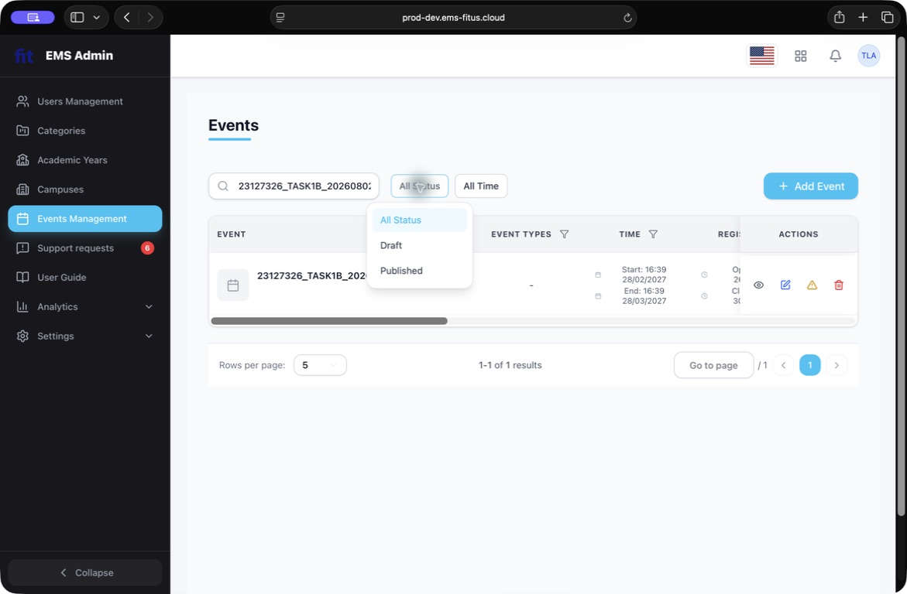; 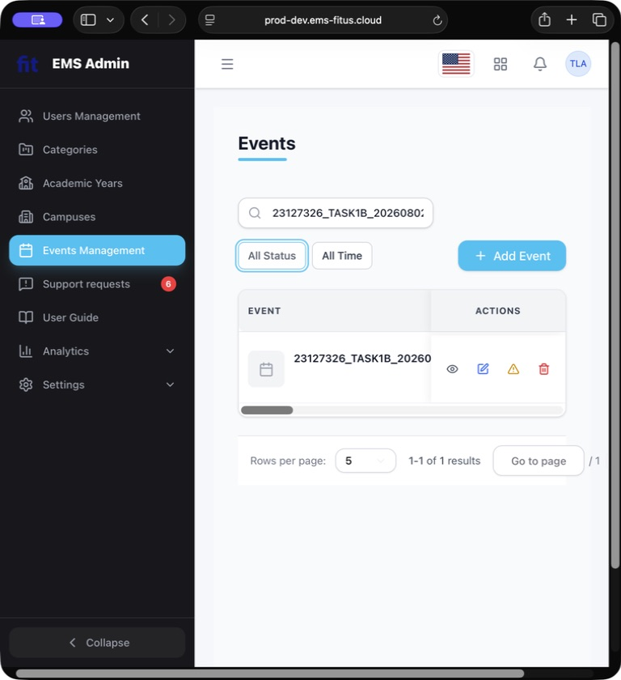; 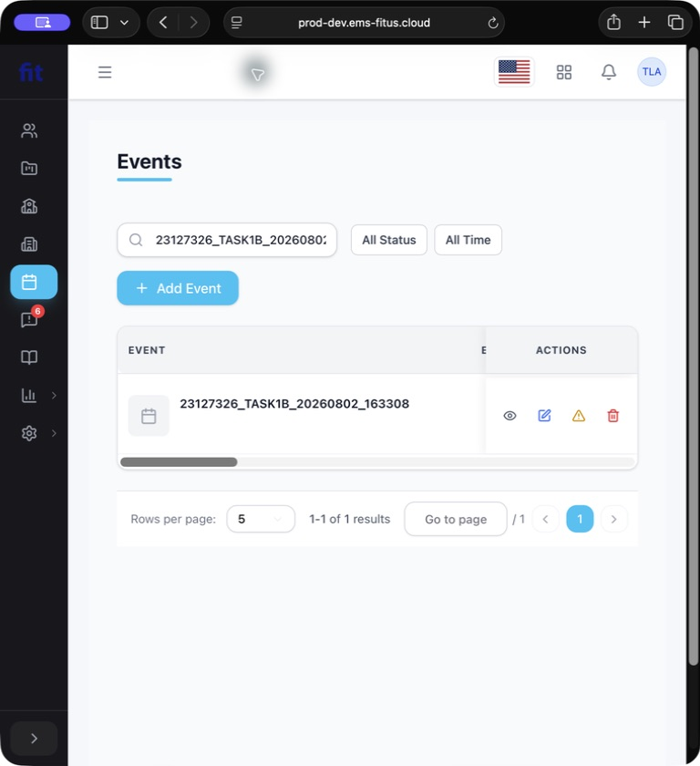 |
| 2026-08-02 18:23–18:26 | A2 | Biểu mẫu/điều hướng thích ứng ở kích thước gọn và kiểm thử lại chú giải/tiêu điểm biểu tượng | 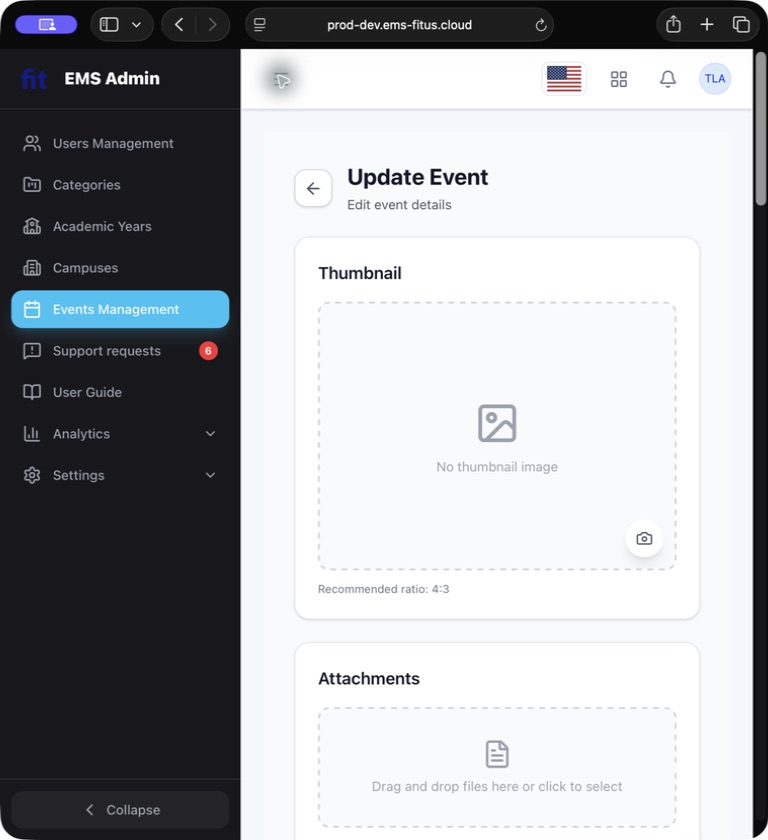; 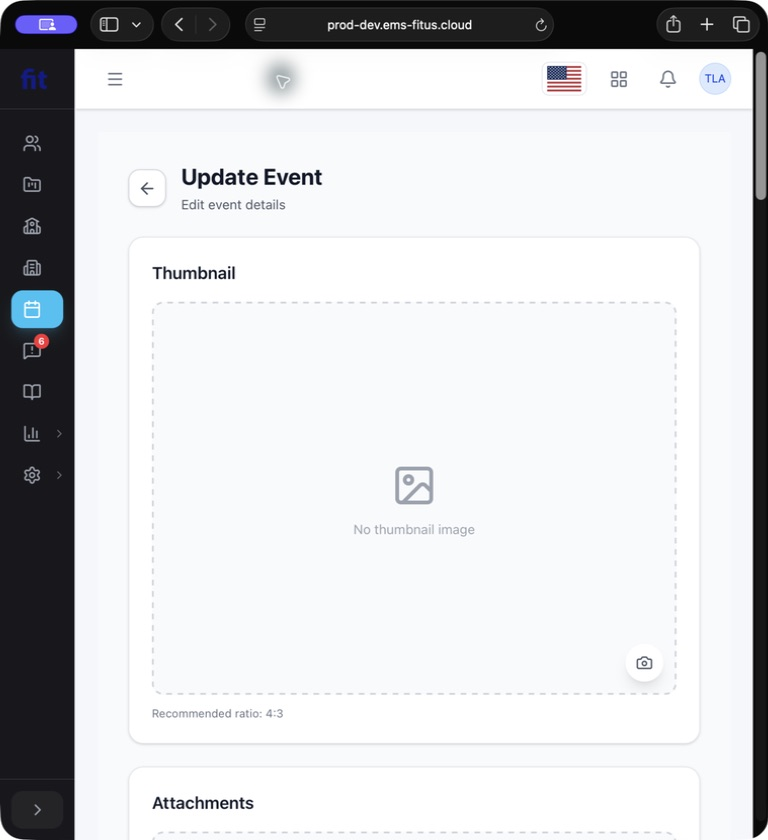; 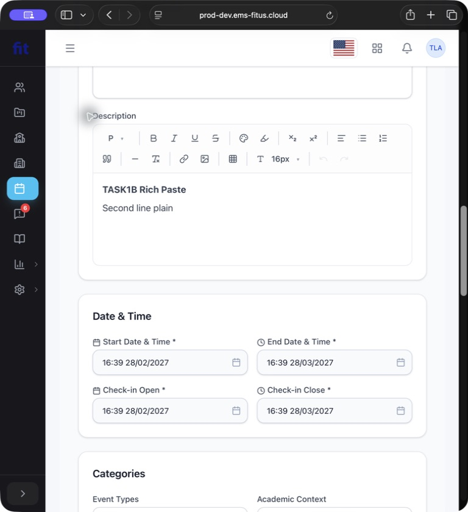; ; ; ;  |
| 2026-08-02 18:26–18:28 | A3 | Giao diện gọn `Registration & Roles` và kiểm thử `Reminder` chưa lưu 24→25 → `Back` → mở lại | 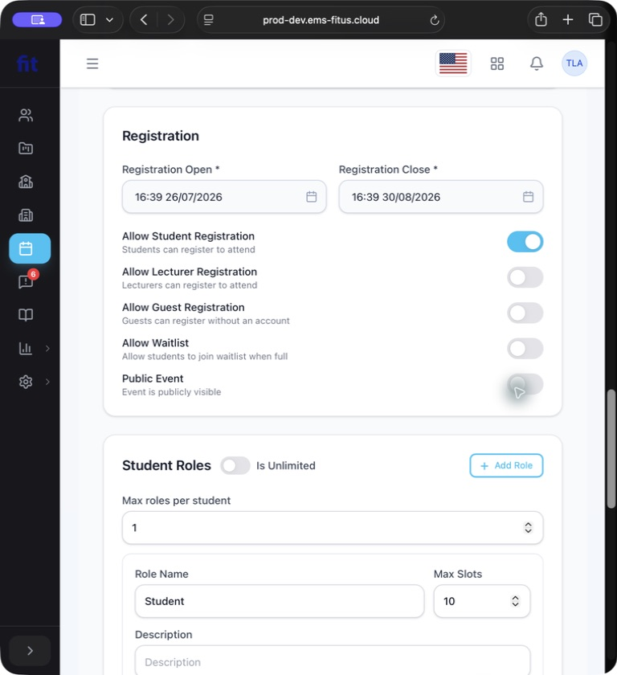; ; ;  |

## 4. Task 2 - Kiểm thử với 5 người dùng thật

### 4.1 Kịch bản nhiệm vụ theo mục tiêu

**Bối cảnh đọc cho người tham gia:**

> Bạn là cộng tác viên quản trị sự kiện của khoa. Ban tổ chức cần bạn chuẩn bị một sự kiện học thuật mới ở trạng thái bản nháp, cấu hình đăng ký cho sinh viên và một vai trò cộng tác viên bổ sung, sau đó tìm sự kiện trong danh sách quản trị và mở lại ở chế độ chỉnh sửa (`Edit`) để xác nhận dữ liệu đã được lưu. Không xuất bản hoặc xóa sự kiện.

| Nhóm trên EMS | Trường/điều khiển | Giá trị yêu cầu |
| --- | --- | --- |
| Media | `Thumbnail` | Để trống. |
| Media | `Event Banner` | Để trống. |
| Media | `Attachments` | Để trống. |
| `Basic Information` | `Event Title` | `23127326_UT_<mã người tham gia>_<thời điểm>` |
| `Basic Information` | `Sub-description` | `Workshop Kỹ năng nghiên cứu 2026` |
| `Basic Information` | `Description` | `Workshop giúp sinh viên chuẩn bị đề cương nghiên cứu và trình bày kết quả.` |
| `Date & Time` | `Start Date & Time` | 08:00 25/08/2026 |
| `Date & Time` | `End Date & Time` | 11:30 25/08/2026 |
| `Date & Time` | `Check-in Open` | 07:30 25/08/2026 |
| `Date & Time` | `Check-in Close` | 09:00 25/08/2026 |
| `Categories` | `Event Types` | Chọn một giá trị phù hợp trong danh sách EMS đang cung cấp. |
| `Categories` | `Academic Context` | Chọn một giá trị phù hợp trong danh sách EMS đang cung cấp. |
| `Registration` | `Registration Open` | 08:00 10/08/2026 |
| `Registration` | `Registration Close` | 23:00 20/08/2026 |
| `Registration` | `Allow Student Registration` | Bật. |
| `Registration` | `Allow Lecturer Registration` | Tắt. |
| `Registration` | `Allow Guest Registration` | Tắt. |
| `Registration` | `Allow Waitlist` | Bật. |
| `Registration` | `Public Event` | Tắt. |
| `Student Roles` | `Is Unlimited` | Tắt. |
| `Student Roles` | `Max roles per student` | 1 |
| `Student Roles` | `Role Name` | `Student` |
| `Student Roles` | `Max Slots` | 30 |
| `Student Roles` | `Description` | `Sinh viên tham dự workshop` |
| `Location & Organization` | `Location` | `Phòng I.23` |
| `Location & Organization` | `Campus` | `Cho Quan Campus` |
| `Location & Organization` | `Organizing Unit` | `Khoa Công nghệ Thông tin` |
| `Additional Options` | `Album Link` | Để trống. |
| `Additional Options` | `Allow Additional Role` | Bật. |
| `Additional Options` | `Additional Role Name` | `Cộng tác viên` |
| `Additional Options` | `Description` | `Hỗ trợ tổ chức sự kiện` |
| `Additional Options` | `Reminder before hours` | 24 |
| Trạng thái cuối | `Save as Draft` | Lưu dưới dạng `Draft`; không `Publish` và không xóa sự kiện. |

Kịch bản bao phủ A2 khi tạo/sửa dữ liệu, A3 khi cấu hình đăng ký và vai trò, và A1 khi tìm kiếm, nhận biết trạng thái nháp và mở lại sự kiện bằng `Edit`.

### 4.2 Thiết kế đo lường

| Chỉ số | Cách đo |
| --- | --- |
| Task success | `Hoàn thành`: tạo được bản nháp, đủ dữ liệu A2/A3 và mở lại bằng `Edit` để xác nhận mà không cần gợi ý; `Một phần`: lưu được bản nháp nhưng thiếu ít nhất một yêu cầu, không xác nhận được hoặc phải nhận gợi ý; `Thất bại`: không tạo được bản nháp dùng được trong 15 phút hoặc để người điều phối làm thay. |
| Time on task | Bắt đầu khi người tham gia nói đã hiểu nhiệm vụ; dừng khi họ mở bản nháp bằng `Edit` và tuyên bố hoàn tất, bỏ cuộc hoặc chạm mốc 15 phút. Ghi theo `mm:ss`. |
| Error count | Mỗi thao tác tạo kết quả sai, thông báo lỗi, nhập sai cần sửa hoặc đi sai luồng được tính một lỗi. Cùng một lỗi liên tiếp chỉ tính lại sau khi người tham gia đã thực hiện một hành động khác. |
| Hesitation count | Một lần dừng/quét giao diện từ 5 giây, lặp lại việc tìm kiếm hoặc nói rõ sự không chắc chắn được tính là một hesitation. Một episode liên tục chỉ tính một lần. |
| Can thiệp | Ghi riêng mọi gợi ý của người điều phối; nếu có gợi ý dẫn đường thì kết quả cao nhất là `Một phần`. |
| Post-task score | Dùng System Usability Scale (SUS) gồm 10 mệnh đề, thang 1–5. Điểm câu lẻ = phản hồi - 1; câu chẵn = 5 - phản hồi; cộng 10 câu rồi nhân 2,5 để ra thang 0–100. |
| Probe questions | Năm câu hỏi mở về độ rõ ràng, khả năng phục hồi khi lỗi, tốc độ/phản hồi, mức độ tin tưởng và thay đổi ưu tiên. |

### 4.3 Tuyển người tham gia và pilot

Nhóm mục tiêu là người từ 18 tuổi, ngoài lớp học phần này, đã từng dùng biểu mẫu web và phù hợp vai trò quản trị/tổ chức sự kiện. Tuyển 5 người chính và 1 người pilot riêng; lưu thông tin liên hệ thật để có thể xác minh, nhưng chỉ ghi bản che phần giữa trong bài nộp.

| Nội dung | Ghi chú |
| --- | --- |
| Trạng thái pilot | Chưa có dữ liệu người thật; không tính là đã hoàn thành. |
| Người pilot | Cần 1 người phù hợp tiêu chí và không thuộc P1–P5. |
| Mục tiêu pilot | Xác nhận người tham gia hiểu mục tiêu mà không cần hướng dẫn từng bước; dữ liệu ngày giờ hợp lệ; luồng A1/A2/A3 không bị gãy; phiên có thể hoàn tất trong 20 phút. |
| Vấn đề phát hiện | Chờ kết quả quan sát pilot thật. |
| Điều chỉnh trước 5 session chính | Chỉ ghi sau pilot; ưu tiên sửa câu chữ, dữ liệu hoặc khâu chuẩn bị, không biến kịch bản thành hướng dẫn thao tác. |

### 4.4 Bảng người tham gia

| ID | Hồ sơ phù hợp | Liên hệ đã che | Ngày giờ phiên | Thiết bị/trình duyệt | Minh chứng ghi hình |
| --- | --- | --- | --- | --- | --- |
| P1 | Chưa tuyển/xác nhận | Chưa có dữ liệu thật | Chưa xếp lịch | Chưa ghi nhận | Chưa ghi nhận |
| P2 | Chưa tuyển/xác nhận | Chưa có dữ liệu thật | Chưa xếp lịch | Chưa ghi nhận | Chưa ghi nhận |
| P3 | Chưa tuyển/xác nhận | Chưa có dữ liệu thật | Chưa xếp lịch | Chưa ghi nhận | Chưa ghi nhận |
| P4 | Chưa tuyển/xác nhận | Chưa có dữ liệu thật | Chưa xếp lịch | Chưa ghi nhận | Chưa ghi nhận |
| P5 | Chưa tuyển/xác nhận | Chưa có dữ liệu thật | Chưa xếp lịch | Chưa ghi nhận | Chưa ghi nhận |

### 4.5 Bảng chỉ số

| Người tham gia | Kết quả | Thời gian | Số lỗi | Số lần do dự | Điểm SUS | Ghi chú chính |
| --- | --- | ---: | ---: | ---: | ---: | --- |
| P1 | [Hoàn thành/Một phần/Thất bại] | [mm:ss] | [ ] | [ ] | [ ] | [ ] |
| P2 | [ ] | [ ] | [ ] | [ ] | [ ] | [ ] |
| P3 | [ ] | [ ] | [ ] | [ ] | [ ] | [ ] |
| P4 | [ ] | [ ] | [ ] | [ ] | [ ] | [ ] |
| P5 | [ ] | [ ] | [ ] | [ ] | [ ] | [ ] |
| **Tổng hợp** | [Tỷ lệ hoàn thành] | [Trung bình] | [Trung bình] | [Trung bình] | [Trung bình] | [ ] |

### 4.6 Các phát hiện tính khả dụng theo mức độ

| ID | Màn hình | Phát hiện | Bằng chứng | Mức độ | Ảnh minh chứng | Khuyến nghị |
| --- | --- | --- | --- | ---: | --- | --- |
| UX-001 | [A1/A2/A3] | [Vấn đề tính khả dụng] | [Người tham gia/chỉ số/trích dẫn] | [0-4] | [screenshots/...] | [Khuyến nghị cụ thể] |

### 4.7 Khuyến nghị theo độ ưu tiên

| Ưu tiên | Khuyến nghị | Lý do | Phát hiện liên quan |
| --- | --- | --- | --- |
| P0 | [Sửa ngay] | [Ảnh hưởng nghiêm trọng] | [UX-...] |
| P1 | [Sửa sớm] | [Ảnh hưởng vừa] | [UX-...] |
| P2 | [Cải thiện sau] | [Tối ưu trải nghiệm] | [UX-...] |

## 5. Task 3 - Cross-Browser / Cross-Platform

### 5.1 Coverage summary

| Dimension | Yêu cầu theo đề | Coverage thực tế |
| --- | --- | --- |
| Operating systems | 3 OS per screen | [Windows, macOS, Android/iOS...] |
| Browsers | 5 browsers per screen | [Chrome, Firefox, Safari, Edge, Opera/Samsung Internet...] |
| Device classes | 3 device classes per screen | [Desktop, tablet, phone] |
| Screenshot requirement | Mỗi cell có screenshot, ảnh hiển thị EMS URL, browser/OS/device, và email overlay | [Đã đủ/Chưa đủ] |

### 5.2 Compatibility matrix summary

Chi tiết đầy đủ nằm ở `submission/cross_platform_matrix.md`.

| Screen | Cells covered | Passed | Failed | OS covered | Browsers covered | Device classes covered |
| --- | ---: | ---: | ---: | --- | --- | --- |
| A1 | [ ] | [ ] | [ ] | [ ] | [ ] | [ ] |
| A2 | [ ] | [ ] | [ ] | [ ] | [ ] | [ ] |
| A3 | [ ] | [ ] | [ ] | [ ] | [ ] | [ ] |

### 5.3 Compatibility defects

| ID | Screen | Environment | Defect | Expected | Actual | Severity | Screenshot ref | Google Form timestamp |
| --- | --- | --- | --- | --- | --- | ---: | --- | --- |
| CP-BUG-001 | [A1/A2/A3] | [OS + Browser + Device] | [Overflow/overlap/broken layout...] | [ ] | [ ] | [0-4] | [screenshots/...] | [ ] |

## 6. Bug & Usability Findings submission

| Nội dung | Giá trị |
| --- | --- |
| Google Form | https://forms.gle/CJQFQCAXcsDbXDMM9 |
| Aggregated log | `submission/bug_usability_findings_log.md` |
| Tổng Bug | [ ] |
| Tổng Usability findings | [ ] |
| Tổng Compatibility defects | [ ] |
| Đối soát form và log | [Khớp/Chưa khớp] |

## 7. AI appendix

| Artefact | File |
| --- | --- |
| AI Audit Report | `submission/ai-audit/ai_audit_report.md` |
| AI Critique 200-300 words | `submission/ai_critique.md` |

## 8. Kết luận

[Tóm tắt mức độ ổn định UI của các màn hình Pool A, rủi ro nổi bật, và 3 đề xuất ưu tiên nhất.]
