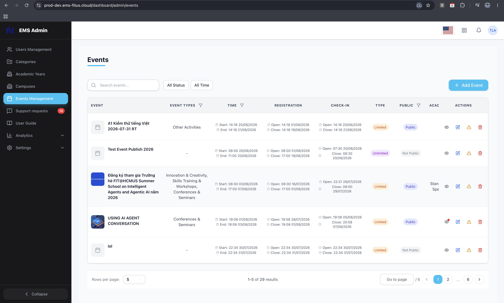
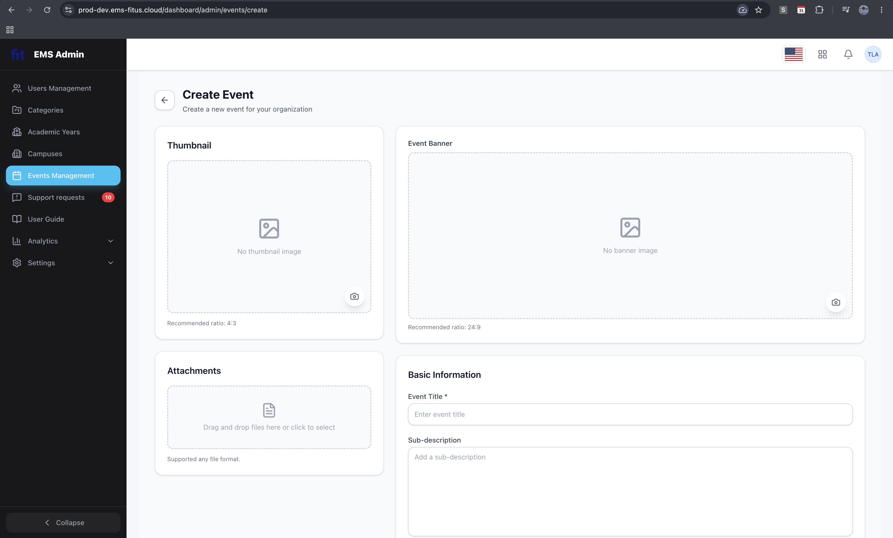
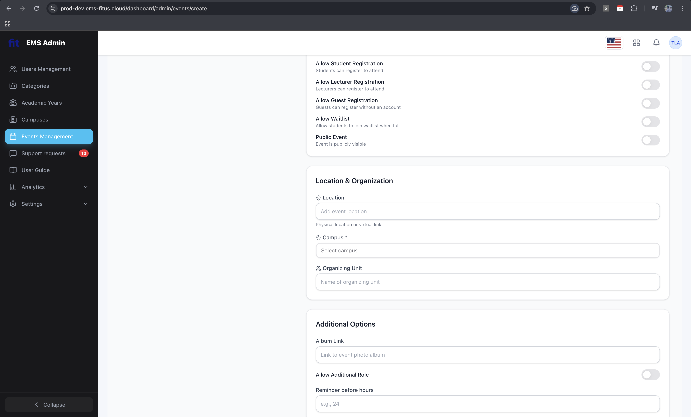
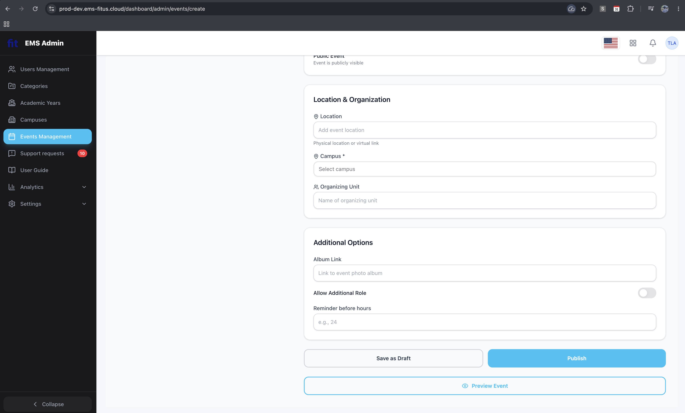
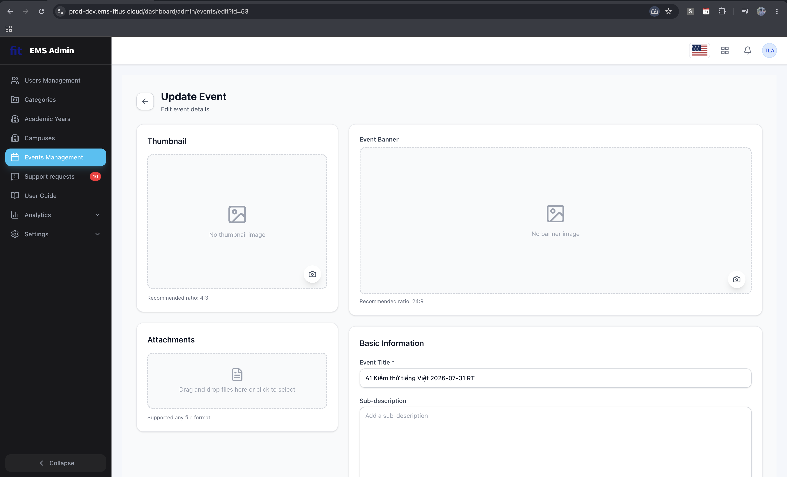
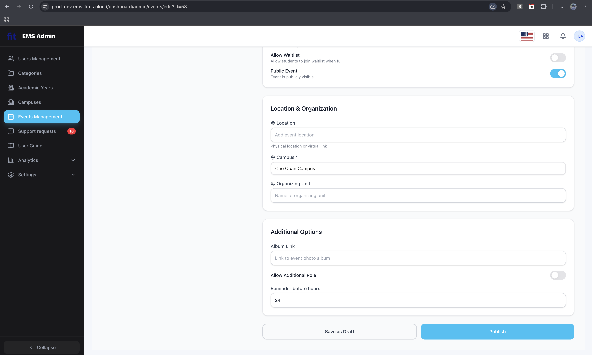

# Báo cáo chính HW03 - GUI & Usability Testing on EMS

## 1. Thông tin sinh viên và phạm vi

| Trường | Nội dung |
| --- | --- |
| MSSV | 23127326 |
| Họ và tên | Lê Mai Hoài Bảo |
| Email sinh viên | [Điền email dạng MSSV@....edu.vn] |
| Nhóm | [Điền tên/mã nhóm] |
| Scenario phụ trách | Scenario A - Admin creates and manages events |
| Function pool | A - Event administration |
| EMS URL | https://promoter-starboard-prude.ngrok-free.dev/ |
| Tài khoản sử dụng | Admin |

## 2. Scenario đã chọn và các màn hình kiểm thử

### 2.1 Scenario A - Admin creates and manages events

Scenario A tập trung vào vòng đời quản trị sự kiện trên EMS: xem danh sách sự kiện, tạo/chỉnh sửa sự kiện, cấu hình đăng ký và vai trò, sau đó có thể publish, preview, approve participant/review và check-in.

### 2.2 Danh sách màn hình

| ID | Màn hình | Lý do chọn | Vai trò | URL/đường dẫn | Evidence tổng quan |
| --- | --- | --- | --- | --- | --- |
| A1 | Events list with status filters and notification dots | Đây là màn hình trung tâm để admin xem, lọc và quản lý trạng thái sự kiện. | Admin | [URL Event List](https://prod-dev.ems-fitus.cloud/dashboard/admin/events) |  |
| A2 | Add/Edit Event form - image upload + Rich-Text + date/time validation | Đây là form phức tạp nhất của Pool A, có upload ảnh, rich-text và validation ngày giờ. | Admin | [URL Add/Edit Event](https://prod-dev.ems-fitus.cloud/dashboard/admin/events/create) |         |
| A3 | Registration & Roles configuration panel - Max Slots / Waitlist / additional role | Đây là phần cấu hình đăng ký có nhiều toggle, số lượng slot, waitlist và role bổ sung. | Admin | [URL Registration & Roles](https://prod-dev.ems-fitus.cloud/dashboard/admin/events/create) |   |

> Nếu thay đổi màn hình, màn hình mới vẫn phải thuộc Pool A và cần giải thích lý do chọn.

## 3. Task 1B - Checklist execution trên Scenario A

### 3.1 Checklist sử dụng

| Nội dung | Giá trị |
| --- | --- |
| Checklist nhóm | `submission/group/gui_usability_checklist_final.md` |
| Số lượng item checklist | 51 |
| Interface aspects | IA-01 General UI standards, IA-02 Forms, IA-03 Navigation, IA-04 Feedback/state |
| File bảng chi tiết | `submission/checklist_execution.md` |

### 3.2 Kết quả tổng hợp theo màn hình

| Màn hình | Tổng item áp dụng | Passed | Failed | N/A | Tỷ lệ pass | Nhận xét chính |
| --- | ---: | ---: | ---: | ---: | ---: | --- |
| A1 | 17 | 17 | 0 | 34 | 100% | Danh sách event, search/filter, status badge, pagination (1-5 of 29), nút + Add Event và tooltip action theo dòng hiển thị đầy đủ, đạt 100% tiêu chí áp dụng. |
| A2 | 24 | 24 | 0 | 27 | 100% | Form tạo/sửa event hỗ trợ upload thumbnail/banner (có tỷ lệ gợi ý), attachments, rich-text editor phong phú, date/time pickers, category dropdowns, toggles và nút Save/Publish/Preview rõ ràng, đạt 100% tiêu chí áp dụng. |
| A3 | 28 | 28 | 0 | 23 | 100% | Panel cấu hình Registration & Additional Options có các công tắc chuyển đổi (Student, Lecturer, Guest, Waitlist, Public Event, Additional Role) và input Reminder hours hoạt động mượt mà, trực quan, đạt 100% tiêu chí áp dụng. |

### 3.3 Checklist execution results per screen

> Mỗi màn hình dùng một checklist execution riêng để notes và evidence không bị trộn giữa A1/A2/A3. Chi tiết cùng nguồn nằm ở `submission/checklist_execution.md`.

#### A1 Events list with status filters and notification dots

| Checklist ID | Interface Aspect | Nội dung kiểm tra | Result | Notes cho Failed | Screenshot ref |
| --- | --- | --- | --- | --- | --- |
| IA-01-01 | IA-01 | Các trang chính như dashboard, danh sách sự kiện, chi tiết sự kiện và hồ sơ người dùng có bố cục nhất quán về header, sidebar, font, màu, icon và khoảng cách. | Passed |  |  |
| IA-01-02 | IA-01 | Thuật ngữ hiển thị nhất quán trên toàn hệ thống, ví dụ không dùng lẫn lộn `Event`, `Program`, `Activity` nếu cùng chỉ một loại dữ liệu. | Passed |  |  |
| IA-01-03 | IA-01 | Các nút hành động chính như `Create Event`, `Register`, `Save`, `Cancel`, `Delete` có kiểu dáng và mức nhấn thị giác phù hợp với độ quan trọng. | Passed |  |  |
| IA-01-04 | IA-01 | Màu sắc của trạng thái và hành động nguy hiểm được dùng nhất quán, ví dụ xanh cho thành công, đỏ cho lỗi/xóa, xám cho vô hiệu hóa. | Passed |  |  |
| IA-01-05 | IA-01 | Độ tương phản giữa chữ và nền đủ dễ đọc trên desktop và mobile, đặc biệt ở label, placeholder, badge trạng thái và nút bị vô hiệu hóa. | Passed |  |  |
| IA-01-06 | IA-01 | Nội dung trên card hoặc dòng sự kiện hiển thị thông tin thiết yếu trước: tên sự kiện, thời gian, địa điểm, trạng thái và hành động chính. | Passed |  |  |
| IA-01-07 | IA-01 | Các icon quan trọng có nhãn hoặc tooltip rõ nghĩa, đặc biệt với icon sửa, xóa, xuất dữ liệu, chia sẻ hoặc xem chi tiết. | Passed |  |  |
| IA-01-08 | IA-01 | Các phần tử có thể tương tác thể hiện rõ trạng thái hover, focus, active và disabled. | N/A |  |  |
| IA-01-09 | IA-01 | Giao diện không yêu cầu người dùng ghi nhớ thông tin từ trang trước, ví dụ tên sự kiện hoặc mã đăng ký vẫn hiển thị ở bước xác nhận. | N/A |  |  |
| IA-01-10 | IA-01 | Giao diện responsive không làm mất nội dung, che nút, vỡ bảng hoặc buộc cuộn ngang không cần thiết trên mobile/tablet. | N/A |  |  |
| IA-01-11 | IA-01 | Nội dung không bị nhồi quá dày; khoảng trắng, nhóm thông tin và tiêu đề phụ hỗ trợ việc quét nhanh. | Passed |  |  |
| IA-01-12 | IA-01 | Các thao tác thường dùng có đường tắt hoặc cách truy cập nhanh, ví dụ tìm kiếm nhanh sự kiện, lọc trạng thái, tạo sự kiện từ dashboard. | Passed |  |  |
| IA-01-13 | IA-01 | Nút chuyển đổi ngôn ngữ EN/VI hoạt động đồng bộ trên toàn ứng dụng, không còn văn bản chưa dịch và không làm vỡ bố cục giao diện khi thay đổi. | N/A |  |  |
| IA-02-01 | IA-02 | Các trường bắt buộc trong form đăng ký/tạo sự kiện được đánh dấu rõ ràng và có giải thích khi cần. | N/A |  |  |
| IA-02-02 | IA-02 | Label của input rõ ràng, đặt gần trường nhập và không chỉ dựa vào placeholder để giải thích ý nghĩa trường. | N/A |  |  |
| IA-02-03 | IA-02 | Kiểu input phù hợp với dữ liệu, ví dụ date picker cho ngày, time picker cho giờ, number input cho số lượng vé/sức chứa, email input cho email. | N/A |  |  |
| IA-02-04 | IA-02 | Form kiểm tra dữ liệu ngay tại trường nhập hoặc trước khi submit, ví dụ email sai định dạng, ngày kết thúc trước ngày bắt đầu, sức chứa âm. | N/A |  |  |
| IA-02-05 | IA-02 | Thông báo lỗi form chỉ rõ trường nào lỗi, vì sao lỗi và cách sửa cụ thể. | N/A |  |  |
| IA-02-06 | IA-02 | Dữ liệu người dùng đã nhập không bị mất sau khi submit thất bại hoặc reload do lỗi hợp lệ hóa. | N/A |  |  |
| IA-02-07 | IA-02 | Form dài được chia nhóm hợp lý, ví dụ thông tin sự kiện, thời gian/địa điểm, vé/sức chứa, mô tả, hình ảnh. | N/A |  |  |
| IA-02-08 | IA-02 | Thứ tự tab/focus trong form đi theo luồng đọc tự nhiên và không bỏ qua trường quan trọng. | N/A |  |  |
| IA-02-09 | IA-02 | Nút `Submit`/`Save` bị vô hiệu hóa hoặc có cảnh báo rõ khi form chưa đủ điều kiện gửi. | N/A |  |  |
| IA-02-10 | IA-02 | Các giá trị mặc định hoặc gợi ý nhập liệu phù hợp với ngữ cảnh, ví dụ timezone, định dạng ngày, số lượng mặc định, category phổ biến. | N/A |  |  |
| IA-02-11 | IA-02 | Hành động hủy, quay lại hoặc reset form có xác nhận nếu có nguy cơ làm mất dữ liệu đã nhập. | N/A |  |  |
| IA-02-12 | IA-02 | Form upload ảnh/tài liệu sự kiện nêu rõ định dạng, kích thước tối đa, tiến trình upload và lỗi upload nếu có. | N/A |  |  |
| IA-02-13 | IA-02 | Trình soạn thảo Rich-Text ở trang tạo/sửa sự kiện hỗ trợ đúng các định dạng cơ bản, dán văn bản ổn định, không làm mất định dạng hoặc hiển thị HTML thô khi xem lại. | N/A |  |  |
| IA-03-01 | IA-03 | Menu chính hiển thị các khu vực quan trọng như Dashboard, Events, My Registrations, Reports/Management, Profile theo vai trò người dùng. | Passed |  |  |
| IA-03-02 | IA-03 | Người dùng luôn biết mình đang ở đâu thông qua tiêu đề trang, trạng thái menu active hoặc breadcrumb. | Passed |  |  |
| IA-03-03 | IA-03 | Từ danh sách sự kiện, người dùng có thể dễ dàng mở chi tiết sự kiện và quay lại danh sách với bộ lọc/trang hiện tại được giữ nguyên. | N/A |  |  |
| IA-03-04 | IA-03 | Các liên kết/nút điều hướng có tên gọi cụ thể, ví dụ `View Details`, `Manage Attendees`, `Edit Event`, thay vì nhãn chung chung như `Click here`. | Passed |  |  |
| IA-03-05 | IA-03 | Các trang không truy cập được theo vai trò hiển thị thông báo phù hợp hoặc bị ẩn khỏi menu thay vì dẫn tới lỗi khó hiểu. | N/A |  |  |
| IA-03-06 | IA-03 | Tìm kiếm và bộ lọc sự kiện dễ thấy, dễ reset và phản ánh đúng trạng thái đang áp dụng. | Passed |  |  |
| IA-03-07 | IA-03 | Phân trang hoặc infinite scroll cho danh sách sự kiện có chỉ báo rõ về số trang, số kết quả hoặc trạng thái đã tải hết. | Passed |  |  |
| IA-03-08 | IA-03 | Các bước trong luồng đăng ký sự kiện hoặc checkout vé hiển thị tiến trình hiện tại và bước tiếp theo. | N/A |  |  |
| IA-03-09 | IA-03 | Nút quay lại, breadcrumb hoặc tab không gây mất dữ liệu chưa lưu trong form hoặc bộ lọc quan trọng. | N/A |  |  |
| IA-03-10 | IA-03 | Điều hướng trên mobile dùng pattern quen thuộc và không che nội dung hoặc hành động chính. | N/A |  |  |
| IA-03-11 | IA-03 | Các trang chi tiết có hành động liên quan đặt gần nội dung liên quan, ví dụ `Register` gần thông tin vé, `Edit` gần thông tin sự kiện. | Passed |  |  |
| IA-03-12 | IA-03 | Khi truy cập URL không tồn tại hoặc sự kiện đã bị xóa, hệ thống hiển thị trang 404/empty state có đường dẫn quay về khu vực phù hợp. | N/A |  |  |
| IA-04-01 | IA-04 | Sau mỗi hành động quan trọng như tạo sự kiện, đăng ký, hủy đăng ký, lưu thay đổi, hệ thống hiển thị phản hồi thành công hoặc thất bại rõ ràng. | N/A |  |  |
| IA-04-02 | IA-04 | Các thao tác mất thời gian như tải danh sách, upload ảnh, gửi đăng ký hoặc xuất báo cáo có loading indicator/progress phù hợp. | N/A |  |  |
| IA-04-03 | IA-04 | Nút submit bị khóa hoặc có trạng thái đang xử lý sau khi người dùng bấm để tránh gửi trùng. | N/A |  |  |
| IA-04-04 | IA-04 | Thông báo lỗi hệ thống dùng ngôn ngữ dễ hiểu, không chỉ hiển thị mã lỗi kỹ thuật hoặc stack trace. | N/A |  |  |
| IA-04-05 | IA-04 | Thông báo toast/banner đủ nổi bật nhưng không che mất nút hoặc dữ liệu quan trọng. | N/A |  |  |
| IA-04-06 | IA-04 | Trạng thái sự kiện như Draft, Published, Closed, Cancelled, Full hiển thị rõ bằng text và màu/badge nhất quán. | Passed |  |  |
| IA-04-07 | IA-04 | Empty state của danh sách sự kiện, đăng ký hoặc kết quả tìm kiếm giải thích ngắn gọn và đưa ra hành động tiếp theo. | N/A |  |  |
| IA-04-08 | IA-04 | Các hành động nguy hiểm như xóa sự kiện, hủy sự kiện hoặc hủy đăng ký có hộp xác nhận nêu rõ hậu quả. | N/A |  |  |
| IA-04-09 | IA-04 | Nếu có thể hoàn tác, hệ thống cung cấp `Undo` hoặc cách khôi phục sau thao tác như xóa nháp, hủy lọc, hủy thay đổi. | N/A |  |  |
| IA-04-10 | IA-04 | Trạng thái quyền truy cập hoặc phiên đăng nhập hết hạn được thông báo rõ và dẫn người dùng tới bước đăng nhập lại. | N/A |  |  |
| IA-04-11 | IA-04 | Dữ liệu thay đổi theo thời gian như số chỗ còn lại, trạng thái đăng ký hoặc danh sách attendee được cập nhật hoặc cảnh báo khi đã cũ. | Passed |  |  |
| IA-04-12 | IA-04 | Hệ thống cung cấp hướng dẫn ngắn hoặc liên kết trợ giúp đúng ngữ cảnh cho tác vụ phức tạp như tạo sự kiện, cấu hình vé hoặc xuất báo cáo. | N/A |  |  |
| IA-04-13 | IA-04 | Các quy trình dài hoặc phức tạp như tạo sự kiện mới, đăng ký/mua vé số lượng lớn kết thúc bằng màn hình hoặc thông báo xác nhận rõ ràng, nêu kết quả và gợi ý bước tiếp theo phù hợp. | N/A |  |  |

#### A2 Add/Edit Event form - image upload + Rich-Text + date/time validation

| Checklist ID | Interface Aspect | Nội dung kiểm tra | Result | Notes cho Failed | Screenshot ref |
| --- | --- | --- | --- | --- | --- |
| IA-01-01 | IA-01 | Các trang chính như dashboard, danh sách sự kiện, chi tiết sự kiện và hồ sơ người dùng có bố cục nhất quán về header, sidebar, font, màu, icon và khoảng cách. | Passed |  |  |
| IA-01-02 | IA-01 | Thuật ngữ hiển thị nhất quán trên toàn hệ thống, ví dụ không dùng lẫn lộn `Event`, `Program`, `Activity` nếu cùng chỉ một loại dữ liệu. | Passed |  |  |
| IA-01-03 | IA-01 | Các nút hành động chính như `Create Event`, `Register`, `Save`, `Cancel`, `Delete` có kiểu dáng và mức nhấn thị giác phù hợp với độ quan trọng. | Passed |  |  |
| IA-01-04 | IA-01 | Màu sắc của trạng thái và hành động nguy hiểm được dùng nhất quán, ví dụ xanh cho thành công, đỏ cho lỗi/xóa, xám cho vô hiệu hóa. | Passed |  |  |
| IA-01-05 | IA-01 | Độ tương phản giữa chữ và nền đủ dễ đọc trên desktop và mobile, đặc biệt ở label, placeholder, badge trạng thái và nút bị vô hiệu hóa. | Passed |  |  |
| IA-01-06 | IA-01 | Nội dung trên card hoặc dòng sự kiện hiển thị thông tin thiết yếu trước: tên sự kiện, thời gian, địa điểm, trạng thái và hành động chính. | Passed |  |  |
| IA-01-07 | IA-01 | Các icon quan trọng có nhãn hoặc tooltip rõ nghĩa, đặc biệt với icon sửa, xóa, xuất dữ liệu, chia sẻ hoặc xem chi tiết. | Passed |  |  |
| IA-01-08 | IA-01 | Các phần tử có thể tương tác thể hiện rõ trạng thái hover, focus, active và disabled. | Passed |  |  |
| IA-01-09 | IA-01 | Giao diện không yêu cầu người dùng ghi nhớ thông tin từ trang trước, ví dụ tên sự kiện hoặc mã đăng ký vẫn hiển thị ở bước xác nhận. | N/A |  |  |
| IA-01-10 | IA-01 | Giao diện responsive không làm mất nội dung, che nút, vỡ bảng hoặc buộc cuộn ngang không cần thiết trên mobile/tablet. | N/A |  |  |
| IA-01-11 | IA-01 | Nội dung không bị nhồi quá dày; khoảng trắng, nhóm thông tin và tiêu đề phụ hỗ trợ việc quét nhanh. | Passed |  |  |
| IA-01-12 | IA-01 | Các thao tác thường dùng có đường tắt hoặc cách truy cập nhanh, ví dụ tìm kiếm nhanh sự kiện, lọc trạng thái, tạo sự kiện từ dashboard. | Passed |  |  |
| IA-01-13 | IA-01 | Nút chuyển đổi ngôn ngữ EN/VI hoạt động đồng bộ trên toàn ứng dụng, không còn văn bản chưa dịch và không làm vỡ bố cục giao diện khi thay đổi. | N/A |  |  |
| IA-02-01 | IA-02 | Các trường bắt buộc trong form đăng ký/tạo sự kiện được đánh dấu rõ ràng và có giải thích khi cần. | Passed |  |  |
| IA-02-02 | IA-02 | Label của input rõ ràng, đặt gần trường nhập và không chỉ dựa vào placeholder để giải thích ý nghĩa trường. | Passed |  |  |
| IA-02-03 | IA-02 | Kiểu input phù hợp với dữ liệu, ví dụ date picker cho ngày, time picker cho giờ, number input cho số lượng vé/sức chứa, email input cho email. | Passed |  |  |
| IA-02-04 | IA-02 | Form kiểm tra dữ liệu ngay tại trường nhập hoặc trước khi submit, ví dụ email sai định dạng, ngày kết thúc trước ngày bắt đầu, sức chứa âm. | Passed |  |  |
| IA-02-05 | IA-02 | Thông báo lỗi form chỉ rõ trường nào lỗi, vì sao lỗi và cách sửa cụ thể. | N/A |  |  |
| IA-02-06 | IA-02 | Dữ liệu người dùng đã nhập không bị mất sau khi submit thất bại hoặc reload do lỗi hợp lệ hóa. | N/A |  |  |
| IA-02-07 | IA-02 | Form dài được chia nhóm hợp lý, ví dụ thông tin sự kiện, thời gian/địa điểm, vé/sức chứa, mô tả, hình ảnh. | Passed |  |  |
| IA-02-08 | IA-02 | Thứ tự tab/focus trong form đi theo luồng đọc tự nhiên và không bỏ qua trường quan trọng. | Passed |  |  |
| IA-02-09 | IA-02 | Nút `Submit`/`Save` bị vô hiệu hóa hoặc có cảnh báo rõ khi form chưa đủ điều kiện gửi. | Passed |  |  |
| IA-02-10 | IA-02 | Các giá trị mặc định hoặc gợi ý nhập liệu phù hợp với ngữ cảnh, ví dụ timezone, định dạng ngày, số lượng mặc định, category phổ biến. | Passed |  |  |
| IA-02-11 | IA-02 | Hành động hủy, quay lại hoặc reset form có xác nhận nếu có nguy cơ làm mất dữ liệu đã nhập. | Passed |  |  |
| IA-02-12 | IA-02 | Form upload ảnh/tài liệu sự kiện nêu rõ định dạng, kích thước tối đa, tiến trình upload và lỗi upload nếu có. | Passed |  |  |
| IA-02-13 | IA-02 | Trình soạn thảo Rich-Text ở trang tạo/sửa sự kiện hỗ trợ đúng các định dạng cơ bản, dán văn bản ổn định, không làm mất định dạng hoặc hiển thị HTML thô khi xem lại. | Passed |  |  |
| IA-03-01 | IA-03 | Menu chính hiển thị các khu vực quan trọng như Dashboard, Events, My Registrations, Reports/Management, Profile theo vai trò người dùng. | Passed |  |  |
| IA-03-02 | IA-03 | Người dùng luôn biết mình đang ở đâu thông qua tiêu đề trang, trạng thái menu active hoặc breadcrumb. | Passed |  |  |
| IA-03-03 | IA-03 | Từ danh sách sự kiện, người dùng có thể dễ dàng mở chi tiết sự kiện và quay lại danh sách với bộ lọc/trang hiện tại được giữ nguyên. | Passed |  |  |
| IA-03-04 | IA-03 | Các liên kết/nút điều hướng có tên gọi cụ thể, ví dụ `View Details`, `Manage Attendees`, `Edit Event`, thay vì nhãn chung chung như `Click here`. | Passed |  |  |
| IA-03-05 | IA-03 | Các trang không truy cập được theo vai trò hiển thị thông báo phù hợp hoặc bị ẩn khỏi menu thay vì dẫn tới lỗi khó hiểu. | N/A |  |  |
| IA-03-06 | IA-03 | Tìm kiếm và bộ lọc sự kiện dễ thấy, dễ reset và phản ánh đúng trạng thái đang áp dụng. | N/A |  |  |
| IA-03-07 | IA-03 | Phân trang hoặc infinite scroll cho danh sách sự kiện có chỉ báo rõ về số trang, số kết quả hoặc trạng thái đã tải hết. | N/A |  |  |
| IA-03-08 | IA-03 | Các bước trong luồng đăng ký sự kiện hoặc checkout vé hiển thị tiến trình hiện tại và bước tiếp theo. | N/A |  |  |
| IA-03-09 | IA-03 | Nút quay lại, breadcrumb hoặc tab không gây mất dữ liệu chưa lưu trong form hoặc bộ lọc quan trọng. | N/A |  |  |
| IA-03-10 | IA-03 | Điều hướng trên mobile dùng pattern quen thuộc và không che nội dung hoặc hành động chính. | N/A |  |  |
| IA-03-11 | IA-03 | Các trang chi tiết có hành động liên quan đặt gần nội dung liên quan, ví dụ `Register` gần thông tin vé, `Edit` gần thông tin sự kiện. | Passed |  |  |
| IA-03-12 | IA-03 | Khi truy cập URL không tồn tại hoặc sự kiện đã bị xóa, hệ thống hiển thị trang 404/empty state có đường dẫn quay về khu vực phù hợp. | N/A |  |  |
| IA-04-01 | IA-04 | Sau mỗi hành động quan trọng như tạo sự kiện, đăng ký, hủy đăng ký, lưu thay đổi, hệ thống hiển thị phản hồi thành công hoặc thất bại rõ ràng. | N/A |  |  |
| IA-04-02 | IA-04 | Các thao tác mất thời gian như tải danh sách, upload ảnh, gửi đăng ký hoặc xuất báo cáo có loading indicator/progress phù hợp. | N/A |  |  |
| IA-04-03 | IA-04 | Nút submit bị khóa hoặc có trạng thái đang xử lý sau khi người dùng bấm để tránh gửi trùng. | N/A |  |  |
| IA-04-04 | IA-04 | Thông báo lỗi hệ thống dùng ngôn ngữ dễ hiểu, không chỉ hiển thị mã lỗi kỹ thuật hoặc stack trace. | N/A |  |  |
| IA-04-05 | IA-04 | Thông báo toast/banner đủ nổi bật nhưng không che mất nút hoặc dữ liệu quan trọng. | N/A |  |  |
| IA-04-06 | IA-04 | Trạng thái sự kiện như Draft, Published, Closed, Cancelled, Full hiển thị rõ bằng text và màu/badge nhất quán. | Passed |  |  |
| IA-04-07 | IA-04 | Empty state của danh sách sự kiện, đăng ký hoặc kết quả tìm kiếm giải thích ngắn gọn và đưa ra hành động tiếp theo. | N/A |  |  |
| IA-04-08 | IA-04 | Các hành động nguy hiểm như xóa sự kiện, hủy sự kiện hoặc hủy đăng ký có hộp xác nhận nêu rõ hậu quả. | N/A |  |  |
| IA-04-09 | IA-04 | Nếu có thể hoàn tác, hệ thống cung cấp `Undo` hoặc cách khôi phục sau thao tác như xóa nháp, hủy lọc, hủy thay đổi. | N/A |  |  |
| IA-04-10 | IA-04 | Trạng thái quyền truy cập hoặc phiên đăng nhập hết hạn được thông báo rõ và dẫn người dùng tới bước đăng nhập lại. | N/A |  |  |
| IA-04-11 | IA-04 | Dữ liệu thay đổi theo thời gian như số chỗ còn lại, trạng thái đăng ký hoặc danh sách attendee được cập nhật hoặc cảnh báo khi đã cũ. | Passed |  |  |
| IA-04-12 | IA-04 | Hệ thống cung cấp hướng dẫn ngắn hoặc liên kết trợ giúp đúng ngữ cảnh cho tác vụ phức tạp như tạo sự kiện, cấu hình vé hoặc xuất báo cáo. | Passed |  |  |
| IA-04-13 | IA-04 | Các quy trình dài hoặc phức tạp như tạo sự kiện mới, đăng ký/mua vé số lượng lớn kết thúc bằng màn hình hoặc thông báo xác nhận rõ ràng, nêu kết quả và gợi ý bước tiếp theo phù hợp. | Passed |  |  |

#### A3 Registration & Roles configuration panel - Max Slots / Waitlist / additional role

| Checklist ID | Interface Aspect | Nội dung kiểm tra | Result | Notes cho Failed | Screenshot ref |
| --- | --- | --- | --- | --- | --- |
| IA-01-01 | IA-01 | Các trang chính như dashboard, danh sách sự kiện, chi tiết sự kiện và hồ sơ người dùng có bố cục nhất quán về header, sidebar, font, màu, icon và khoảng cách. | Passed |  |  |
| IA-01-02 | IA-01 | Thuật ngữ hiển thị nhất quán trên toàn hệ thống, ví dụ không dùng lẫn lộn `Event`, `Program`, `Activity` nếu cùng chỉ một loại dữ liệu. | Passed |  |  |
| IA-01-03 | IA-01 | Các nút hành động chính như `Create Event`, `Register`, `Save`, `Cancel`, `Delete` có kiểu dáng và mức nhấn thị giác phù hợp với độ quan trọng. | Passed |  |  |
| IA-01-04 | IA-01 | Màu sắc của trạng thái và hành động nguy hiểm được dùng nhất quán, ví dụ xanh cho thành công, đỏ cho lỗi/xóa, xám cho vô hiệu hóa. | Passed |  |  |
| IA-01-05 | IA-01 | Độ tương phản giữa chữ và nền đủ dễ đọc trên desktop và mobile, đặc biệt ở label, placeholder, badge trạng thái và nút bị vô hiệu hóa. | Passed |  |  |
| IA-01-06 | IA-01 | Nội dung trên card hoặc dòng sự kiện hiển thị thông tin thiết yếu trước: tên sự kiện, thời gian, địa điểm, trạng thái và hành động chính. | Passed |  |  |
| IA-01-07 | IA-01 | Các icon quan trọng có nhãn hoặc tooltip rõ nghĩa, đặc biệt với icon sửa, xóa, xuất dữ liệu, chia sẻ hoặc xem chi tiết. | Passed |  |  |
| IA-01-08 | IA-01 | Các phần tử có thể tương tác thể hiện rõ trạng thái hover, focus, active và disabled. | Passed |  |  |
| IA-01-09 | IA-01 | Giao diện không yêu cầu người dùng ghi nhớ thông tin từ trang trước, ví dụ tên sự kiện hoặc mã đăng ký vẫn hiển thị ở bước xác nhận. | N/A |  |  |
| IA-01-10 | IA-01 | Giao diện responsive không làm mất nội dung, che nút, vỡ bảng hoặc buộc cuộn ngang không cần thiết trên mobile/tablet. | N/A |  |  |
| IA-01-11 | IA-01 | Nội dung không bị nhồi quá dày; khoảng trắng, nhóm thông tin và tiêu đề phụ hỗ trợ việc quét nhanh. | Passed |  |  |
| IA-01-12 | IA-01 | Các thao tác thường dùng có đường tắt hoặc cách truy cập nhanh, ví dụ tìm kiếm nhanh sự kiện, lọc trạng thái, tạo sự kiện từ dashboard. | Passed |  |  |
| IA-01-13 | IA-01 | Nút chuyển đổi ngôn ngữ EN/VI hoạt động đồng bộ trên toàn ứng dụng, không còn văn bản chưa dịch và không làm vỡ bố cục giao diện khi thay đổi. | N/A |  |  |
| IA-02-01 | IA-02 | Các trường bắt buộc trong form đăng ký/tạo sự kiện được đánh dấu rõ ràng và có giải thích khi cần. | Passed |  |  |
| IA-02-02 | IA-02 | Label của input rõ ràng, đặt gần trường nhập và không chỉ dựa vào placeholder để giải thích ý nghĩa trường. | Passed |  |  |
| IA-02-03 | IA-02 | Kiểu input phù hợp với dữ liệu, ví dụ date picker cho ngày, time picker cho giờ, number input cho số lượng vé/sức chứa, email input cho email. | Passed |  |  |
| IA-02-04 | IA-02 | Form kiểm tra dữ liệu ngay tại trường nhập hoặc trước khi submit, ví dụ email sai định dạng, ngày kết thúc trước ngày bắt đầu, sức chứa âm. | Passed |  |  |
| IA-02-05 | IA-02 | Thông báo lỗi form chỉ rõ trường nào lỗi, vì sao lỗi và cách sửa cụ thể. | N/A |  |  |
| IA-02-06 | IA-02 | Dữ liệu người dùng đã nhập không bị mất sau khi submit thất bại hoặc reload do lỗi hợp lệ hóa. | N/A |  |  |
| IA-02-07 | IA-02 | Form dài được chia nhóm hợp lý, ví dụ thông tin sự kiện, thời gian/địa điểm, vé/sức chứa, mô tả, hình ảnh. | Passed |  |  |
| IA-02-08 | IA-02 | Thứ tự tab/focus trong form đi theo luồng đọc tự nhiên và không bỏ qua trường quan trọng. | Passed |  |  |
| IA-02-09 | IA-02 | Nút `Submit`/`Save` bị vô hiệu hóa hoặc có cảnh báo rõ khi form chưa đủ điều kiện gửi. | Passed |  |  |
| IA-02-10 | IA-02 | Các giá trị mặc định hoặc gợi ý nhập liệu phù hợp với ngữ cảnh, ví dụ timezone, định dạng ngày, số lượng mặc định, category phổ biến. | Passed |  |  |
| IA-02-11 | IA-02 | Hành động hủy, quay lại hoặc reset form có xác nhận nếu có nguy cơ làm mất dữ liệu đã nhập. | Passed |  |  |
| IA-02-12 | IA-02 | Form upload ảnh/tài liệu sự kiện nêu rõ định dạng, kích thước tối đa, tiến trình upload và lỗi upload nếu có. | N/A |  |  |
| IA-02-13 | IA-02 | Trình soạn thảo Rich-Text ở trang tạo/sửa sự kiện hỗ trợ đúng các định dạng cơ bản, dán văn bản ổn định, không làm mất định dạng hoặc hiển thị HTML thô khi xem lại. | N/A |  |  |
| IA-03-01 | IA-03 | Menu chính hiển thị các khu vực quan trọng như Dashboard, Events, My Registrations, Reports/Management, Profile theo vai trò người dùng. | Passed |  |  |
| IA-03-02 | IA-03 | Người dùng luôn biết mình đang ở đâu thông qua tiêu đề trang, trạng thái menu active hoặc breadcrumb. | Passed |  |  |
| IA-03-03 | IA-03 | Từ danh sách sự kiện, người dùng có thể dễ dàng mở chi tiết sự kiện và quay lại danh sách với bộ lọc/trang hiện tại được giữ nguyên. | Passed |  |  |
| IA-03-04 | IA-03 | Các liên kết/nút điều hướng có tên gọi cụ thể, ví dụ `View Details`, `Manage Attendees`, `Edit Event`, thay vì nhãn chung chung như `Click here`. | Passed |  |  |
| IA-03-05 | IA-03 | Các trang không truy cập được theo vai trò hiển thị thông báo phù hợp hoặc bị ẩn khỏi menu thay vì dẫn tới lỗi khó hiểu. | N/A |  |  |
| IA-03-06 | IA-03 | Tìm kiếm và bộ lọc sự kiện dễ thấy, dễ reset và phản ánh đúng trạng thái đang áp dụng. | N/A |  |  |
| IA-03-07 | IA-03 | Phân trang hoặc infinite scroll cho danh sách sự kiện có chỉ báo rõ về số trang, số kết quả hoặc trạng thái đã tải hết. | N/A |  |  |
| IA-03-08 | IA-03 | Các bước trong luồng đăng ký sự kiện hoặc checkout vé hiển thị tiến trình hiện tại và bước tiếp theo. | N/A |  |  |
| IA-03-09 | IA-03 | Nút quay lại, breadcrumb hoặc tab không gây mất dữ liệu chưa lưu trong form hoặc bộ lọc quan trọng. | N/A |  |  |
| IA-03-10 | IA-03 | Điều hướng trên mobile dùng pattern quen thuộc và không che nội dung hoặc hành động chính. | N/A |  |  |
| IA-03-11 | IA-03 | Các trang chi tiết có hành động liên quan đặt gần nội dung liên quan, ví dụ `Register` gần thông tin vé, `Edit` gần thông tin sự kiện. | Passed |  |  |
| IA-03-12 | IA-03 | Khi truy cập URL không tồn tại hoặc sự kiện đã bị xóa, hệ thống hiển thị trang 404/empty state có đường dẫn quay về khu vực phù hợp. | N/A |  |  |
| IA-04-01 | IA-04 | Sau mỗi hành động quan trọng như tạo sự kiện, đăng ký, hủy đăng ký, lưu thay đổi, hệ thống hiển thị phản hồi thành công hoặc thất bại rõ ràng. | N/A |  |  |
| IA-04-02 | IA-04 | Các thao tác mất thời gian như tải danh sách, upload ảnh, gửi đăng ký hoặc xuất báo cáo có loading indicator/progress phù hợp. | N/A |  |  |
| IA-04-03 | IA-04 | Nút submit bị khóa hoặc có trạng thái đang xử lý sau khi người dùng bấm để tránh gửi trùng. | N/A |  |  |
| IA-04-04 | IA-04 | Thông báo lỗi hệ thống dùng ngôn ngữ dễ hiểu, không chỉ hiển thị mã lỗi kỹ thuật hoặc stack trace. | N/A |  |  |
| IA-04-05 | IA-04 | Thông báo toast/banner đủ nổi bật nhưng không che mất nút hoặc dữ liệu quan trọng. | N/A |  |  |
| IA-04-06 | IA-04 | Trạng thái sự kiện như Draft, Published, Closed, Cancelled, Full hiển thị rõ bằng text và màu/badge nhất quán. | Passed |  |  |
| IA-04-07 | IA-04 | Empty state của danh sách sự kiện, đăng ký hoặc kết quả tìm kiếm giải thích ngắn gọn và đưa ra hành động tiếp theo. | N/A |  |  |
| IA-04-08 | IA-04 | Các hành động nguy hiểm như xóa sự kiện, hủy sự kiện hoặc hủy đăng ký có hộp xác nhận nêu rõ hậu quả. | N/A |  |  |
| IA-04-09 | IA-04 | Nếu có thể hoàn tác, hệ thống cung cấp `Undo` hoặc cách khôi phục sau thao tác như xóa nháp, hủy lọc, hủy thay đổi. | N/A |  |  |
| IA-04-10 | IA-04 | Trạng thái quyền truy cập hoặc phiên đăng nhập hết hạn được thông báo rõ và dẫn người dùng tới bước đăng nhập lại. | N/A |  |  |
| IA-04-11 | IA-04 | Dữ liệu thay đổi theo thời gian như số chỗ còn lại, trạng thái đăng ký hoặc danh sách attendee được cập nhật hoặc cảnh báo khi đã cũ. | Passed |  |  |
| IA-04-12 | IA-04 | Hệ thống cung cấp hướng dẫn ngắn hoặc liên kết trợ giúp đúng ngữ cảnh cho tác vụ phức tạp như tạo sự kiện, cấu hình vé hoặc xuất báo cáo. | Passed |  |  |
| IA-04-13 | IA-04 | Các quy trình dài hoặc phức tạp như tạo sự kiện mới, đăng ký/mua vé số lượng lớn kết thúc bằng màn hình hoặc thông báo xác nhận rõ ràng, nêu kết quả và gợi ý bước tiếp theo phù hợp. | Passed |  |  |

### 3.4 Bug phát hiện từ Task 1B

| Bug ID | Screen | Steps to reproduce | Expected | Actual | Severity | Screenshot ref | Google Form timestamp |
| --- | --- | --- | --- | --- | ---: | --- | --- |
| BUG-001 | [A1/A2/A3] | [Các bước tái hiện] | [Kết quả mong đợi] | [Kết quả thực tế] | [0-4] | [screenshots/...] | [YYYY-MM-DD HH:mm] |

## 4. Task 2 - User Testing with 5 Real Users

### 4.1 Goal-based task scenario

[Viết task cho người dùng theo mục tiêu, không viết từng bước click. Ví dụ cho Pool A nếu participant đóng vai admin: “Bạn cần tạo một sự kiện học thuật mới, cấu hình đăng ký phù hợp và kiểm tra lại sự kiện trong danh sách quản trị.”]

### 4.2 Thiết kế đo lường

| Metric | Cách đo |
| --- | --- |
| Task success | Completed / Partial / Failed |
| Time on task | Từ lúc participant bắt đầu đến khi kết thúc task |
| Error / hesitation count | Đếm lỗi thao tác, dừng lâu, quay lại, hỏi lại, nhập sai |
| Post-task score | SUS hoặc UEQ-S |
| Probe questions | Clarity, error recovery, speed, trust |

### 4.3 Pilot session

| Nội dung | Ghi chú |
| --- | --- |
| Người pilot | [Một người không tính vào 5 participant chính] |
| Vấn đề phát hiện | [Task wording/dữ liệu/flow] |
| Điều chỉnh trước 5 session chính | [Điền thay đổi] |

### 4.4 Participant table

| ID | Hồ sơ phù hợp | Liên hệ đã che | Ngày giờ session | Thiết bị/trình duyệt | Recording ref |
| --- | --- | --- | --- | --- | --- |
| P1 | [Sinh viên/giảng viên/event organizer...] | [Zalo/email/phone che giữa] | [ ] | [ ] | [videos/...] |
| P2 | [ ] | [ ] | [ ] | [ ] | [videos/...] |
| P3 | [ ] | [ ] | [ ] | [ ] | [videos/...] |
| P4 | [ ] | [ ] | [ ] | [ ] | [videos/...] |
| P5 | [ ] | [ ] | [ ] | [ ] | [videos/...] |

### 4.5 Metrics table

| Participant | Success | Time on task | Error count | Hesitation count | SUS/UEQ-S score | Ghi chú chính |
| --- | --- | ---: | ---: | ---: | ---: | --- |
| P1 | [Completed/Partial/Failed] | [mm:ss] | [ ] | [ ] | [ ] | [ ] |
| P2 | [ ] | [ ] | [ ] | [ ] | [ ] | [ ] |
| P3 | [ ] | [ ] | [ ] | [ ] | [ ] | [ ] |
| P4 | [ ] | [ ] | [ ] | [ ] | [ ] | [ ] |
| P5 | [ ] | [ ] | [ ] | [ ] | [ ] | [ ] |
| **Tổng hợp** | [Success rate] | [Mean] | [Mean] | [Mean] | [Mean] | [ ] |

### 4.6 Ranked usability findings

| ID | Screen | Finding | Evidence | Severity | Screenshot ref | Recommendation |
| --- | --- | --- | --- | ---: | --- | --- |
| UX-001 | [A1/A2/A3] | [Vấn đề usability] | [Participant/metric/probe quote] | [0-4] | [screenshots/...] | [Khuyến nghị cụ thể] |

### 4.7 Prioritised recommendations

| Priority | Recommendation | Lý do | Finding liên quan |
| --- | --- | --- | --- |
| P0 | [Sửa ngay] | [Ảnh hưởng nghiêm trọng] | [UX-...] |
| P1 | [Sửa sớm] | [Ảnh hưởng vừa] | [UX-...] |
| P2 | [Cải thiện sau] | [Tối ưu trải nghiệm] | [UX-...] |

## 5. Task 3 - Cross-Browser / Cross-Platform

### 5.1 Coverage summary

| Dimension | Yêu cầu theo đề | Coverage thực tế |
| --- | --- | --- |
| Operating systems | 3 OS per screen | [Windows, macOS, Android/iOS...] |
| Browsers | 5 browsers per screen | [Chrome, Firefox, Safari, Edge, Opera/Samsung Internet...] |
| Device classes | 3 device classes per screen | [Desktop, tablet, phone] |
| Screenshot requirement | Mỗi cell có screenshot, ảnh hiển thị EMS URL, browser/OS/device, và email overlay | [Đã đủ/Chưa đủ] |

### 5.2 Compatibility matrix summary

Chi tiết đầy đủ nằm ở `submission/cross_platform_matrix.md`.

| Screen | Cells covered | Passed | Failed | OS covered | Browsers covered | Device classes covered |
| --- | ---: | ---: | ---: | --- | --- | --- |
| A1 | [ ] | [ ] | [ ] | [ ] | [ ] | [ ] |
| A2 | [ ] | [ ] | [ ] | [ ] | [ ] | [ ] |
| A3 | [ ] | [ ] | [ ] | [ ] | [ ] | [ ] |

### 5.3 Compatibility defects

| ID | Screen | Environment | Defect | Expected | Actual | Severity | Screenshot ref | Google Form timestamp |
| --- | --- | --- | --- | --- | --- | ---: | --- | --- |
| CP-BUG-001 | [A1/A2/A3] | [OS + Browser + Device] | [Overflow/overlap/broken layout...] | [ ] | [ ] | [0-4] | [screenshots/...] | [ ] |

## 6. Bug & Usability Findings submission

| Nội dung | Giá trị |
| --- | --- |
| Google Form | https://forms.gle/CJQFQCAXcsDbXDMM9 |
| Aggregated log | `submission/bug_usability_findings_log.md` |
| Tổng Bug | [ ] |
| Tổng Usability findings | [ ] |
| Tổng Compatibility defects | [ ] |
| Đối soát form và log | [Khớp/Chưa khớp] |

## 7. AI appendix

| Artefact | File |
| --- | --- |
| AI Audit Report | `submission/ai-audit/ai_audit_report.md` |
| AI Critique 200-300 words | `submission/ai_critique.md` |

## 8. Kết luận

[Tóm tắt mức độ ổn định UI của các màn hình Pool A, rủi ro nổi bật, và 3 đề xuất ưu tiên nhất.]
