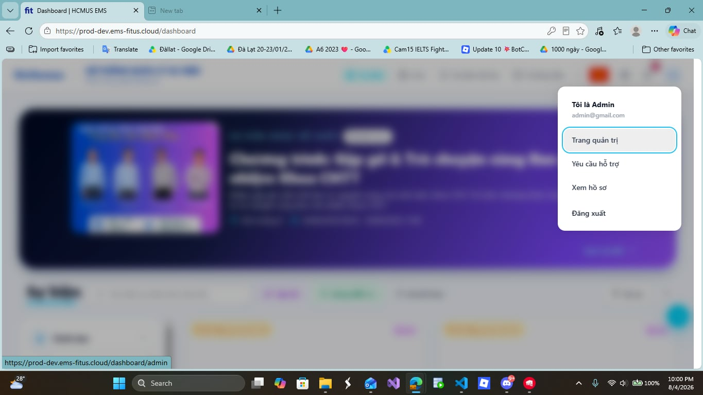
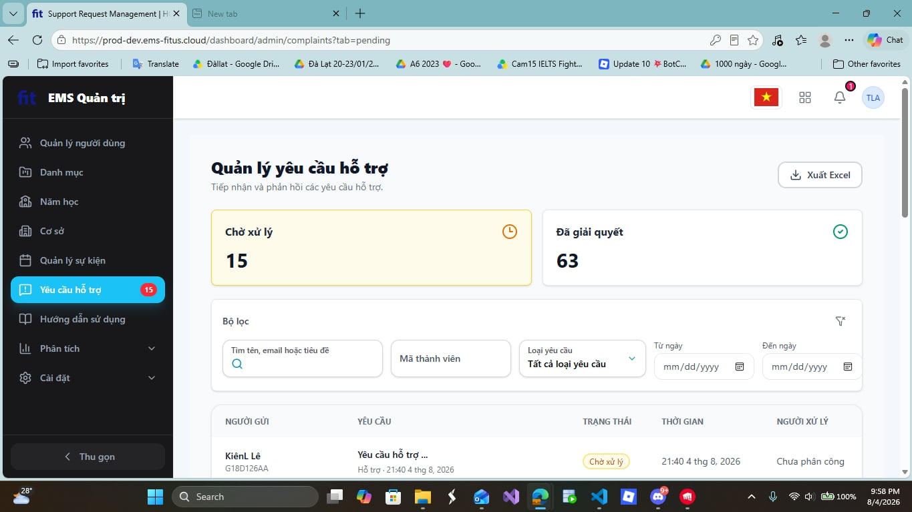

# Task 2 - Session Notes Template

File này dành cho người điều phối/interviewer ghi chú, không đưa participant tự điền. Participant chỉ đọc `submission/task2/participant_brief.md`; các quan sát, metric, câu trả lời và SUS raw score sẽ do Lê Trung Kiên ghi lại trong file session tương ứng.

## 1. Thông tin phiên

| Trường             | Giá trị                                       |
| -------------------- | ----------------------------------------------- |
| Participant ID       | `P02`                                         |
| Họ tên             | Nguyễn Hoàng Danh                             |
| Số điện thoại    | 0909355476                                      |
| Thiết bị/browser   | Windows 11 - Edge                               |
| Ngày giờ           | `2026-08-04 21:36`                              |
| Người điều phối | Lê Trung Kiên                                 |
| Scenario             | D - User requests Support and Admin resolves it |
| Consent              | Yes                                             |
| Recording            | `N/A`                                           |

## 2. Setup đã đưa cho participant

| Hạng mục         | Giá trị                                                         |
| ------------------ | ----------------------------------------------------------------- |
| Participant brief  | `submission/task2/participant_brief.md`                         |
| Website EMS        | `https://prod-dev.ems-fitus.cloud`                              |
| User account D1-D2 | `ltkien23@clc.fitus.edu.vn` / `Nothing2k@5`                   |
| Admin account D3   | `admin@gmail.com` / `Admin@123`                               |
| Màn hình D1      | User tạo support request có image attachment                    |
| Màn hình D2      | User xem My Requests list/detail có response                     |
| Màn hình D3      | Admin xem Support Requests list, Pending/Resolved tabs và search |

Ghi chú kiểm soát:

- Không hướng dẫn từng cú click.
- Chỉ can thiệp nếu participant bị kẹt hoàn toàn.
- Không để participant đổi mật khẩu, email, profile hoặc sửa dữ liệu ngoài phạm vi test.
- Với D3, nếu không muốn đưa admin password cho participant, người điều phối đăng nhập sẵn admin session rồi cho participant thao tác dưới giám sát.

## 3. Task scenario đã đọc cho participant

```text
Bạn đang dùng hệ thống EMS của khoa. Bạn gặp một vấn đề khi tham gia hoặc đăng ký sự kiện và muốn gửi yêu cầu hỗ trợ kèm ảnh minh chứng.

Hãy gửi một yêu cầu hỗ trợ, sau đó kiểm tra lại yêu cầu của mình trong danh sách support requests và cho biết bạn thấy trạng thái/phản hồi ở đâu.
```

Phần admin D3:

```text
Sau khi trải nghiệm phía user, hãy dùng màn hình admin đã được chuẩn bị để tìm request theo tiêu đề, member code, category hoặc trạng thái, rồi cho biết bạn tìm thấy request ở tab nào.
```

## 4. Checklist quan sát nhanh

| Màn hình                              | Hoàn tất?                    | Quan sát chính | Lỗi/nhầm lẫn | Do dự                                         | Có can thiệp?  |
| --------------------------------------- | ------------------------------ | ---------------- | --------------- | ---------------------------------------------- | ---------------- |
| D1 - Create support request             | `Completed`                    | Tạo được support request nhanh; participant hiểu vị trí `Yêu cầu hỗ trợ` trong menu tài khoản. | Ghi nhận field trong form khó thấy dấu nháy khi nhập. | 0 - Không do dự đáng kể ở bước tạo request. | `Không` |
| D2 - My Requests/detail                 | `Completed`                    | Tìm lại được request vừa tạo trong danh sách user và tin hệ thống đã ghi nhận nhờ trạng thái `Chờ xử lý`. | Khi dùng `Back`, participant quay về trang hỗ trợ nhưng không nhận ra ngay. | 1 - Back về trang hỗ trợ nhưng không nhận ra ngay ngữ cảnh hiện tại. | `Không` |
| D3 - Admin Support Requests list/search | `Completed`                    | Tìm được request trong màn hình admin nhưng bị lẫn giữa entry support phía user và trang quản trị. | Lẫn qua phần `Yêu cầu hỗ trợ` phía user khi đang đăng nhập admin; không chú ý ngay có hai vùng/tab `Chờ xử lý` và `Đã giải quyết`. | 2 - Do dự khi chọn đúng khu vực admin và khi phân biệt `Chờ xử lý`/`Đã giải quyết`. | `Không` |

## 5. Timeline/quan sát chi tiết

| Thời điểm | Màn hình | Hành động/quan sát | Có lỗi/nhầm lẫn? | Có do dự?  | Quote/ghi chú |
| ------------ | ---------- | ---------------------- | -------------------- | ------------ | -------------- |
| 00:00        | Start      | Bắt đầu task.       | No                   | No           |                |
| 01:03        | D1         | Hoàn tất tạo support request và chuyển sang bước kiểm tra lại request. | No                   | No           | Participant thấy entry `Yêu cầu hỗ trợ` trong menu tài khoản quen thuộc, dễ tìm. |
| 02:10        | D2         | Tìm lại request trong danh sách user; khi quay lại bằng `Back`, participant chưa nhận ra ngay đang ở trang hỗ trợ. | Yes                  | Yes          | Tin request đã được ghi nhận vì thấy trạng thái `Chờ xử lý` và request nằm trong danh sách. |
| 03:43        | D3         | Vào màn hình admin để tìm request; participant bị lẫn giữa `Yêu cầu hỗ trợ` phía user và `Trang quản trị`, đồng thời không để ý ngay hai trạng thái/tab `Chờ xử lý` và `Đã giải quyết`. | Yes                  | Yes          | "Lẫn lộn trang người dùng và quản lý của admin"; "không để ý có 2 tab". |

## 6. Kết quả task

| Metric        | Giá trị                                |
| ------------- | ---------------------------------------- |
| Success       | `Completed`                              |
| Time on task  | 03:43                                    |
| Errors        | 2                                        |
| Hesitations   | 3                                        |
| Interventions | `Không`                                  |
| Key friction  | Participant bị lẫn giữa luồng support phía user và trang quản trị khi dùng tài khoản admin; trạng thái `Chờ xử lý`/`Đã giải quyết` chưa đủ nổi bật để nhận ra ngay. |
| Evidence      | `submission/task2/session_notes/image/P02_session_notes/1785855764060.png`; `submission/task2/session_notes/image/P02_session_notes/1785855715511.png` |

## 7. Câu trả lời sau task

| Câu hỏi                                                                                                   | Trả lời participant                                                                                                                                                                                                                                              |
| ----------------------------------------------------------------------------------------------------------- | ------------------------------------------------------------------------------------------------------------------------------------------------------------------------------------------------------------------------------------------------------------------ |
| Phần nào giúp bạn hiểu đang cần làm gì? Phần nào gây khó hiểu?                                | Dễ hiểu: Do để trong avt tài khoản nên người dùng quen thuộc, dễ tìm thấy chỗ yêu cầu hỗ trợ.<br />Khó hiểu: Bị lẫn lộn qua danh sách yêu cầu hỗ trợ của người dùng. Màu field form tạo yêu cầu làm không thấy dấu nháy |
| Nếu nhập sai hoặc muốn quay lại, bạn có thấy cách sửa/khôi phục rõ không?                     | Không chỉnh sửa được yêu cầu hỗ trợ đã được thêm.<br />Cách sửa và quay lại thấy rõ ràng                                                                                                                                                    |
| Bước nào làm bạn chậm nhất?                                                                          | Lẫn lộn trang người dùng và quản lý của admin khi đăng nhập bằng admin                                                                                                                                                                                |
| Sau khi gửi request hoặc xem response, bạn có tin là hệ thống đã ghi nhận/xử lý chưa? Vì sao? | Tin vì có trạng thái Chờ xử lý và nằm trong danh sách                                                                                                                                                                                                    |
| Bạn có dễ tìm lại request vừa tạo không?                                                            | Có vì nó nằm ngay đầu                                                                                                                                                                                                                                        |
| Nếu phải tìm request để xử lý, bạn sẽ dùng title, member code, category hay status?               | User: Title > Status<br />Admin: Status > Category > Title > Member code                                                                                                                                                                                           |
| Ở D3, bạn có tìm được đúng request trong Pending/Resolved tab không?                              | Có nhưng không để ý có 2 tab để chuyển qua lại.                                                                                                                                                                                                         |
| Bạn có nhận thấy vấn đề nào về layout mobile/desktop không?                                       | Không nhận thấy vấn đề nào hết.                                                                                                                                                                                                                            |

## 8. SUS raw score

| Điểm | Ý nghĩa             |
| -----: | --------------------- |
|      1 | Rất không đồng ý |
|      2 | Không đồng ý      |
|      3 | Trung lập            |
|      4 | Đồng ý             |
|      5 | Rất đồng ý        |

| Mã             | Câu hỏi                                                                                                                  | Điểm 1-5 |
| --------------- | -------------------------------------------------------------------------------------------------------------------------- | ---------: |
| SUS-01          | Tôi nghĩ tôi muốn sử dụng hệ thống này thường xuyên nếu có nhu cầu gửi hoặc theo dõi yêu cầu hỗ trợ. |          4 |
| SUS-02          | Tôi thấy hệ thống này phức tạp không cần thiết.                                                                  |          2 |
| SUS-03          | Tôi thấy hệ thống này dễ sử dụng.                                                                                  |          4 |
| SUS-04          | Tôi nghĩ tôi cần người có kỹ thuật hỗ trợ thì mới dùng được hệ thống này.                              |          2 |
| SUS-05          | Tôi thấy các chức năng trong flow support request được liên kết với nhau hợp lý.                              |          5 |
| SUS-06          | Tôi thấy hệ thống có quá nhiều điểm không nhất quán.                                                           |          1 |
| SUS-07          | Tôi nghĩ hầu hết mọi người có thể học cách dùng flow này rất nhanh.                                          |          4 |
| SUS-08          | Tôi thấy hệ thống này rườm rà hoặc bất tiện khi sử dụng.                                                      |          1 |
| SUS-09          | Tôi cảm thấy tự tin khi sử dụng flow support request này.                                                           |          4 |
| SUS-10          | Tôi cần học thêm nhiều thứ trước khi có thể sử dụng flow này thành thạo.                                    |          1 |
| SUS score 0-100 | `85.0`                                                                                                              |            |

## 9. Candidate findings từ phiên này

| ID tạm    | Screen         | Type                | Description  | Evidence         | Severity 0-4 | Có submit Google Form? |
| ---------- | -------------- | ------------------- | ------------ | ---------------- | -----------: | ----------------------- |
| UT-P02-001 | `D3` | `Usability` | Khi đăng nhập bằng admin, menu tài khoản hiển thị cả `Trang quản trị` và `Yêu cầu hỗ trợ`, làm participant lẫn giữa luồng support phía user và màn hình quản trị cần dùng để xử lý request. | `submission/task2/session_notes/image/P02_session_notes/1785855764060.png`; participant trả lời: `Lẫn lộn trang người dùng và quản lý của admin khi đăng nhập bằng admin` | 2 | `No` |
| UT-P02-002 | `D3` | `Usability` | Hai trạng thái/tab `Chờ xử lý` và `Đã giải quyết` trong màn hình quản lý support request chưa được participant nhận ra ngay, làm chậm việc xác định request nằm ở tab nào. | `submission/task2/session_notes/image/P02_session_notes/1785855715511.png`; participant trả lời: `Có nhưng không để ý có 2 tab để chuyển qua lại` | 2 | `No` |


Hình này là Danh lẫn lộn giữa tab yêu cầu hỗ trợ bên user và admin khi đăng nhập tài khoản admin.


Hình này là Danh không nhận ra việc chuyển Chờ xử lý và Đã giải quyết.

