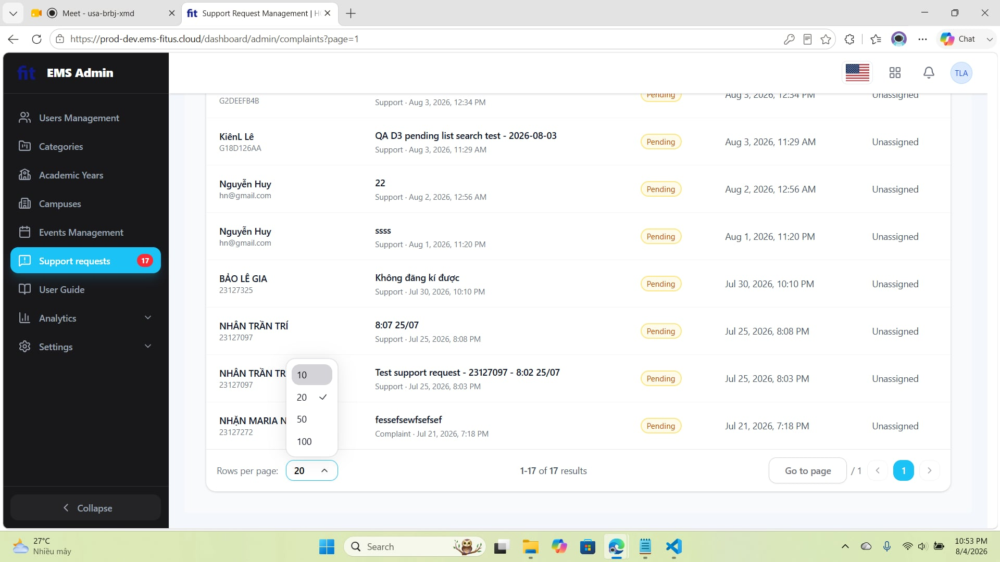
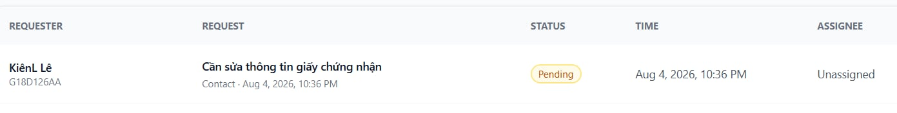
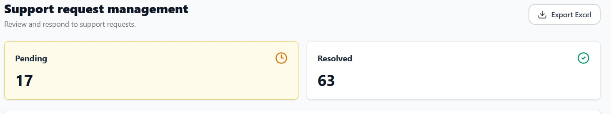

# Task 2 - Session Notes Template

File này dành cho người điều phối/interviewer ghi chú, không đưa participant tự điền. Participant chỉ đọc `submission/task2/participant_brief.md`; các quan sát, metric, câu trả lời và SUS raw score sẽ do Lê Trung Kiên ghi lại trong file session tương ứng.

## 1. Thông tin phiên

| Trường             | Giá trị                                       |
| -------------------- | ----------------------------------------------- |
| Participant ID       | `P03`                                         |
| Họ tên             | Nguyễn Hữu Anh Trí                           |
| Số điện thoại    | 0947570902                                      |
| Thiết bị/browser   | Windows 11 - Edge                               |
| Ngày giờ           | 22:31 4/8/2026                                  |
| Người điều phối | Lê Trung Kiên                                 |
| Scenario             | D - User requests Support and Admin resolves it |
| Consent              | Yes                                             |
| Recording            | `[File path hoặc N/A]`                       |

## 2. Setup đã đưa cho participant

| Hạng mục         | Giá trị                                                         |
| ------------------ | ----------------------------------------------------------------- |
| Participant brief  | `submission/task2/participant_brief.md`                         |
| Website EMS        | `https://prod-dev.ems-fitus.cloud`                              |
| User account D1-D2 | `ltkien23@clc.fitus.edu.vn` / `Nothing2k@5`                   |
| Admin account D3   | `admin@gmail.com` / `Admin@123`                               |
| Màn hình D1      | User tạo support request có image attachment                    |
| Màn hình D2      | User xem My Requests list/detail có response                     |
| Màn hình D3      | Admin xem Support Requests list, Pending/Resolved tabs và search |

Ghi chú kiểm soát:

- Không hướng dẫn từng cú click.
- Chỉ can thiệp nếu participant bị kẹt hoàn toàn.
- Không để participant đổi mật khẩu, email, profile hoặc sửa dữ liệu ngoài phạm vi test.
- Với D3, nếu không muốn đưa admin password cho participant, người điều phối đăng nhập sẵn admin session rồi cho participant thao tác dưới giám sát.

## 3. Task scenario đã đọc cho participant

```text
Bạn đang dùng hệ thống EMS của khoa. Bạn gặp một vấn đề khi tham gia hoặc đăng ký sự kiện và muốn gửi yêu cầu hỗ trợ kèm ảnh minh chứng.

Hãy gửi một yêu cầu hỗ trợ, sau đó kiểm tra lại yêu cầu của mình trong danh sách support requests và cho biết bạn thấy trạng thái/phản hồi ở đâu.
```

Phần admin D3:

```text
Sau khi trải nghiệm phía user, hãy dùng màn hình admin đã được chuẩn bị để tìm request theo tiêu đề, member code, category hoặc trạng thái, rồi cho biết bạn tìm thấy request ở tab nào.
```

## 4. Checklist quan sát nhanh

| Màn hình                              | Hoàn tất?                    | Quan sát chính | Lỗi/nhầm lẫn                         | Do dự           | Có can thiệp?  |
| --------------------------------------- | ------------------------------ | ---------------- | --------------------------------------- | ---------------- | ---------------- |
| D1 - Create support request             | `[Completed/Partial/Failed]` | `[Điền]`     | `[Điền]`<br />Phần support cs đỏ | `[Số/lý do]` | `[Không/Có]` |
| D2 - My Requests/detail                 | `[Completed/Partial/Failed]` | `[Điền]`     | `[Điền]`                            | `[Số/lý do]` | `[Không/Có]` |
| D3 - Admin Support Requests list/search | `[Completed/Partial/Failed]` | `[Điền]`     | `[Điền]`                            | `[Số/lý do]` | `[Không/Có]` |

## 5. Timeline/quan sát chi tiết

| Thời điểm | Màn hình | Hành động/quan sát | Có lỗi/nhầm lẫn? | Có do dự?  | Quote/ghi chú |
| ------------ | ---------- | ---------------------- | -------------------- | ------------ | -------------- |
| 00:00        | Start      | Bắt đầu task.       | No                   | No           |                |
| 02:14        | D1         | `[Điền]`           | `[Yes/No]`         | `[Yes/No]` | `[Điền]`   |
| 02:20        | D2         | `[Điền]`           | `[Yes/No]`         | `[Yes/No]` | `[Điền]`   |
| 05:14        | D3         | `[Điền]`           | `[Yes/No]`         | `[Yes/No]` | `[Điền]`   |

## 6. Kết quả task

| Metric        | Giá trị                                |
| ------------- | ---------------------------------------- |
| Success       | `[Completed/Partial/Failed]`           |
| Time on task  | `[mm:ss]`                              |
| Errors        | `[Số]`                                |
| Hesitations   | `[Số]`                                |
| Interventions | `[Không/Có, mô tả]`                |
| Key friction  | `[Điền]`                             |
| Evidence      | `[Screenshot/recording path nếu có]` |

## 7. Câu trả lời sau task

| Câu hỏi                                                                                                   | Trả lời participant                                                     |
| ----------------------------------------------------------------------------------------------------------- | ------------------------------------------------------------------------- |
| Phần nào giúp bạn hiểu đang cần làm gì? Phần nào gây khó hiểu?                                | Có user guide hướng dẫn nên dễ hiểu                                |
| Nếu nhập sai hoặc muốn quay lại, bạn có thấy cách sửa/khôi phục rõ không?                     | Có                                                                       |
| Bước nào làm bạn chậm nhất?                                                                          | Điền form support request                                               |
| Sau khi gửi request hoặc xem response, bạn có tin là hệ thống đã ghi nhận/xử lý chưa? Vì sao? | Có status Pending, có hiện request trong danh sách                    |
| Bạn có dễ tìm lại request vừa tạo không?                                                            | Có vì nằm lên đầu                                                   |
| Nếu phải tìm request để xử lý, bạn sẽ dùng title, member code, category hay status?               | Category > Member Code > Title > Status                                   |
| Ở D3, bạn có tìm được đúng request trong Pending/Resolved tab không?                              | Có. Nhưng không nhận ra 2 tab switch qua lại được                 |
| Bạn có nhận thấy vấn đề nào về layout mobile/desktop không?                                       | Admin: Cột REQUEST khá rộng. Filter date range nên để 1 hàng mới. |

## 8. SUS raw score

| Điểm | Ý nghĩa             |
| -----: | --------------------- |
|      1 | Rất không đồng ý |
|      2 | Không đồng ý      |
|      3 | Trung lập            |
|      4 | Đồng ý             |
|      5 | Rất đồng ý        |

| Mã             | Câu hỏi                                                                                                                  | Điểm 1-5 |
| --------------- | -------------------------------------------------------------------------------------------------------------------------- | ---------: |
| SUS-01          | Tôi nghĩ tôi muốn sử dụng hệ thống này thường xuyên nếu có nhu cầu gửi hoặc theo dõi yêu cầu hỗ trợ. |          4 |
| SUS-02          | Tôi thấy hệ thống này phức tạp không cần thiết.                                                                  |          2 |
| SUS-03          | Tôi thấy hệ thống này dễ sử dụng.                                                                                  |          4 |
| SUS-04          | Tôi nghĩ tôi cần người có kỹ thuật hỗ trợ thì mới dùng được hệ thống này.                              |          1 |
| SUS-05          | Tôi thấy các chức năng trong flow support request được liên kết với nhau hợp lý.                              |          3 |
| SUS-06          | Tôi thấy hệ thống có quá nhiều điểm không nhất quán.                                                           |          3 |
| SUS-07          | Tôi nghĩ hầu hết mọi người có thể học cách dùng flow này rất nhanh.                                          |          4 |
| SUS-08          | Tôi thấy hệ thống này rườm rà hoặc bất tiện khi sử dụng.                                                      |          2 |
| SUS-09          | Tôi cảm thấy tự tin khi sử dụng flow support request này.                                                           |          4 |
| SUS-10          | Tôi cần học thêm nhiều thứ trước khi có thể sử dụng flow này thành thạo.                                    |          1 |
| SUS score 0-100 | `[Người kiểm thử tính sau]`                                                                                         |            |

## 9. Candidate findings từ phiên này

| ID tạm    | Screen         | Type                | Description  | Evidence         | Severity 0-4 | Có submit Google Form? |
| ---------- | -------------- | ------------------- | ------------ | ---------------- | -----------: | ----------------------- |
| UT-P03-001 | `[D1/D2/D3]` | `[Bug/Usability]` | `[Điền]` | `[Path/quote]` |              | `[Yes/No]`            |

- Số lượng rows per page bị fix cố định cả bên user và admin



- Cột Request trong Admin dashboard tab support requests



- Khó nhận ra tab Pending, Resolved chuyển qua lại được

