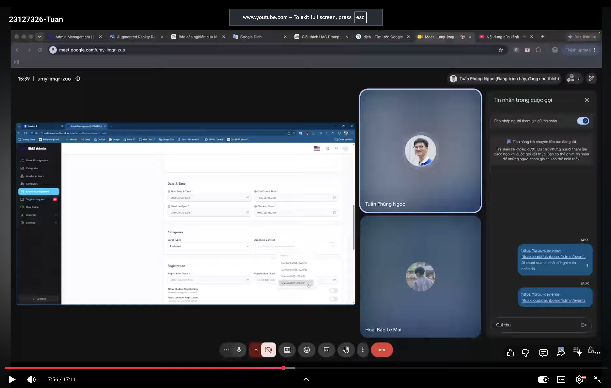
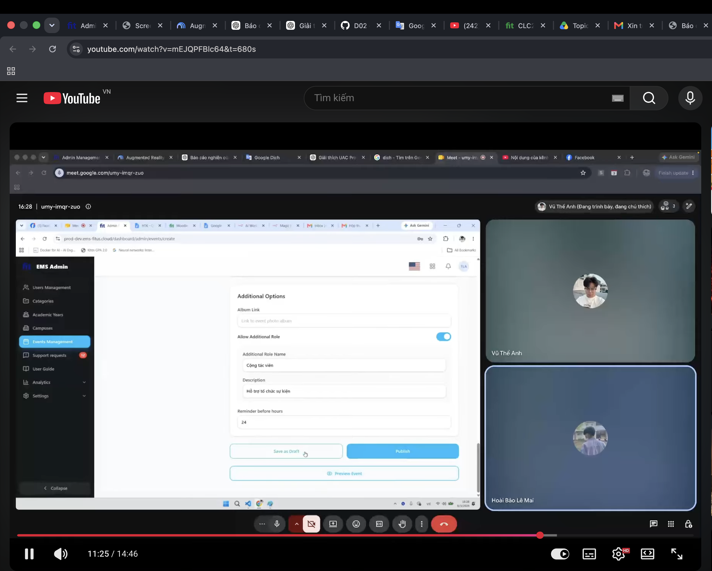
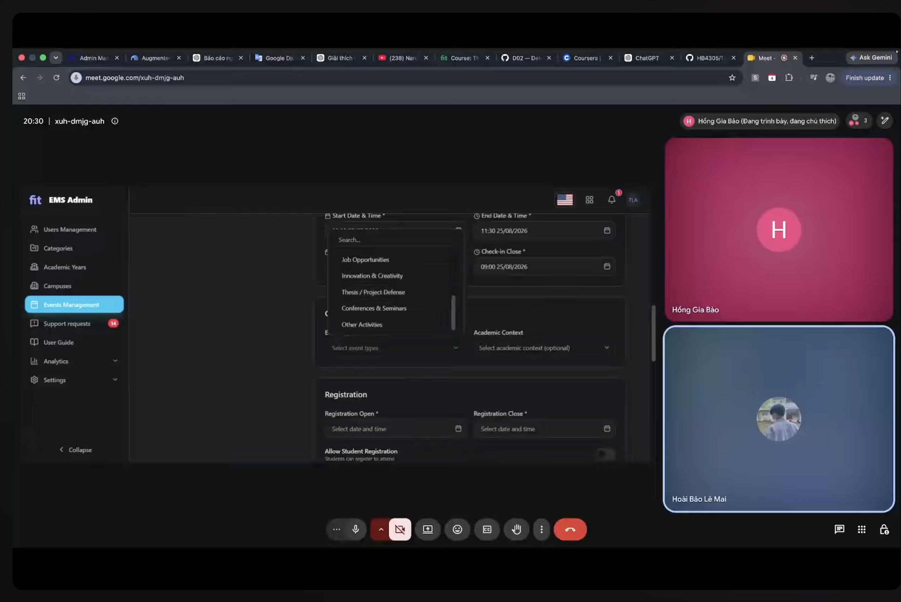

# Báo cáo tính khả dụng - Kịch bản A

## 1. Thông tin chung

| Trường | Nội dung |
| --- | --- |
| Sinh viên | Lê Mai Hoài Bảo |
| MSSV | 23127326 |
| Kịch bản | A - Quản trị viên tạo và quản lý sự kiện |
| Màn hình liên quan | A1 Danh sách sự kiện, A2 Thêm/Sửa sự kiện, A3 Đăng ký và vai trò |
| Ngày chuẩn bị Phase 1 | 2026-08-03 |
| Ngày chạy 5 phiên | 03–04/08/2026 |
| Video pilot | [23127326-PilotUser](https://youtu.be/RBcwhBtWzQ0) |
| Phương pháp điểm số | System Usability Scale (SUS), thang 0–100 |
| Minh chứng chi tiết | `submission/user_testing_evidence.md` |

## 2. Kịch bản nhiệm vụ

> Bạn là cộng tác viên quản trị sự kiện của khoa. Ban tổ chức cần bạn chuẩn bị một sự kiện học thuật mới ở trạng thái bản nháp, cấu hình đăng ký cho sinh viên và một vai trò cộng tác viên bổ sung, sau đó tìm sự kiện trong danh sách quản trị và mở lại ở chế độ chỉnh sửa để xác nhận dữ liệu đã được lưu. Không xuất bản hoặc xóa sự kiện.

Dữ liệu nghiệp vụ, tiêu chí hoàn thành, quy tắc quan sát, bộ câu SUS và câu hỏi thăm dò được khóa trong `submission/user_testing_evidence.md` trước khi chạy pilot.

## 3. Trạng thái thực hiện

| Hạng mục | Trạng thái | Minh chứng |
| --- | --- | --- |
| Kịch bản theo mục tiêu | Hoàn tất | Mục 2 và `submission/user_testing_evidence.md` |
| Chỉ số và quy tắc đếm | Hoàn tất | Kết quả nhiệm vụ, thời gian, lỗi, do dự, can thiệp và SUS |
| Câu hỏi thăm dò | Hoàn tất | Mức độ rõ ràng, phục hồi lỗi, tốc độ, độ tin cậy và ưu tiên thay đổi |
| Tiêu chí tuyển người tham gia | Hoàn tất | 5 người chính + 1 pilot, đều ngoài lớp |
| Tuyển đủ 5 người thật | Đã thực hiện | P1–P5 có họ tên, liên hệ đã che, consent, thời gian phiên, thiết bị và video trong `submission/user_testing_evidence.md` |
| Chạy pilot với 1 người thật | Đã thực hiện | Trần Hữu Lộc (`098****620`), ngoài lớp/P1–P5, đã đồng ý tham gia và ghi hình; hoàn thành trong `08:24`, lỗi/do dự/can thiệp `0/0/0`; không cần điều chỉnh kịch bản; [video](https://youtu.be/RBcwhBtWzQ0) |

## 4. Tóm tắt người tham gia

| ID | Người tham gia | Hồ sơ phù hợp | Liên hệ đã che | Kết quả | Thời gian | Lỗi | Do dự | SUS |
| --- | --- | --- | --- | --- | ---: | ---: | ---: | ---: |
| P1 | Phùng Ngọc Tuấn | Sinh viên ngoài lớp, đã đồng ý tham gia và ghi hình | `093****285` | Hoàn thành | `08:42` | `1` | `1` | `60` |
| P2 | Trần Tuấn Kiệt | Sinh viên ngoài lớp, đã đồng ý tham gia và ghi hình | `070****688` | Hoàn thành | `03:29` | `0` | `0` | `80` |
| P3 | Vũ Thế Anh | Sinh viên ngoài lớp, đã đồng ý tham gia và ghi hình | `094****183` | Một phần | `07:33` | `1` | `1` | `77.5` |
| P4 | Hồng Gia Bảo | Sinh viên ngoài lớp, đã đồng ý tham gia và ghi hình | `090****520` | Một phần | `06:28` | `1` | `1` | `75` |
| P5 | Quách Vĩnh Kỳ | Sinh viên ngoài lớp, đã đồng ý tham gia và ghi hình | `094****445` | Một phần | `11:10` | `1` | `0` | `77.5` |

## 5. Tóm tắt chỉ số

| Chỉ số | Kết quả |
| --- | ---: |
| Tỷ lệ hoàn thành | P1–P5: `40%` hoàn thành (2/5), `60%` một phần (3/5) |
| Thời gian trung bình | P1–P5: `07:28` (làm tròn) |
| Số lỗi trung bình | P1–P5: `0.80` |
| Số lần do dự trung bình | P1–P5: `0.60` |
| Điểm SUS trung bình | P1–P5: `74.0` |

## 6. Phát hiện theo mức độ

Mức độ: 0 = không phải vấn đề, 1 = thẩm mỹ/khó chịu nhỏ, 2 = vấn đề nhỏ có cách xử lý thay thế, 3 = nghiêm trọng, 4 = chặn task hoặc gây mất dữ liệu.

| ID | Màn hình | Phát hiện | Bằng chứng | Mức độ | Minh chứng ảnh/video | Khuyến nghị | Thời gian biểu mẫu |
| --- | --- | --- | --- | ---: | --- | --- | --- |
| UX-001 | A2 – Categories | Nhãn `Academic Context` không đủ rõ để người dùng biết cần chọn ngữ cảnh nào. | P1 do dự tại `07:55` và nói “này là sao”; [video](https://youtu.be/dilkwkxXt0Q?t=475). | 2 |  [Video/audio P1 tại 07:55](https://youtu.be/dilkwkxXt0Q?t=475) | Thêm mô tả ngắn/ví dụ dưới nhãn `Academic Context` và làm rõ quan hệ với `Event Types`. | 22:37 ngày 05/08/2026 |
| UX-002 | A2 – Save as Draft/validation | Khi form có trường không hợp lệ, nhấn `Save as Draft` không có phản hồi tổng thể và không đưa người dùng tới trường lỗi. | P3 tại `11:20` nhấn hai lần không thấy thay đổi, phải tự cuộn lên tìm lỗi; P5 cũng cho biết khó hiểu vì không có thông báo lỗi chung dạng pop-up; [video P3](https://youtu.be/mEJQPFBlc64?t=680), [video P5](https://youtu.be/FmSO-TaYQxo). | 2 |  [Video P3 tại 11:20](https://youtu.be/mEJQPFBlc64?t=680); [video/audio probe P5](https://youtu.be/FmSO-TaYQxo) | Khi submit thất bại, hiển thị thông báo/tóm tắt validation và tự cuộn, đưa focus tới trường lỗi đầu tiên. | 22:38 ngày 05/08/2026 |
| UX-003 | A2 – Date & Time | Thao tác chọn/chỉnh giờ bằng điều khiển kéo gây khó khăn và mất thời gian. | P3 cho biết phải kéo chuột mạnh, đây là phần phiền nhất và muốn nhập giờ trực tiếp; [video P3](https://youtu.be/mEJQPFBlc64). | 2 | [Video/audio probe P3](https://youtu.be/mEJQPFBlc64) | Cho phép nhập giờ trực tiếp bằng bàn phím, giữ time picker dễ thao tác và gom các trường thời gian liên quan. | 22:41 ngày 05/08/2026 |
| UX-004 | A2 – Categories | Trạng thái đã chọn của `Event Types` không đủ rõ, khiến người dùng không chắc lựa chọn đã được ghi nhận hay chưa. | P4 do dự tại `05:25` khi danh sách `Event Types` đang mở; [video](https://www.youtube.com/watch?v=kyZxvvLCOkE&t=325s). | 2 |  [Video P4 tại 05:25](https://www.youtube.com/watch?v=kyZxvvLCOkE&t=325s) | Hiển thị lựa chọn hiện tại rõ ràng trong ô, thêm dấu chọn cho option đã chọn và giữ phản hồi sau khi danh sách đóng. | 22:43 ngày 05/08/2026 |

### 6.1 Minh chứng phóng lớn

**UX-001 — Academic Context khó hiểu**

**UX-002 — Save as Draft thiếu phản hồi lỗi tổng thể**

**UX-003 — Điều khiển chọn giờ khó thao tác**

Minh chứng tương tác: [video/audio probe P3](https://youtu.be/mEJQPFBlc64). Finding này không dùng ảnh tĩnh.

**UX-004 — Trạng thái chọn Event Types không rõ**

## 7. Phân tích

### 7.1 Nhóm điểm khó sử dụng

Các phát hiện được chia thành ba nhóm. Nhóm thứ nhất liên quan đến **độ rõ ràng khi phân loại sự kiện**: `Academic Context` không giải thích ý nghĩa (UX-001), còn `Event Types` không thể hiện đủ rõ lựa chọn hiện tại (UX-004). Hai vấn đề đều làm người dùng phải dừng lại để diễn giải trạng thái của phần `Categories`.

Nhóm thứ hai liên quan đến **phản hồi và phục hồi lỗi khi lưu**. UX-002 cho thấy khi `Save as Draft` thất bại vì dữ liệu không hợp lệ, hệ thống không hiển thị tóm tắt lỗi và không đưa người dùng tới trường cần sửa. Đây là rủi ro trực tiếp đối với việc hoàn thành nhiệm vụ vì người dùng có thể nhấn lại nhiều lần hoặc cho rằng hệ thống không phản hồi.

Nhóm thứ ba liên quan đến **hiệu quả nhập thời gian**. UX-003 phản ánh điều khiển chọn giờ bằng thao tác kéo gây khó khăn và làm chậm quá trình nhập. Các sai lệch riêng của P4 (`Is Unlimited`) và P5 (mở nhầm sự kiện) được giữ trong dữ liệu phiên để giải thích kết quả `Một phần`, nhưng chưa được nâng thành finding riêng vì chưa có đủ bằng chứng cho thấy đó là vấn đề lặp lại của thiết kế.

### 7.2 Ảnh hưởng tới trải nghiệm

Về **mức độ rõ ràng**, UX-001 và UX-004 làm người dùng không chắc trường có nghĩa gì hoặc lựa chọn đã được ghi nhận chưa. Về **khả năng phục hồi lỗi và độ tin cậy**, UX-002 khiến người dùng không biết vì sao bản nháp chưa được lưu, làm giảm niềm tin vào phản hồi của hệ thống. Về **tốc độ**, UX-003 tạo thêm thao tác và thời gian khi nhập giờ.

Điểm SUS trung bình `74.0` cho thấy người tham gia nhìn chung đánh giá hệ thống ở mức có thể sử dụng, nhưng tỷ lệ hoàn thành đầy đủ chỉ đạt `40%` (2/5). Chênh lệch này cho thấy cảm nhận sử dụng tương đối tích cực không đồng nghĩa với việc dữ liệu nghiệp vụ được nhập chính xác. Ba phiên `Một phần` đều hoàn tất mà không cần can thiệp, nhưng vẫn để lại dữ liệu sai hoặc không xác nhận đúng bản nháp; vì vậy phản hồi hệ thống và khả năng nhận biết trạng thái cần được ưu tiên cải thiện.

### 7.3 Khuyến nghị theo độ ưu tiên

| Ưu tiên | Khuyến nghị | Lý do | Phát hiện liên quan |
| --- | --- | --- | --- |
| P1 | Hiển thị tóm tắt validation và tự cuộn/focus trường lỗi đầu tiên sau khi nhấn `Save as Draft`. | Giảm nguy cơ người dùng không hiểu vì sao chưa lưu được và tác động trực tiếp tới khả năng hoàn thành nhiệm vụ. | UX-002 |
| P2 | Thêm giải thích hoặc ví dụ dưới nhãn `Academic Context`. | Giúp người dùng hiểu mục đích của trường trước khi chọn, giảm lỗi và do dự ở phần `Categories`. | UX-001 |
| P2 | Hiển thị rõ giá trị hiện tại và dấu chọn của `Event Types`, kể cả sau khi danh sách đóng. | Giúp người dùng xác nhận lựa chọn đã được ghi nhận. | UX-004 |
| P2 | Cho phép nhập giờ trực tiếp bằng bàn phím và cải thiện thao tác của time picker. | Giảm thời gian và thao tác kéo gây khó khăn khi nhập các mốc thời gian. | UX-003 |

## 8. Kết luận

Năm phiên kiểm thử cho thấy luồng tạo và lưu bản nháp có thể hoàn thành nhưng chưa đủ rõ và ổn định để bảo đảm người dùng luôn nhập đúng dữ liệu. Hệ thống đạt SUS trung bình `74.0`, song chỉ 2/5 người hoàn thành đầy đủ và bốn finding mức độ 2 tập trung tại A2. Ưu tiên cao nhất là cải thiện phản hồi validation khi lưu; tiếp theo là làm rõ `Academic Context`, trạng thái chọn `Event Types` và cách nhập giờ. Không ghi nhận finding mức độ 3 hoặc 4 trong Task 2.
